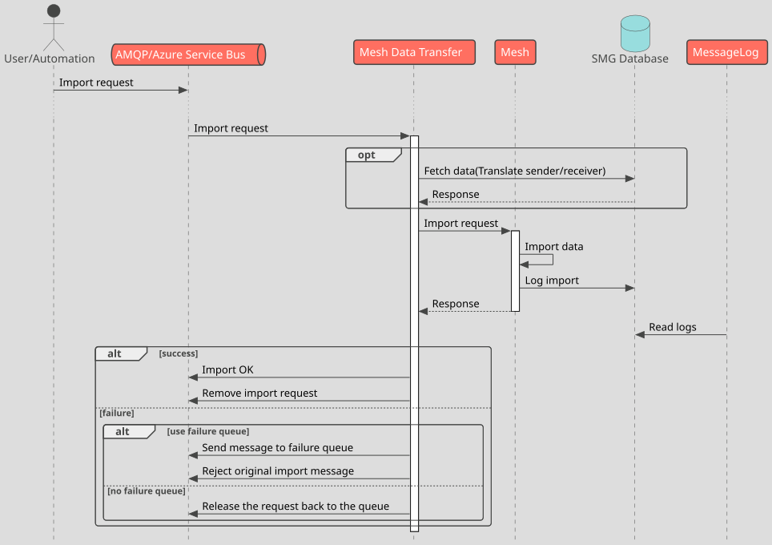
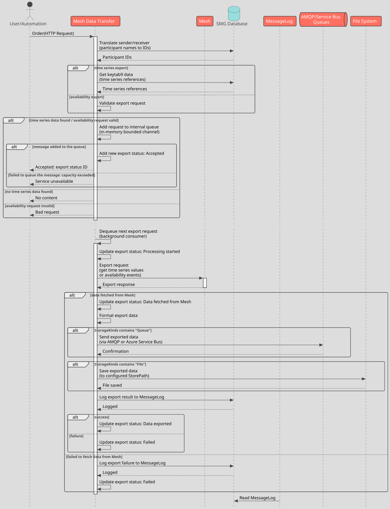

## General info

The _Mesh Data Transfer_ service enables users to perform time series and availability data exports and imports from a `Mesh` server. It uses the AMQP protocol as an external communication method to guarantee high level of reliability and versatility.

Mesh Data Transfer offers HTTP endpoints for creating both availability and time series export orders (used by certain Volue products, e.g. Participant, Nimbus). Imports are requested via queues (AMQP 1.0 or Azure Service Bus) and the outcomes of the import operations are sent to AMQP reply queues. The export results are stored as files or sent to an AMQP queue, depending on the configuration. Mesh Data Transfer is also responsible for saving export status to the `Message Log` (in the case of imports it is done by Mesh).

## Usage

### Time series export

To invoke a Mesh time series export one has to post a HTTP request to Mesh Data Transfer's `Order` service. Minimal working example:

```powershell
$body = '[{"Date":"2024-10-11T17:10:37","Receiver":"DemoBase","Keytab":1,"ValuesFrom":"2024-05-09T00:00:00","ValuesTo":"2024-05-11T00:00:00","Protocol":126}]'
Invoke-WebRequest -Uri "http://localhost:7000/Order" -Method Post -ContentType "application/json" -Body $body
```

A prerequisite of a successful time series export is a pre-filled `keytab9` database table with references to the time series we want to export. The `keytab` parameter refers to the taret `keytab9` row. `keytab9` is normally filled by the client application like Participant or Nimbus.

`Protocol` denotes the export type. Possible options are:

| ID  | Protocol                      |
| --- | ----------------------------- |
| 121 | PVPLAN                        |
| 122 | Bidding                       |
| 123 | Standard export               |
| 125 | APOR/APOT                     |
| 134 | GS2                           |
| 135 | EDIEL DELFOR                  |
| 137 | Excel CSV                     |
| 138 | TS Volumes Web Service export |
| 139 | MSCONS                        |


`Receiver` can be either the name or the integer key (`opun_key`) of the receiver participant.

#### Export sender

The sender defined in the time series export definition (a "sender host") is used by Mesh Data Transfer to specify the sender of the time series data (the sender is then referenced in the Message Log or directly in case of some of the export types, like Standard export or GS2; moreover all the output is grouped by the senders (see below)). If the sender is not defined in the time series export definition, a default sender is selected (which is defined by `ParticipantSettings/ICC_SENDER` parameter in the configuration file).

There is also an option to specify the sender in the time series export request:

```powershell
$body = '[{"Date":"2024-10-11T17:10:37","Receiver":"DemoBase","Sender":"Mesh","Keytab":1,"ValuesFrom":"2024-05-09T00:00:00","ValuesTo":"2024-05-11T00:00:00","Protocol":126}]'
Invoke-WebRequest -Uri "http://localhost:7000/Order" -Method Post -ContentType "application/json" -Body $body
```

In this case the exported time series will be limited to those that match the input sender parameter. When the time series export definition does not specify the sender host, it will be replaced with the input sender parameter (instead of the default sender).

The same rules apply to Sender request parameter as to the Receiver parameter, i.e. it can be a name or an integer.

##### Grouping of the output by sender

If the time series included in a single time series export request refer to a different sender, these time series will be grouped into separate export results.

## Data Flow

Message flow when _importing_ data to `Mesh`:



Message flow when _exporting_ data from `Mesh`:



Mesh Data Transfer provides request tracking capability. A request ID is included in the response to the export request. It can be used to check the request status by sending `HTTP` `GET` to the `exportstatus/<ID>` endpoint. Example:

```powershell
Invoke-WebRequest -Uri "http://localhost:7000/exportstatus/4bb1306d-5259-411a-8e28-2c41107d48c9" -Method Get
```
