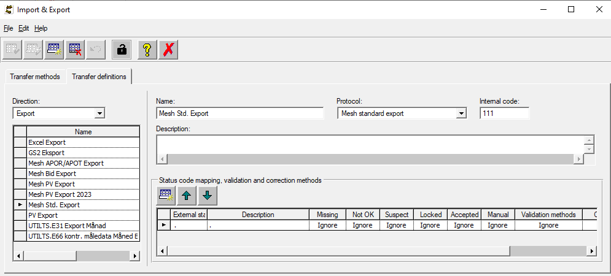
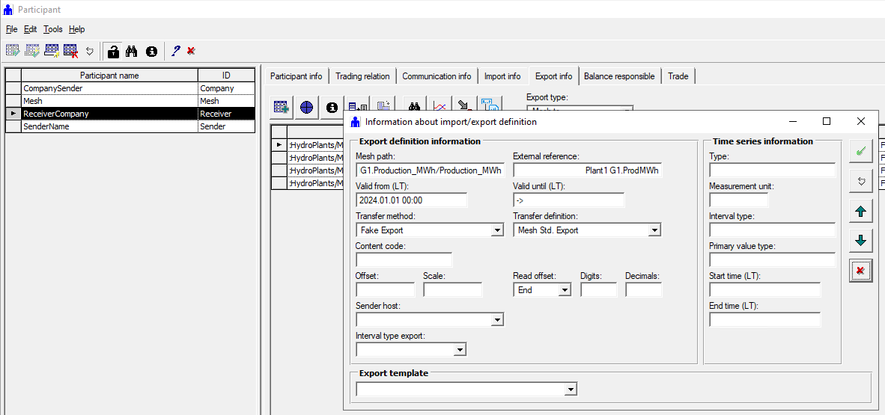
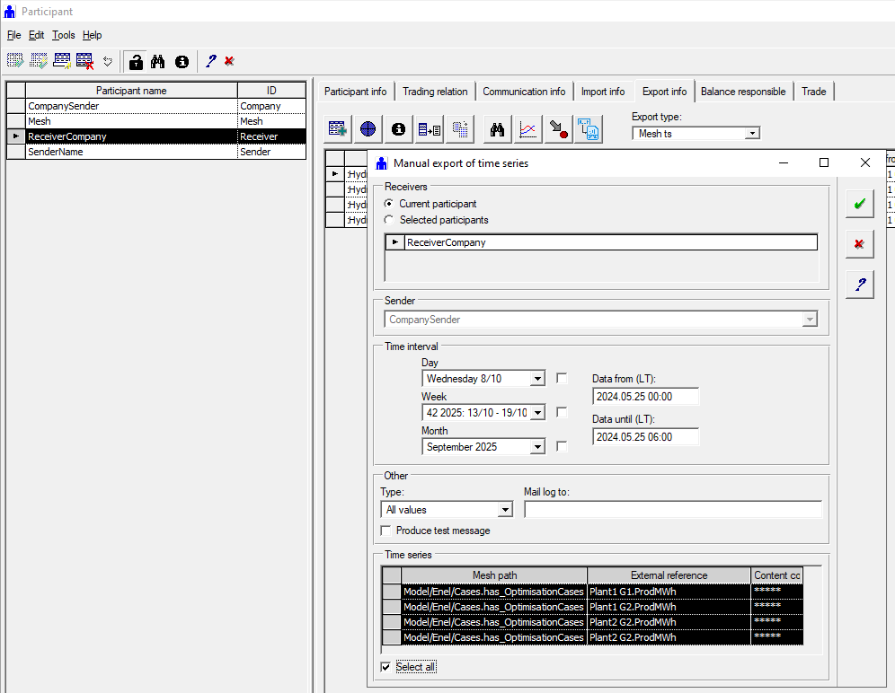
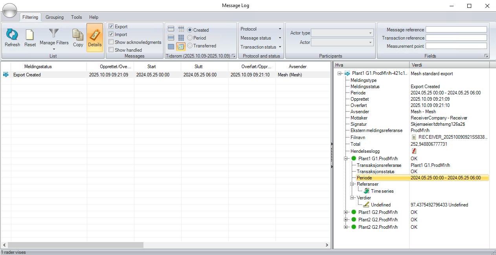

# Export of time series values using Mesh Data Transfer

This document describes how time series values can be exported from Mesh using Mesh Data Transfer and AMQP messages in the Mesh standard XML format.

The definition of the XML format is found in the [`AMQPmessageTypes.xsd`](./xsd/AMQPmessageTypes.xsd).

Currently, when doing exports, it it necessary to define export definitions in the SmG Participant application using transfer definitions defined using the SmG Import/Export application.

- [Export of time series values using Mesh Data Transfer](#export-of-time-series-values-using-mesh-data-transfer)
  - [Create export definitions](#create-export-definitions)
  - [Perform a manual export](#perform-a-manual-export)
  - [XML output message structure](#xml-output-message-structure)
    - [Timestamp](#timestamp)

## Create export definitions

When defining export definitions it is necessary to have a definition of the format to be produced. This is defined by a transfer definition created and maintained in the SmG Import/Export application. The definition of the standard XML format looks like this:



Using the SmG Participant application, it is possible to define one or more time series to export from Mesh:



Please observe:

- `Mesh path` - Each time series in the export definition is referenced by the full path to a time series attribute on an object within the Mesh model. This time series can either be a time series stored in the database or a calculated time series that only exists within the memory of the Mesh service.
- `External reference` - The text written into the external reference field is the identification of the time series in the export message.
- `Transfer definition` - The transfer definition defines in which format the time series shall be exported in.
- `Transfer method` - The transfer method is a grouping method that can be used to automatically transfer the time series in a time scheduled way or when triggering an export from a Nimbus task.

## Perform a manual export

We are manually triggering an export in the SmG Participant application as a way to visualise the export process including Mesh Data Transfer:

- `Initiate the export` - This is done by selecting the participant that is going to receive the exported values, selecting the time period to export and the time series to export. By choosing **Start export**, an export order is transferred to Mesh Data Transfer.

  

- `Gather values and create the export message` - Mesh Data Transfer will take the export order and select information for the given time series and time period, and format this information in the specified format. The formatted information will be put as a message into the defined export queue where it can be retrieved by anyone listening to that queue. Information about the export will also be stored as a file in the `TransactionLog` directory of SmG and is available in the SmG MessageLog application.

  

The export in the above example resulted in this information:

````xml
<?xml version="1.0" encoding="utf-8"?>
<Reply xmlns:xsi="http://www.w3.org/2001/XMLSchema-instance" xmlns:xsd="http://www.w3.org/2001/XMLSchema" xmlns="http://www.powel.com/SmE/AMQPmessageTypes/v1.0">
  <MessageVersion>1.0</MessageVersion>
  <Sender>Mesh</Sender>
  <Receiver>Receiver</Receiver>
  <CreationDate>2025-10-09T12:56:53.0791484+02:00</CreationDate>
  <MessageId>16f9356f-8466-4434-b2ca-39ccc6904b10</MessageId>
  <Replies>
    <Timeseries QueryId="22d8afc3-6584-4a19-a070-2cda4beec27c">
      <Points Id="950c29cb-b318-4eff-85aa-daad27c6b8b8" Path="Plant1G1_ProdMWh" DeltaT="PT15M" Reference="Plant1G1_ProdMWh" UnitOfMeasurement="MWh" UnitOfMeasurementName="MWh" CurveType="StaircaseStartOfStep">
        <Segments>
          <Segment Start="2024-05-24T22:00:00Z" End="2024-05-25T04:00:00Z">
            <Point Timestamp="2024-05-24T22:00:00Z" Value="8.755792907435174" />
            <Point Timestamp="2024-05-24T22:15:00Z" Value="8.755792907435174" />
            <Point Timestamp="2024-05-24T22:30:00Z" Value="8.755792907435174" />
            <Point Timestamp="2024-05-24T22:45:00Z" Value="8.755792907435174" />
            <Point Timestamp="2024-05-24T23:00:00Z" Value="8.606089207503743" />
            <Point Timestamp="2024-05-24T23:15:00Z" Value="8.606089207503743" />
            <Point Timestamp="2024-05-24T23:30:00Z" Value="8.606089207503743" />
            <Point Timestamp="2024-05-24T23:45:00Z" Value="8.606089207503743" />
            <Point Timestamp="2024-05-25T00:00:00Z" Value="5.912219712564671" />
            <Point Timestamp="2024-05-25T00:15:00Z" Value="5.912219712564671" />
            <Point Timestamp="2024-05-25T00:30:00Z" Value="5.912219712564671" />
            <Point Timestamp="2024-05-25T00:45:00Z" Value="5.912219712564671" />
            <Point Timestamp="2024-05-25T01:00:00Z" Value="1.085285492407221" />
            <Point Timestamp="2024-05-25T01:15:00Z" Value="1.085285492407221" />
            <Point Timestamp="2024-05-25T01:30:00Z" Value="1.085285492407221" />
            <Point Timestamp="2024-05-25T01:45:00Z" Value="1.085285492407221" />
            <Point Timestamp="2024-05-25T02:00:00Z" Value="0" />
            <Point Timestamp="2024-05-25T02:15:00Z" Value="0" />
            <Point Timestamp="2024-05-25T02:30:00Z" Value="0" />
            <Point Timestamp="2024-05-25T02:45:00Z" Value="0" />
            <Point Timestamp="2024-05-25T03:00:00Z" Value="0" />
            <Point Timestamp="2024-05-25T03:15:00Z" Value="0" />
            <Point Timestamp="2024-05-25T03:30:00Z" Value="0" />
            <Point Timestamp="2024-05-25T03:45:00Z" Value="0" />
          </Segment>
        </Segments>
      </Points>
    </Timeseries>
    <Timeseries QueryId="0a2e23b0-0921-4116-8df6-408794534bd3">
      <Points Id="34ce8b65-bf39-4728-8b0c-3d84e3ed0ea4" Path="Plant1G2_ProdMWh" DeltaT="PT15M" Reference="Plant1G2_ProdMWh" UnitOfMeasurement="MWh" UnitOfMeasurementName="MWh" CurveType="StaircaseStartOfStep">
        <Segments>
          <Segment Start="2024-05-24T22:00:00Z" End="2024-05-25T04:00:00Z">
            <Point Timestamp="2024-05-24T22:00:00Z" Value="8.755792907435174" />
            <Point Timestamp="2024-05-24T22:15:00Z" Value="8.755792907435174" />
            <Point Timestamp="2024-05-24T22:30:00Z" Value="8.755792907435174" />
            <Point Timestamp="2024-05-24T22:45:00Z" Value="8.755792907435174" />
            <Point Timestamp="2024-05-24T23:00:00Z" Value="8.606089207503743" />
            <Point Timestamp="2024-05-24T23:15:00Z" Value="8.606089207503743" />
            <Point Timestamp="2024-05-24T23:30:00Z" Value="8.606089207503743" />
            <Point Timestamp="2024-05-24T23:45:00Z" Value="8.606089207503743" />
            <Point Timestamp="2024-05-25T00:00:00Z" Value="0" />
            <Point Timestamp="2024-05-25T00:15:00Z" Value="0" />
            <Point Timestamp="2024-05-25T00:30:00Z" Value="0" />
            <Point Timestamp="2024-05-25T00:45:00Z" Value="0" />
            <Point Timestamp="2024-05-25T01:00:00Z" Value="0" />
            <Point Timestamp="2024-05-25T01:15:00Z" Value="0" />
            <Point Timestamp="2024-05-25T01:30:00Z" Value="0" />
            <Point Timestamp="2024-05-25T01:45:00Z" Value="0" />
            <Point Timestamp="2024-05-25T02:00:00Z" Value="0" />
            <Point Timestamp="2024-05-25T02:15:00Z" Value="0" />
            <Point Timestamp="2024-05-25T02:30:00Z" Value="0" />
            <Point Timestamp="2024-05-25T02:45:00Z" Value="0" />
            <Point Timestamp="2024-05-25T03:00:00Z" Value="0" />
            <Point Timestamp="2024-05-25T03:15:00Z" Value="0" />
            <Point Timestamp="2024-05-25T03:30:00Z" Value="0" />
            <Point Timestamp="2024-05-25T03:45:00Z" Value="0" />
          </Segment>
        </Segments>
      </Points>
    </Timeseries>
    <Timeseries QueryId="c5b18c82-2977-4ca4-9bba-8e5f83714ec5">
      <Points Id="70715c36-fb2c-4a4c-8550-bd2e9d00781a" Path="Plant2G2_ProdMWh" DeltaT="PT15M" Reference="Plant2G2_ProdMWh" UnitOfMeasurement="MWh" UnitOfMeasurementName="MWh" CurveType="StaircaseStartOfStep">
        <Segments>
          <Segment Start="2024-05-24T22:00:00Z" End="2024-05-25T04:00:00Z">
            <Point Timestamp="2024-05-24T22:00:00Z" Value="4.105500142290939" />
            <Point Timestamp="2024-05-24T22:15:00Z" Value="4.105500142290939" />
            <Point Timestamp="2024-05-24T22:30:00Z" Value="4.105500142290939" />
            <Point Timestamp="2024-05-24T22:45:00Z" Value="4.105500142290939" />
            <Point Timestamp="2024-05-24T23:00:00Z" Value="5.039827688587095" />
            <Point Timestamp="2024-05-24T23:15:00Z" Value="5.039827688587095" />
            <Point Timestamp="2024-05-24T23:30:00Z" Value="5.039827688587095" />
            <Point Timestamp="2024-05-24T23:45:00Z" Value="5.039827688587095" />
            <Point Timestamp="2024-05-25T00:00:00Z" Value="2.7252765978268876" />
            <Point Timestamp="2024-05-25T00:15:00Z" Value="2.7252765978268876" />
            <Point Timestamp="2024-05-25T00:30:00Z" Value="2.7252765978268876" />
            <Point Timestamp="2024-05-25T00:45:00Z" Value="2.7252765978268876" />
            <Point Timestamp="2024-05-25T01:00:00Z" Value="0.5" />
            <Point Timestamp="2024-05-25T01:15:00Z" Value="0.5" />
            <Point Timestamp="2024-05-25T01:30:00Z" Value="0.5" />
            <Point Timestamp="2024-05-25T01:45:00Z" Value="0.5" />
            <Point Timestamp="2024-05-25T02:00:00Z" Value="0" />
            <Point Timestamp="2024-05-25T02:15:00Z" Value="0" />
            <Point Timestamp="2024-05-25T02:30:00Z" Value="0" />
            <Point Timestamp="2024-05-25T02:45:00Z" Value="0" />
            <Point Timestamp="2024-05-25T03:00:00Z" Value="0" />
            <Point Timestamp="2024-05-25T03:15:00Z" Value="0" />
            <Point Timestamp="2024-05-25T03:30:00Z" Value="0" />
            <Point Timestamp="2024-05-25T03:45:00Z" Value="0" />
          </Segment>
        </Segments>
      </Points>
    </Timeseries>
    <Timeseries QueryId="285427bb-f122-4b01-8cf8-5da77ecdb3b8">
      <Points Id="120b2cc1-ea37-406f-b39b-cba088deef7c" Path="Plant2G2_ProdMWh" DeltaT="PT15M" Reference="Plant2G2_ProdMWh" UnitOfMeasurement="MWh" UnitOfMeasurementName="MWh" CurveType="StaircaseStartOfStep">
        <Segments>
          <Segment Start="2024-05-24T22:00:00Z" End="2024-05-25T04:00:00Z">
            <Point Timestamp="2024-05-24T22:00:00Z" Value="4.105500142290939" />
            <Point Timestamp="2024-05-24T22:15:00Z" Value="4.105500142290939" />
            <Point Timestamp="2024-05-24T22:30:00Z" Value="4.105500142290939" />
            <Point Timestamp="2024-05-24T22:45:00Z" Value="4.105500142290939" />
            <Point Timestamp="2024-05-24T23:00:00Z" Value="5.039827688587095" />
            <Point Timestamp="2024-05-24T23:15:00Z" Value="5.039827688587095" />
            <Point Timestamp="2024-05-24T23:30:00Z" Value="5.039827688587095" />
            <Point Timestamp="2024-05-24T23:45:00Z" Value="5.039827688587095" />
            <Point Timestamp="2024-05-25T00:00:00Z" Value="0" />
            <Point Timestamp="2024-05-25T00:15:00Z" Value="0" />
            <Point Timestamp="2024-05-25T00:30:00Z" Value="0" />
            <Point Timestamp="2024-05-25T00:45:00Z" Value="0" />
            <Point Timestamp="2024-05-25T01:00:00Z" Value="0" />
            <Point Timestamp="2024-05-25T01:15:00Z" Value="0" />
            <Point Timestamp="2024-05-25T01:30:00Z" Value="0" />
            <Point Timestamp="2024-05-25T01:45:00Z" Value="0" />
            <Point Timestamp="2024-05-25T02:00:00Z" Value="0" />
            <Point Timestamp="2024-05-25T02:15:00Z" Value="0" />
            <Point Timestamp="2024-05-25T02:30:00Z" Value="0" />
            <Point Timestamp="2024-05-25T02:45:00Z" Value="0" />
            <Point Timestamp="2024-05-25T03:00:00Z" Value="0" />
            <Point Timestamp="2024-05-25T03:15:00Z" Value="0" />
            <Point Timestamp="2024-05-25T03:30:00Z" Value="0" />
            <Point Timestamp="2024-05-25T03:45:00Z" Value="0" />
          </Segment>
        </Segments>
      </Points>
    </Timeseries>
  </Replies>
</Reply>
````

## XML output message structure

This is an example of the structure of the XML message:

````xml
<?xml version="1.0" encoding="utf-8"?>
<Reply xmlns:xsi="http://www.w3.org/2001/XMLSchema-instance" xmlns:xsd="http://www.w3.org/2001/XMLSchema" xmlns="http://www.powel.com/SmE/AMQPmessageTypes/v1.0">
  <MessageVersion>1.0</MessageVersion>
  <Sender>Mesh</Sender>
  <Receiver>Receiver</Receiver>
  <CreationDate>2025-10-09T12:56:53.0791484+02:00</CreationDate>
  <MessageId>16f9356f-8466-4434-b2ca-39ccc6904b10</MessageId>
  <Replies>
    <Timeseries QueryId="22d8afc3-6584-4a19-a070-2cda4beec27c">
      <Points Id="950c29cb-b318-4eff-85aa-daad27c6b8b8" Path="Plant1G1_ProdMWh" DeltaT="PT15M" Reference="Plant1G1_ProdMWh" UnitOfMeasurement="MWh" UnitOfMeasurementName="MWh" CurveType="StaircaseStartOfStep">
        <Segments>
          <Segment Start="2024-05-24T22:00:00Z" End="2024-05-25T04:00:00Z">
            <Point Timestamp="2024-05-24T22:00:00Z" Value="8.755792907435174" />
            ...
            <Point Timestamp="2024-05-25T03:30:00Z" Value="0" />
            <Point Timestamp="2024-05-25T03:45:00Z" Value="0" />
          </Segment>
        </Segments>
      </Points>
    </Timeseries>
    ... or more Timeseries
  </Replies>
</Reply>
````

Parameters:

- `MessageVersion` - version of the message format, currently only 1.0 is supported.
- `Sender` - name of the sender (always Mesh).
- `Receiver` - name of the receiver.
- `CreationDate` - time when the message was created.
- `MessageId` - id of the message, used in the response message to signal success or failure.
- `Replies/Timeseries` - contains list of time series with exported values.
- `Replies/Timeseries/Points` - one time series with exported values with the following attributes normally used:
  - `Path` and `Reference` - Identification of the time series using the external reference of the export definition.
  - `DeltaT` - the resolution of the data to import defined as `P<days>DT<hours>H<minutes>M<seconds>S` (for example, hourly resolution is `PT1H` and 15 minute resolution is `PT15M`).
  - `UnitOfMeasurement` - the unit of measurement of the exported time series.
  - `CurveType` - the curve type of the exported time series.
- `Replies/Timeseries/Points/Segments` - contains a list of exported time intervals (normally just 1 interval).
- `Replies/Timeseries/Points/Segments/Segment` - a time interval with continuous values:
  - `Start` - defines the start (inclusive) of the exported time interval.
  - `End` - defines the end (exclusive) of the exported time interval.
- `Replies/Timeseries/Points/Segments/Segment/Point` - a single exported value with the following attributes:
  - `Timestamp` - timestamp of the value to insert/replace.
  - `Value` - the value to insert/replace.

### Timestamp

All timestamps have timezone defined, either using `Z` (for UTC) or offset from UTC (like `+02:00`).
