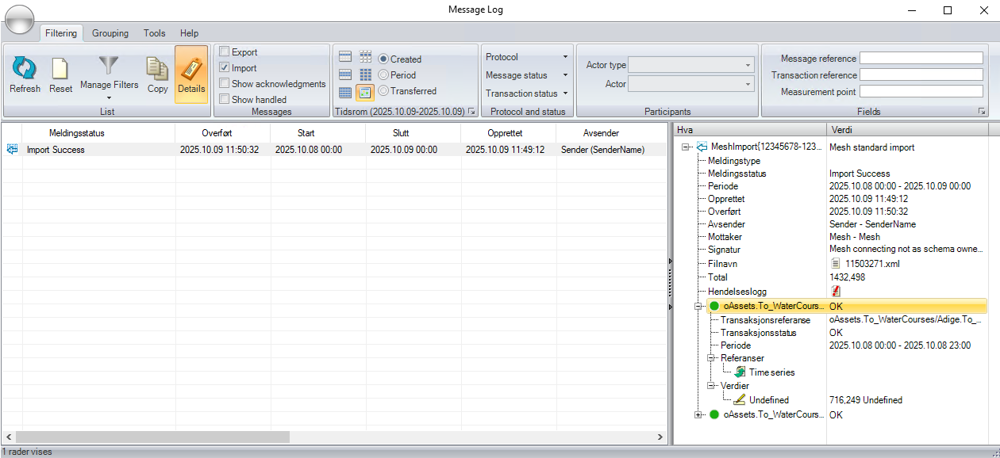

# Import of time series values using Mesh Data Transfer

This document describes how time series values can be imported into Mesh using Mesh Data Transfer and AMQP messages in the
Mesh standard XML format.

The definition of the XML format is found in the [`AMQPmessageTypes.xsd`](./xsd/AMQPmessageTypes.xsd).

- [Import of time series values using Mesh Data Transfer](#import-of-time-series-values-using-mesh-data-transfer)
  - [XML input message structure](#xml-input-message-structure)
    - [Timestamp](#timestamp)
    - [Search format hints](#search-format-hints)
  - [XML response message structure](#xml-response-message-structure)
  - [MessageLog overview](#messagelog-overview)
  - [Examples](#examples)
    - [Message with 3 time series](#message-with-3-time-series)
    - [Acknowledgement successful import](#acknowledgement-successful-import)
    - [Acknowledgement non-successful import](#acknowledgement-non-successful-import)

## XML input message structure

This is an example of the structure of the XML message:

````xml
<?xml version="1.0" encoding="utf-8"?>
<Request xmlns:xsi="http://www.w3.org/2001/XMLSchema-instance"
xmlns:xsd="http://www.w3.org/2001/XMLSchema"
xmlns="http://www.powel.com/SmE/AMQPmessageTypes">
  <MessageId>12345678-1234-1234-1234-123456789012</MessageId>
  <MessageVersion>1.0.0.0</MessageVersion>
  <Sender>SenderName</Sender>
  <Receiver>Mesh</Receiver>
  <CreationDate>2021-01-01T01:00:00+01:00</CreationDate>
  <Inputs>
    <TimeseriesPoints>
      <Points Path="Model/Company/Mesh" Search="*[.Type=ObjectType&amp;&amp;.Name=&quot;ObjectName1&quot;].tsAttribute" DeltaT="PT1H">
        <Segments>
          <Segment Start="2020-08-03T00:00:00Z" End="2020-08-10T13:00:00Z">
            <Point Timestamp="2020-08-03T00:00:00Z" Value="7.26" />
            <Point Timestamp="2020-08-03T01:00:00Z" Value="6.8" />
            ...
            <Point Timestamp="2020-08-10T11:00:00Z" Value="10.9" />
            <Point Timestamp="2020-08-10T12:00:00Z" Value="11.05" />
          </Segment>
        </Segments>
      </Points>
      <Points ...>
      ... and more time series
    </TimeseriesPoints>
  </Inputs>
</Request>
````

Parameters:

- `MessageId` - id of the message, used in the response message to signal success or failure.
- `MessageVersion` - version of the message format, currently only 1.0.0.0 is supported.
- `Sender` - name of the sender (used in lookup for SmG Participant to use when saving information in
SmG Message Log).
- `Receiver` - name of the receiver (always Mesh).
- `CreationDate` - time when the message was created.
- `Inputs/TimeseriesPoints` - contains list of time series with values to be imported.
- `Inputs/TimeseriesPoints/Points` - defines one time series with values to be imported with the following attributes normally used:
  - `Path` - path to a starting point for the search in the Mesh model.
  - `Search` - search for the time series attribute to store the values on relative to the object defined by the Path. **_Note!_** This search must result in exactly one hit to be used in the import.
  - `DeltaT` - the resolution of the data to import defined as `P<days>DT<hours>H<minutes>M<seconds>S` (for example, hourly resolution is `PT1H` and 15 minute resolution is `PT15M`).
- `Inputs/TimeseriesPoints/Points/Segments` - contains a list of time intervals that is inserted or updated with the received values.
- `Inputs/TimeseriesPoints/Points/Segments/Segment` - defines a time interval to be replaced with the received values with the following attributes:
  - `Start` - defines the start (inclusive) of the time interval to insert/replace.
  - `End` - defines the end (exclusive) of the time interval to insert/replace.
- `Inputs/TimeseriesPoints/Points/Segments/Segment/Point` - defines a single value to insert/replace with the following attributes:
  - `Timestamp` - timestamp of the value to insert/replace.
  - `Value` - the value to insert/replace.

### Timestamp

All timestamps in the message shall have timezone defined, either using `Z` (for UTC) or offset from UTC (like `+01:00`).

### Search format hints

The search option used is the same as used in Nimbus, the only difference is that some characters must be replaced to create a valid XML:

- `&` is replaced by `&amp;`
- `"` is replaced by `%quot;`

Other conventions:

- `.` refers to the current object (for example, `.Type=ObjectType` means that the type of the object must be ObjectType).
- `...` refers to the owner of the current object (for example, '...Type=OwnerType` means the the type of the owner must be OwnerType).
- `&amp;&amp;` result in an AND operation (for example, `.Type=ObjectType&amp;&amp;.Name=XXX` means that the type of the object must be ObjectType and the name of the object must be XXX).
- Strings with spaces must be quoted (for example, `.Name=&quot;Unit G1&quot;`).

## XML response message structure

````xml
<?xml version="1.0" encoding="utf-8"?>
<Reply xmlns:xsi="http://www.w3.org/2001/XMLSchema-instance"
xmlns:xsd="http://www.w3.org/2001/XMLSchema"
xmlns="http://www.powel.com/SmE/AMQPmessageTypes">
  <RequestMessageId>12345678-1234-1234-1234-123456789012</RequestMessageId>
  <MessageVersion>1.0.0.0</MessageVersion>
  <ImportSuccess>false</ImportSuccess>
  <ImportError>This is the error text from MESH</ImportError>
</Reply>
````

Parameters:

- `RequestMessageId` - the same id as used as MessageId in the input message that this is a response of.
- `MessageVersion` - version of the message format, currently only 1.0.0.0 is supported.
- `ImportSuccess` - flag to signal if import was successful (true) or not (false).
- `ImportError` - (optional) error text if import failed.

## MessageLog overview

When a message is successfully received and translated by Mesh Data Transfer, it will also be visible in the MessageLog application:



## Examples

### Message with 3 time series

````xml
<?xml version="1.0" encoding="utf-8"?>
<Request xmlns:xsi="http://www.w3.org/2001/XMLSchema-instance" xmlns:xsd="http://www.w3.org/2001/XMLSchema" xmlns="http://www.powel.com/SmE/AMQPmessageTypes">
  <MessageId>12345678-1234-1234-1234-123456789012</MessageId>
  <MessageVersion>1.0.0.0</MessageVersion>
  <Sender>SenderName</Sender>
  <Receiver>Mesh</Receiver>
  <CreationDate>2020-12-31T23:00:00Z</CreationDate>
  <Inputs>
    <TimeseriesPoints>
      <Points Path="Model/Company/Mesh" Search="*[.Type=MarketSessionImportData&amp;&amp;...Type=ID4&amp;&amp;.Name=Unit1].Obligation" DeltaT="PT15M">
        <Segments>
          <Segment Start="2023-06-07T22:00:00Z" End="2023-06-08T22:00:00Z">
            <Point Timestamp="2023-06-07T22:00:00Z" Value="35" />
            <Point Timestamp="2023-06-07T22:15:00Z" Value="35" />
            <Point Timestamp="2023-06-07T22:30:00Z" Value="35" />
            <Point Timestamp="2023-06-07T22:45:00Z" Value="35" />
            <Point Timestamp="2023-06-07T23:00:00Z" Value="35" />
            <Point Timestamp="2023-06-07T23:15:00Z" Value="35" />
            <Point Timestamp="2023-06-07T23:30:00Z" Value="35" />
            <Point Timestamp="2023-06-07T23:45:00Z" Value="35" />
            <Point Timestamp="2023-06-08T00:00:00Z" Value="35" />
            <Point Timestamp="2023-06-08T00:15:00Z" Value="35" />
            <Point Timestamp="2023-06-08T00:30:00Z" Value="35" />
            <Point Timestamp="2023-06-08T00:45:00Z" Value="35" />
            <Point Timestamp="2023-06-08T01:00:00Z" Value="35" />
            <Point Timestamp="2023-06-08T01:15:00Z" Value="35" />
            <Point Timestamp="2023-06-08T01:30:00Z" Value="35" />
            <Point Timestamp="2023-06-08T01:45:00Z" Value="35" />
            <Point Timestamp="2023-06-08T02:00:00Z" Value="35" />
            <Point Timestamp="2023-06-08T02:15:00Z" Value="35" />
            <Point Timestamp="2023-06-08T02:30:00Z" Value="35" />
            <Point Timestamp="2023-06-08T02:45:00Z" Value="35" />
            <Point Timestamp="2023-06-08T03:00:00Z" Value="35" />
            <Point Timestamp="2023-06-08T03:15:00Z" Value="35" />
            <Point Timestamp="2023-06-08T03:30:00Z" Value="35" />
            <Point Timestamp="2023-06-08T03:45:00Z" Value="35" />
            <Point Timestamp="2023-06-08T04:00:00Z" Value="35" />
            <Point Timestamp="2023-06-08T04:15:00Z" Value="35" />
            <Point Timestamp="2023-06-08T04:30:00Z" Value="35" />
            <Point Timestamp="2023-06-08T04:45:00Z" Value="32.187" />
            <Point Timestamp="2023-06-08T05:00:00Z" Value="26.562" />
            <Point Timestamp="2023-06-08T05:15:00Z" Value="23.75" />
            <Point Timestamp="2023-06-08T05:30:00Z" Value="23.75" />
            <Point Timestamp="2023-06-08T05:45:00Z" Value="23.75" />
            <Point Timestamp="2023-06-08T06:00:00Z" Value="23.75" />
            <Point Timestamp="2023-06-08T06:15:00Z" Value="23.75" />
            <Point Timestamp="2023-06-08T06:30:00Z" Value="23.75" />
            <Point Timestamp="2023-06-08T06:45:00Z" Value="23.75" />
            <Point Timestamp="2023-06-08T07:00:00Z" Value="23.75" />
            <Point Timestamp="2023-06-08T07:15:00Z" Value="23.75" />
            <Point Timestamp="2023-06-08T07:30:00Z" Value="23.75" />
            <Point Timestamp="2023-06-08T07:45:00Z" Value="23.75" />
            <Point Timestamp="2023-06-08T08:00:00Z" Value="23.75" />
            <Point Timestamp="2023-06-08T08:15:00Z" Value="23.75" />
            <Point Timestamp="2023-06-08T08:30:00Z" Value="23.75" />
            <Point Timestamp="2023-06-08T08:45:00Z" Value="23.75" />
            <Point Timestamp="2023-06-08T09:00:00Z" Value="23.75" />
            <Point Timestamp="2023-06-08T09:15:00Z" Value="23.75" />
            <Point Timestamp="2023-06-08T09:30:00Z" Value="23.75" />
            <Point Timestamp="2023-06-08T09:45:00Z" Value="23.75" />
            <Point Timestamp="2023-06-08T10:00:00Z" Value="23.75" />
            <Point Timestamp="2023-06-08T10:15:00Z" Value="23.75" />
            <Point Timestamp="2023-06-08T10:30:00Z" Value="23.75" />
            <Point Timestamp="2023-06-08T10:45:00Z" Value="23.75" />
            <Point Timestamp="2023-06-08T11:00:00Z" Value="23.75" />
            <Point Timestamp="2023-06-08T11:15:00Z" Value="23.75" />
            <Point Timestamp="2023-06-08T11:30:00Z" Value="23.75" />
            <Point Timestamp="2023-06-08T11:45:00Z" Value="23.75" />
            <Point Timestamp="2023-06-08T12:00:00Z" Value="23.75" />
            <Point Timestamp="2023-06-08T12:15:00Z" Value="23.75" />
            <Point Timestamp="2023-06-08T12:30:00Z" Value="23.75" />
            <Point Timestamp="2023-06-08T12:45:00Z" Value="23.75" />
            <Point Timestamp="2023-06-08T13:00:00Z" Value="23.75" />
            <Point Timestamp="2023-06-08T13:15:00Z" Value="23.75" />
            <Point Timestamp="2023-06-08T13:30:00Z" Value="23.75" />
            <Point Timestamp="2023-06-08T13:45:00Z" Value="23.75" />
            <Point Timestamp="2023-06-08T14:00:00Z" Value="23.75" />
            <Point Timestamp="2023-06-08T14:15:00Z" Value="23.75" />
            <Point Timestamp="2023-06-08T14:30:00Z" Value="23.75" />
            <Point Timestamp="2023-06-08T14:45:00Z" Value="23.75" />
            <Point Timestamp="2023-06-08T15:00:00Z" Value="23.75" />
            <Point Timestamp="2023-06-08T15:15:00Z" Value="23.75" />
            <Point Timestamp="2023-06-08T15:30:00Z" Value="23.75" />
            <Point Timestamp="2023-06-08T15:45:00Z" Value="26.562" />
            <Point Timestamp="2023-06-08T16:00:00Z" Value="32.187" />
            <Point Timestamp="2023-06-08T16:15:00Z" Value="35" />
            <Point Timestamp="2023-06-08T16:30:00Z" Value="35" />
            <Point Timestamp="2023-06-08T16:45:00Z" Value="35" />
            <Point Timestamp="2023-06-08T17:00:00Z" Value="35" />
            <Point Timestamp="2023-06-08T17:15:00Z" Value="35" />
            <Point Timestamp="2023-06-08T17:30:00Z" Value="35" />
            <Point Timestamp="2023-06-08T17:45:00Z" Value="35" />
            <Point Timestamp="2023-06-08T18:00:00Z" Value="35" />
            <Point Timestamp="2023-06-08T18:15:00Z" Value="35" />
            <Point Timestamp="2023-06-08T18:30:00Z" Value="35" />
            <Point Timestamp="2023-06-08T18:45:00Z" Value="35" />
            <Point Timestamp="2023-06-08T19:00:00Z" Value="35" />
            <Point Timestamp="2023-06-08T19:15:00Z" Value="35" />
            <Point Timestamp="2023-06-08T19:30:00Z" Value="35" />
            <Point Timestamp="2023-06-08T19:45:00Z" Value="35" />
            <Point Timestamp="2023-06-08T20:00:00Z" Value="35" />
            <Point Timestamp="2023-06-08T20:15:00Z" Value="35" />
            <Point Timestamp="2023-06-08T20:30:00Z" Value="35" />
            <Point Timestamp="2023-06-08T20:45:00Z" Value="35" />
            <Point Timestamp="2023-06-08T21:00:00Z" Value="35" />
            <Point Timestamp="2023-06-08T21:15:00Z" Value="35" />
            <Point Timestamp="2023-06-08T21:30:00Z" Value="35" />
            <Point Timestamp="2023-06-08T21:45:00Z" Value="35" />
          </Segment>
        </Segments>
      </Points>
      <Points Path="Model/Company/Mesh" Search="*[.Type=MarketSessionImportData&amp;&amp;...Type=ID4&amp;&amp;.Name=Unit1].SbUp" DeltaT="PT15M">
        <Segments>
          <Segment Start="2023-06-07T22:00:00Z" End="2023-06-08T22:00:00Z">
            <Point Timestamp="2023-06-07T22:00:00Z" Value="0" />
            <Point Timestamp="2023-06-07T22:15:00Z" Value="0" />
            <Point Timestamp="2023-06-07T22:30:00Z" Value="0" />
            <Point Timestamp="2023-06-07T22:45:00Z" Value="0" />
            <Point Timestamp="2023-06-07T23:00:00Z" Value="0" />
            <Point Timestamp="2023-06-07T23:15:00Z" Value="0" />
            <Point Timestamp="2023-06-07T23:30:00Z" Value="0" />
            <Point Timestamp="2023-06-07T23:45:00Z" Value="0" />
            <Point Timestamp="2023-06-08T00:00:00Z" Value="0" />
            <Point Timestamp="2023-06-08T00:15:00Z" Value="0" />
            <Point Timestamp="2023-06-08T00:30:00Z" Value="0" />
            <Point Timestamp="2023-06-08T00:45:00Z" Value="0" />
            <Point Timestamp="2023-06-08T01:00:00Z" Value="0" />
            <Point Timestamp="2023-06-08T01:15:00Z" Value="0" />
            <Point Timestamp="2023-06-08T01:30:00Z" Value="0" />
            <Point Timestamp="2023-06-08T01:45:00Z" Value="0" />
            <Point Timestamp="2023-06-08T02:00:00Z" Value="0" />
            <Point Timestamp="2023-06-08T02:15:00Z" Value="0" />
            <Point Timestamp="2023-06-08T02:30:00Z" Value="0" />
            <Point Timestamp="2023-06-08T02:45:00Z" Value="0" />
            <Point Timestamp="2023-06-08T03:00:00Z" Value="0" />
            <Point Timestamp="2023-06-08T03:15:00Z" Value="0" />
            <Point Timestamp="2023-06-08T03:30:00Z" Value="0" />
            <Point Timestamp="2023-06-08T03:45:00Z" Value="0" />
            <Point Timestamp="2023-06-08T04:00:00Z" Value="0" />
            <Point Timestamp="2023-06-08T04:15:00Z" Value="0" />
            <Point Timestamp="2023-06-08T04:30:00Z" Value="0" />
            <Point Timestamp="2023-06-08T04:45:00Z" Value="0" />
            <Point Timestamp="2023-06-08T05:00:00Z" Value="0" />
            <Point Timestamp="2023-06-08T05:15:00Z" Value="0" />
            <Point Timestamp="2023-06-08T05:30:00Z" Value="0" />
            <Point Timestamp="2023-06-08T05:45:00Z" Value="0" />
            <Point Timestamp="2023-06-08T06:00:00Z" Value="0" />
            <Point Timestamp="2023-06-08T06:15:00Z" Value="0" />
            <Point Timestamp="2023-06-08T06:30:00Z" Value="0" />
            <Point Timestamp="2023-06-08T06:45:00Z" Value="0" />
            <Point Timestamp="2023-06-08T07:00:00Z" Value="0" />
            <Point Timestamp="2023-06-08T07:15:00Z" Value="0" />
            <Point Timestamp="2023-06-08T07:30:00Z" Value="0" />
            <Point Timestamp="2023-06-08T07:45:00Z" Value="0" />
            <Point Timestamp="2023-06-08T08:00:00Z" Value="0" />
            <Point Timestamp="2023-06-08T08:15:00Z" Value="0" />
            <Point Timestamp="2023-06-08T08:30:00Z" Value="0" />
            <Point Timestamp="2023-06-08T08:45:00Z" Value="0" />
            <Point Timestamp="2023-06-08T09:00:00Z" Value="0" />
            <Point Timestamp="2023-06-08T09:15:00Z" Value="0" />
            <Point Timestamp="2023-06-08T09:30:00Z" Value="0" />
            <Point Timestamp="2023-06-08T09:45:00Z" Value="0" />
            <Point Timestamp="2023-06-08T10:00:00Z" Value="0" />
            <Point Timestamp="2023-06-08T10:15:00Z" Value="0" />
            <Point Timestamp="2023-06-08T10:30:00Z" Value="0" />
            <Point Timestamp="2023-06-08T10:45:00Z" Value="0" />
            <Point Timestamp="2023-06-08T11:00:00Z" Value="0" />
            <Point Timestamp="2023-06-08T11:15:00Z" Value="0" />
            <Point Timestamp="2023-06-08T11:30:00Z" Value="0" />
            <Point Timestamp="2023-06-08T11:45:00Z" Value="0" />
            <Point Timestamp="2023-06-08T12:00:00Z" Value="0" />
            <Point Timestamp="2023-06-08T12:15:00Z" Value="0" />
            <Point Timestamp="2023-06-08T12:30:00Z" Value="0" />
            <Point Timestamp="2023-06-08T12:45:00Z" Value="0" />
            <Point Timestamp="2023-06-08T13:00:00Z" Value="0" />
            <Point Timestamp="2023-06-08T13:15:00Z" Value="0" />
            <Point Timestamp="2023-06-08T13:30:00Z" Value="0" />
            <Point Timestamp="2023-06-08T13:45:00Z" Value="0" />
            <Point Timestamp="2023-06-08T14:00:00Z" Value="0" />
            <Point Timestamp="2023-06-08T14:15:00Z" Value="0" />
            <Point Timestamp="2023-06-08T14:30:00Z" Value="0" />
            <Point Timestamp="2023-06-08T14:45:00Z" Value="0" />
            <Point Timestamp="2023-06-08T15:00:00Z" Value="0" />
            <Point Timestamp="2023-06-08T15:15:00Z" Value="0" />
            <Point Timestamp="2023-06-08T15:30:00Z" Value="0" />
            <Point Timestamp="2023-06-08T15:45:00Z" Value="0" />
            <Point Timestamp="2023-06-08T16:00:00Z" Value="0" />
            <Point Timestamp="2023-06-08T16:15:00Z" Value="0" />
            <Point Timestamp="2023-06-08T16:30:00Z" Value="0" />
            <Point Timestamp="2023-06-08T16:45:00Z" Value="0" />
            <Point Timestamp="2023-06-08T17:00:00Z" Value="0" />
            <Point Timestamp="2023-06-08T17:15:00Z" Value="0" />
            <Point Timestamp="2023-06-08T17:30:00Z" Value="0" />
            <Point Timestamp="2023-06-08T17:45:00Z" Value="0" />
            <Point Timestamp="2023-06-08T18:00:00Z" Value="0" />
            <Point Timestamp="2023-06-08T18:15:00Z" Value="0" />
            <Point Timestamp="2023-06-08T18:30:00Z" Value="0" />
            <Point Timestamp="2023-06-08T18:45:00Z" Value="0" />
            <Point Timestamp="2023-06-08T19:00:00Z" Value="0" />
            <Point Timestamp="2023-06-08T19:15:00Z" Value="0" />
            <Point Timestamp="2023-06-08T19:30:00Z" Value="0" />
            <Point Timestamp="2023-06-08T19:45:00Z" Value="0" />
            <Point Timestamp="2023-06-08T20:00:00Z" Value="0" />
            <Point Timestamp="2023-06-08T20:15:00Z" Value="0" />
            <Point Timestamp="2023-06-08T20:30:00Z" Value="0" />
            <Point Timestamp="2023-06-08T20:45:00Z" Value="0" />
            <Point Timestamp="2023-06-08T21:00:00Z" Value="0" />
            <Point Timestamp="2023-06-08T21:15:00Z" Value="0" />
            <Point Timestamp="2023-06-08T21:30:00Z" Value="0" />
            <Point Timestamp="2023-06-08T21:45:00Z" Value="0" />
          </Segment>
        </Segments>
      </Points>
      <Points Path="Model/Company/Mesh" Search="*[.Type=MarketSessionImportData&amp;&amp;...Type=ID4&amp;&amp;.Name=Unit1].SbDown" DeltaT="PT15M">
        <Segments>
          <Segment Start="2023-06-07T22:00:00Z" End="2023-06-08T22:00:00Z">
            <Point Timestamp="2023-06-07T22:00:00Z" Value="0" />
            <Point Timestamp="2023-06-07T22:15:00Z" Value="0" />
            <Point Timestamp="2023-06-07T22:30:00Z" Value="0" />
            <Point Timestamp="2023-06-07T22:45:00Z" Value="0" />
            <Point Timestamp="2023-06-07T23:00:00Z" Value="17" />
            <Point Timestamp="2023-06-07T23:15:00Z" Value="17" />
            <Point Timestamp="2023-06-07T23:30:00Z" Value="17" />
            <Point Timestamp="2023-06-07T23:45:00Z" Value="17" />
            <Point Timestamp="2023-06-08T00:00:00Z" Value="0" />
            <Point Timestamp="2023-06-08T00:15:00Z" Value="0" />
            <Point Timestamp="2023-06-08T00:30:00Z" Value="0" />
            <Point Timestamp="2023-06-08T00:45:00Z" Value="0" />
            <Point Timestamp="2023-06-08T01:00:00Z" Value="0" />
            <Point Timestamp="2023-06-08T01:15:00Z" Value="0" />
            <Point Timestamp="2023-06-08T01:30:00Z" Value="0" />
            <Point Timestamp="2023-06-08T01:45:00Z" Value="0" />
            <Point Timestamp="2023-06-08T02:00:00Z" Value="0" />
            <Point Timestamp="2023-06-08T02:15:00Z" Value="0" />
            <Point Timestamp="2023-06-08T02:30:00Z" Value="0" />
            <Point Timestamp="2023-06-08T02:45:00Z" Value="0" />
            <Point Timestamp="2023-06-08T03:00:00Z" Value="0" />
            <Point Timestamp="2023-06-08T03:15:00Z" Value="0" />
            <Point Timestamp="2023-06-08T03:30:00Z" Value="0" />
            <Point Timestamp="2023-06-08T03:45:00Z" Value="0" />
            <Point Timestamp="2023-06-08T04:00:00Z" Value="0" />
            <Point Timestamp="2023-06-08T04:15:00Z" Value="0" />
            <Point Timestamp="2023-06-08T04:30:00Z" Value="0" />
            <Point Timestamp="2023-06-08T04:45:00Z" Value="0" />
            <Point Timestamp="2023-06-08T05:00:00Z" Value="0" />
            <Point Timestamp="2023-06-08T05:15:00Z" Value="0" />
            <Point Timestamp="2023-06-08T05:30:00Z" Value="0" />
            <Point Timestamp="2023-06-08T05:45:00Z" Value="0" />
            <Point Timestamp="2023-06-08T06:00:00Z" Value="0" />
            <Point Timestamp="2023-06-08T06:15:00Z" Value="0" />
            <Point Timestamp="2023-06-08T06:30:00Z" Value="0" />
            <Point Timestamp="2023-06-08T06:45:00Z" Value="0" />
            <Point Timestamp="2023-06-08T07:00:00Z" Value="0" />
            <Point Timestamp="2023-06-08T07:15:00Z" Value="0" />
            <Point Timestamp="2023-06-08T07:30:00Z" Value="0" />
            <Point Timestamp="2023-06-08T07:45:00Z" Value="0" />
            <Point Timestamp="2023-06-08T08:00:00Z" Value="0" />
            <Point Timestamp="2023-06-08T08:15:00Z" Value="0" />
            <Point Timestamp="2023-06-08T08:30:00Z" Value="0" />
            <Point Timestamp="2023-06-08T08:45:00Z" Value="0" />
            <Point Timestamp="2023-06-08T09:00:00Z" Value="0" />
            <Point Timestamp="2023-06-08T09:15:00Z" Value="0" />
            <Point Timestamp="2023-06-08T09:30:00Z" Value="0" />
            <Point Timestamp="2023-06-08T09:45:00Z" Value="0" />
            <Point Timestamp="2023-06-08T10:00:00Z" Value="0" />
            <Point Timestamp="2023-06-08T10:15:00Z" Value="0" />
            <Point Timestamp="2023-06-08T10:30:00Z" Value="0" />
            <Point Timestamp="2023-06-08T10:45:00Z" Value="0" />
            <Point Timestamp="2023-06-08T11:00:00Z" Value="0" />
            <Point Timestamp="2023-06-08T11:15:00Z" Value="0" />
            <Point Timestamp="2023-06-08T11:30:00Z" Value="0" />
            <Point Timestamp="2023-06-08T11:45:00Z" Value="0" />
            <Point Timestamp="2023-06-08T12:00:00Z" Value="0" />
            <Point Timestamp="2023-06-08T12:15:00Z" Value="0" />
            <Point Timestamp="2023-06-08T12:30:00Z" Value="0" />
            <Point Timestamp="2023-06-08T12:45:00Z" Value="0" />
            <Point Timestamp="2023-06-08T13:00:00Z" Value="0" />
            <Point Timestamp="2023-06-08T13:15:00Z" Value="0" />
            <Point Timestamp="2023-06-08T13:30:00Z" Value="0" />
            <Point Timestamp="2023-06-08T13:45:00Z" Value="0" />
            <Point Timestamp="2023-06-08T14:00:00Z" Value="0" />
            <Point Timestamp="2023-06-08T14:15:00Z" Value="0" />
            <Point Timestamp="2023-06-08T14:30:00Z" Value="0" />
            <Point Timestamp="2023-06-08T14:45:00Z" Value="0" />
            <Point Timestamp="2023-06-08T15:00:00Z" Value="0" />
            <Point Timestamp="2023-06-08T15:15:00Z" Value="0" />
            <Point Timestamp="2023-06-08T15:30:00Z" Value="0" />
            <Point Timestamp="2023-06-08T15:45:00Z" Value="0" />
            <Point Timestamp="2023-06-08T16:00:00Z" Value="0" />
            <Point Timestamp="2023-06-08T16:15:00Z" Value="0" />
            <Point Timestamp="2023-06-08T16:30:00Z" Value="0" />
            <Point Timestamp="2023-06-08T16:45:00Z" Value="0" />
            <Point Timestamp="2023-06-08T17:00:00Z" Value="0" />
            <Point Timestamp="2023-06-08T17:15:00Z" Value="0" />
            <Point Timestamp="2023-06-08T17:30:00Z" Value="0" />
            <Point Timestamp="2023-06-08T17:45:00Z" Value="0" />
            <Point Timestamp="2023-06-08T18:00:00Z" Value="0" />
            <Point Timestamp="2023-06-08T18:15:00Z" Value="0" />
            <Point Timestamp="2023-06-08T18:30:00Z" Value="0" />
            <Point Timestamp="2023-06-08T18:45:00Z" Value="0" />
            <Point Timestamp="2023-06-08T19:00:00Z" Value="0" />
            <Point Timestamp="2023-06-08T19:15:00Z" Value="0" />
            <Point Timestamp="2023-06-08T19:30:00Z" Value="0" />
            <Point Timestamp="2023-06-08T19:45:00Z" Value="0" />
            <Point Timestamp="2023-06-08T20:00:00Z" Value="0" />
            <Point Timestamp="2023-06-08T20:15:00Z" Value="0" />
            <Point Timestamp="2023-06-08T20:30:00Z" Value="0" />
            <Point Timestamp="2023-06-08T20:45:00Z" Value="0" />
            <Point Timestamp="2023-06-08T21:00:00Z" Value="0" />
            <Point Timestamp="2023-06-08T21:15:00Z" Value="0" />
            <Point Timestamp="2023-06-08T21:30:00Z" Value="0" />
            <Point Timestamp="2023-06-08T21:45:00Z" Value="0" />
          </Segment>
        </Segments>
      </Points>
    </TimeseriesPoints>
  </Inputs>
</Request>
````

### Acknowledgement successful import

````xml
<?xml version="1.0" encoding="utf-8"?>
<Reply xmlns:xsi="http://www.w3.org/2001/XMLSchema-instance"
xmlns:xsd="http://www.w3.org/2001/XMLSchema"
xmlns="http://www.powel.com/SmE/AMQPmessageTypes">
  <RequestMessageId>12345678-1234-1234-1234-123456789012</RequestMessageId>
  <MessageVersion>1.0.0.0</MessageVersion>
  <ImportSuccess>true</ImportSuccess>
</Reply>
````

### Acknowledgement non-successful import

````xml
<?xml version="1.0" encoding="utf-8"?>
<Reply xmlns:xsi="http://www.w3.org/2001/XMLSchema-instance"
xmlns:xsd="http://www.w3.org/2001/XMLSchema"
xmlns="http://www.powel.com/SmE/AMQPmessageTypes">
  <RequestMessageId>12345678-1234-1234-1234-123456789012</RequestMessageId>
  <MessageVersion>1.0.0.0</MessageVersion>
  <ImportSuccess>false</ImportSuccess>
  <ImportError>This is the error text from MESH</ImportError>
</Reply>
````
