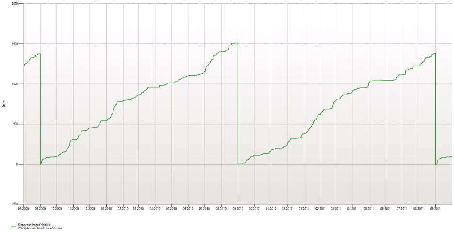
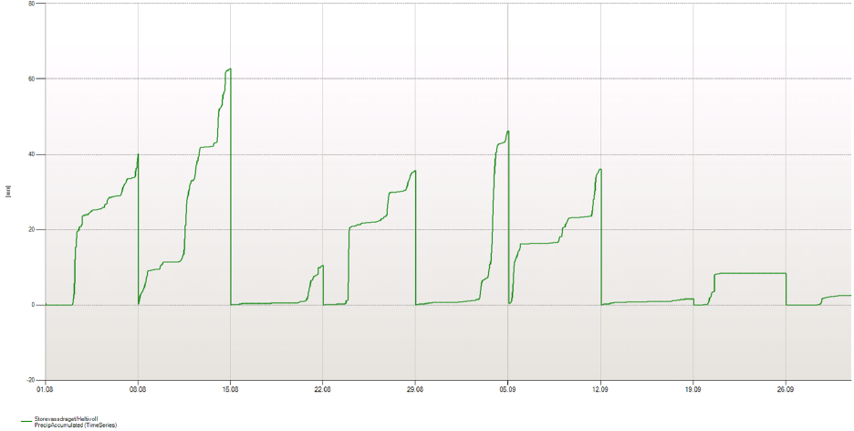
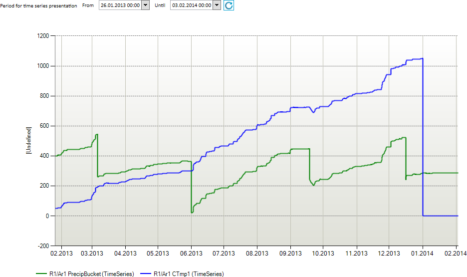
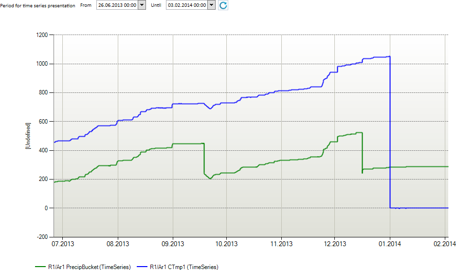

# ACCUMULATE

Accumulates values for some periods for a time series. When entering a new sub
period, the accumulation buffer is reset.

## Syntax

- ACCUMULATE(d,s,t[,d,d])
- ACCUMULATE(t,[s],s)
- ACCUMULATE(t,s,d)

**Description** - syntax 1

| # | Type | Description |
|---|---|---|
| 1 | d | Initial value |
| 2 | s | Start time specification. May be a macro definition or a fully specified time point on the <br>YYYYMMDDhhmmssxxx format. <br>A calendar name may be used as prefix on this specification. <br>Default is current standard time (utc+1 in Norwegian setup). |
| 3 | t | Input data series (fixed interval). |
| 4 | d | Multiplication factor A. If omitted, value is 1.0. |
| 5 | d | Offset factor B. If omitted, value is 0. |

**Description** - syntax 2

| # | Type | Description |
|---|---|---|
| 1 | t | Input time series (fixed interval). |
| 2 | s | Optional. Accumulation from start or end of the interval given in the next argument. <br>’>’ means from the start of the interval and forward. |
| 3 | s | Accumulation interval. Eg. ‘DAY’, ‘WEEK’, ‘MONTH, ‘YEAR’. <br>You can set accumulation period to HYDYEAR, i.e. from 1. September <br>until next 1. September (standard calendar). <br>You can also use a prefix to overrule the standard time (utc+1 in Norwegian setup). <br>Eg. ‘UTCWEEK’. |

**Description** - syntax 3

| Type | Description |
|---|---|
| t | Input data series (fixed interval). |
| s | Accumulation from start or end of the interval given in the next argument. <br>’>’ means from the start of the interval and forward. ’<’ means from the end of <br>the interval and backwards. |
| d | Accumulation period given as number of points. |

## Example 1

Accumulation syntax 1 with five arguments

`@ACCUMULATE(0.0, 'UTC20140101', @t('TsAccInput'), 10.0, 0.0)`

The example starts accumulation at 1. January (UTC calendar) with initial value
0.0 and value at next time point t is

0.0 + 10.0 * TsAccInput[t] + 0.0

or

Result[t] = initialValue + factor A * TsAccInput[t] + factor B

for the first value and

Result[t] = Result[t-1] + factor A * TsAccInput[t] + factor B

for the next values.

## Example 2

Accumulation syntax 1 with three arguments (uses default values for factor A and B (argument four and five))

`@ACCUMULATE(0.0, 'YEAR+10d', @t('TsAccInput'))`

The example starts accumulation 10th of January (UTC calendar) with initial
value 0.0. No multiplication or offset factors are used.

## Example 3

Accumulation syntax 2

`## = @ACCUMULATE(@t('Precipitation_hour_operative'),'>', 'HYDYEAR')`

Accumulates the precipitation for each hydrological year.



## Example 4

Accumulation syntax 2 with second argument omitted.

`## = @ACCUMULATE(@t('Precipitation_hour_operative'),'WEEK')`

Accumulates the precipitation for each week.



## Example 5

Accumulation of bucket precipitation using explicit extended periods

The following example is a general expression for a year's accumulation of
precipitation combined with the [Time](../functions/time.md) function and extended
period functions:

```
 #
 1  tstart = @Time('YEAR',@Time('SOP'))
 2  viewEndTime = @Time('EOP')
 3  @PushExtPeriod('x', tstart - @TimeSpan('HOUR'), viewEndTime)
 4  Precip = @t('PrecipBucket') * 1.0
 5  @PopExtPeriod('x')
 6
 7  @PushExtPeriod('y', tstart, @Time('EOP'))
 8  Delta = @DELTA(Precip)
 9  DeltaClipped = Delta >= -2 ? Delta : 0
10  @PopExtPeriod('y')
11  ## = @ACCUMULATE(DeltaClipped, '>','YEAR')
```

Some comments to the expressions above (ref. line numbers #)

- *#1* Finds the start time for the chart presentation. This example uses the YEAR macro (the start of the year), combined with a reference time indicating the report start. If the reference time is not included, the report displays the current year. See also description of the Time function.
- *#2*  The end time for the report.
- *#3* Extend relevant calculation period with one hour before the relevant start year. This example shows a linear time arithmetic by using `tstart` with the length of an hour in the internal time format. This gives necessary data to the DELTA function in the next block.
- *#4* This example gives only a dummy calculation (multiplied with 1), but in reality you would calculate with MIX, validate and correct functions.
- *#9* Removes large negative contributions on the required period.

In the following example from Nimbus, the function has accumulated the
precipitation from the turn of the year. The start value (tstart), >0, is
displayed in the blue curve:

  

In the following example from Nimbus, the presentation starts later in the year
than in the previous example. The start value (tsstar) is displayed in the blue
chart:

  
