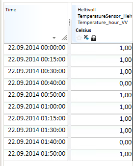
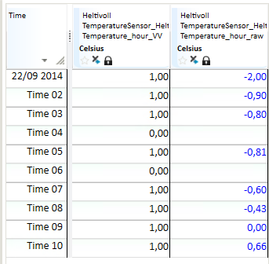
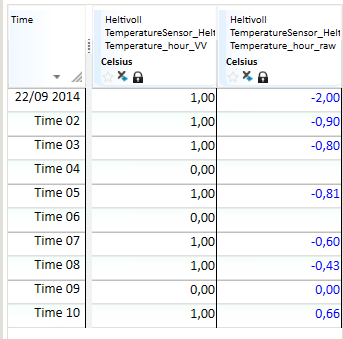
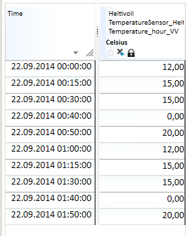
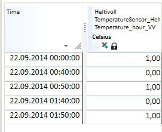

# BOOL
## About the function
This function converts expressions to purely logical values, i.e. `1` for true
and `0` for false.

In general, all the values in the input are converted to true (even zeroes), and
only NaN is converted to false. However, the BOOL(t,d,s) variant allows to
specify a numeric value which will also be converted to false if present in the
input; this is normally set to 0.

If the input is a time series, the output is a time series with the same
resolution as the input time series.

## Syntax
- BOOL(t)
- BOOL(d)
- BOOL(t,d[,s])


| # | Type | Description |
|---|---|---|
| 1 | t or d | For BOOL(t), t is a time series. For BOOL(d), d is either a numerical value or NaN. |
| 2 | d | For BOOL(t,d,s), d is a number which will be converted to false if present in t. |
| 3 | s | If present in BOOL(t,d,s), it must be set to "COMPRESS". If the input is a break point time series, this causes consecutive equal values in the output to be removed. |


  

## Examples
### Example 1: 
```
@BOOL(d)
@BOOL(NaN) Returns 0.
@BOOL(0) Returns 1.
```
Only NaN is converted to false.

### Example 2: @BOOL(t)
  `Temperature_hour_VV = @BOOL(@t('Temperature_hour_raw'))`

  All values are set to true (1) except from NaN, which is false (0), e.g.

  


### Example 3: @BOOL(t,d)
  `Temperature_hour_VV = @BOOL(@t('Temperature_hour_raw'),0)`

  Returns a time series with values:

- 1 when the value in the input series exist and is different from 0.
- 0 when the value in the input series is 0 or missing (NaN).


  For example:

  


### Example 4: @BOOL(t,d,s)
  If we have the following input time series:

TsBrp =
@TIME_MASK('HOUR',{'HOUR','HOUR+15x','HOUR+30x','HOUR+40x','HOUR+50x'},{12,15,15,0,20},'VARINT')

  

Using the following expression, we can convert the input to the time series
below:

  `Temperature_hour_VV = @BOOL(TsBrp,0,'COMPRESS')`

  
