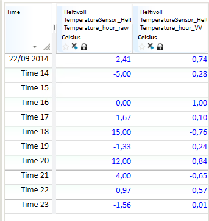

## COS
## About the function
This function is used to calculate the cosine of a time series. **Note!** The
values of the input are in radians.

## Syntax
- COS(t)

| # | Type | Description |
|---|---|---|
| 1 | t | Time series |

## Example
`Temperature_hour_VV = @COS(@t('Temperature_hour_raw'))`

