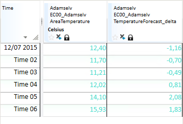

## DELTA

### About the function

Finds the difference between values in a time
series. A typical usage is to calculate the change between value at a time point and the previous time point, but there are other options that are controlled by the arguments to the function.

The result series has the same resolution as the input time series.

### Syntax

- DELTA(t[,d|s])

### Description

| # | Type | Description |
|---|---|---|
| 1 | t | Time series, fixed interval series or breakpoint. Finds the difference between the current value and the previous value in the time series used in the argument. |
| 2 | d or s | Optional. If argument 2 is set to a number different from 0, the value is calculated as the difference between the next value and the current value. If using the number 0, the calculation is equal to the default setting in argument 1. If the second argument is a text it is assumed to be a time macro symbol. The time macro must equal to or be coarser than the resolution of the input time series. Using a time macro > than 0, the function calculates the value as the difference between the next value representing the time macro step and the current value.|

The function can be described like this:

DELTA(t): res(t) = y(t) – y(t-1) Second argument omitted or has value 0

DELTA(t,number≠0): res(t) = y(t+1) – y(t) Second argument has value ≠0

DELTA(t,’+2h’): res(t) = y(t+2h) – y(t) Second argument has value ‘+2h’

DELTA(t,’-2h’): res(t) = y(t) – y(t -2h) Second argument has value ‘-2h’

The input time series might be a fixed interval series or a variable interval
series.

### Examples

#### Example 1

H_Ts1 is an hourly time series with some empty values.

`Result = @DELTA(@t('.H_Ts1'))`

```
| Time | H_Ts1 | Result |
|---|---|---|
| 2021-12-31T22:00:00Z | nan        | nan        |
| 2021-12-31T23:00:00Z |      -1.00 |      -1.00 |
| 2022-01-01T00:00:00Z |       0.00 |       1.00 |
| 2022-01-01T01:00:00Z |      10.00 |      10.00 |
| 2022-01-01T02:00:00Z | nan        |     -10.00 |
| 2022-01-01T03:00:00Z |   20000.00 |   20000.00 |
| 2022-01-01T04:00:00Z |   12500.00 |   -7500.00 |
| 2022-01-01T05:00:00Z |       1.00 |  -12499.00 |
| 2022-01-01T06:00:00Z |   12500.00 |   12499.00 |
| 2022-01-01T07:00:00Z |      10.00 |  -12490.00 |
| 2022-01-01T08:00:00Z |      10.00 |       0.00 |
```

As the result series shows, an empty value is treated as 0 in these delta calculations.

#### Example 2

`Result = @DELTA(@t('.H_Ts1'),'+2h')`

| Time | H_Ts1 | Result |
|---|---|---|
| 2021-12-31T22:00:00Z | nan        |       0.00 |
| 2021-12-31T23:00:00Z |      -1.00 |      11.00 |
| 2022-01-01T00:00:00Z |       0.00 |      -0.00 |
| 2022-01-01T01:00:00Z |      10.00 |   19990.00 |
| 2022-01-01T02:00:00Z | nan        |   12500.00 |
| 2022-01-01T03:00:00Z |   20000.00 |  -19999.00 |
| 2022-01-01T04:00:00Z |   12500.00 |       0.00 |
| 2022-01-01T05:00:00Z |       1.00 |       9.00 |
| 2022-01-01T06:00:00Z |   12500.00 |  -12490.00 |
| 2022-01-01T07:00:00Z |      10.00 |       0.00 |
| 2022-01-01T08:00:00Z |      10.00 |       0.00 |

In this case, a value at time t is based on the difference between the value 2 hours ahead and the value at t.

#### Example 3

BP_Ts1 is a time series with breakpoint resolution.

`Result = @DELTA(@t('.BP_Ts1'))`

| Time | H_Ts1 | Result |
|---|---|---|
| 2021-12-31T23:00:00Z |       1.00 | nan        |
| 2022-01-01T04:00:00Z |       1.50 |       0.50 |
| 2022-01-01T09:00:00Z |       1.20 |      -0.30 |

There is no value before the value at 2021-12-31T23:00:00Z on BP_Ts1 series.
When the input series has breakpoint resolution, empty value is treated differently compared to fixed interval.
We see this in the first value (nan) on the result series. 

#### Example 4

BP_Ts1 is a time series with break point resolution and _linear_ curve type.

`Result = @DELTA(@t('.BP_Ts1'),'+2h')`


| Time | H_Ts1 | Result | Comment |
|---|---|---|---|
| 2021-12-31T23:00:00Z |       1.00 |       0.20 | Value at +2h is 1.2 (1.0+(1.5-1.0)*2/5) |
| 2022-01-01T04:00:00Z |       1.50 |      -0.12 |  |
| 2022-01-01T09:00:00Z |       1.20 |       0.40 | There is a value 2.0 at input series at 13:00 UTC |

**_Note_!** Due to the linear curve type of the input series, the result value is based on the functional value at offset hours.

#### Example 5

`TemperatureForecast_delta = @DELTA(@t('AreaTemperature'))`

Values in the result time series are equal to the difference between the current
value and the previous value in the input time series. An example of this is
shown below. The value of the first row is based on the difference to the value
13,56 in a preceding point in time.


