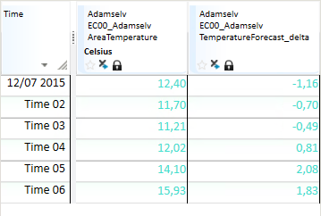

# DELTA
## About the function
Finds the difference between the current value and the previous value in a time
series. In other words, it calculates the change in a time series from one value
to the next. If the offset parameter (argument 2) is set to a number different
from 0, the function calculates the difference between the next value and the
current value. The second argument can also be a time macro symbol

The result series has the same resolution as the input time series.

**Syntax**

- DELTA(t[,d|s])

## Description

| # | Type | Description |
|---|---|---|
| 1 | t | Time series, fixed interval series or breakpoint.  Finds the difference between the current value and the previous value in the time series used in the argument. |
| 2 | d or s | Optional. If argument 2 is set to a number different from 0, the value is calculated as the difference between the next value and the current value. Using the number 0, the calculation is equal to the default setting in argument 1.  Optional. The second argument can also be a time macro symbol. The time macro must equal to or be coarser than the resolution of the input time series. Using a time macro > than 0, the function calculates the value as the difference between the next value representing the time macro step and the current value. Using a time macro |

The function can be described like this:

DELTA(t): res(t) = y(t) – y(t-1) Second argument omitted or has value 0

DELTA(t,number≠0): res(t) = y(t+1) – y(t) Second argument has value ≠0

DELTA(t,’+2h’): res(t) = y(t+2h) – y(t) Second argument has value ‘+2h’

DELTA(t,’-2h’): res(t) = y(t) – y(t -2h) Second argument has value ‘-2h’

The input time series might be a fixed interval series or a variable interval
series.

## Example
@DELTA(t)

`TemperatureForecast_delta = @DELTA(@t('AreaTemperature'))`

Values in the result time series are equal to the difference between the current
value and the previous value in the input time series. An example of this is
shown below. The value of the first row is based on the difference to the value
13,56 in a preceding point in time.

