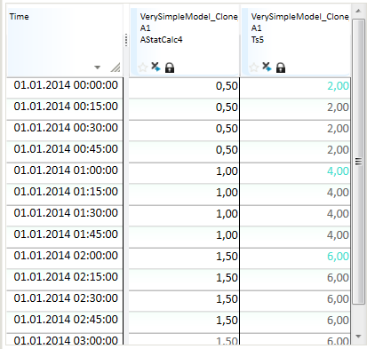
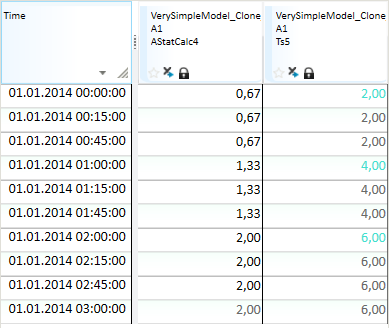

## DISTRIBUTE
This topic describes DISTRIBUTE variants ([R6](#r6), [R7](#r7), [Ra7](#ra7)) for
transforming from one time resolution to another.

To get an overview of all the transformation function variants, see:

[Which functions can be used when?](../functions/transform_what_when.md)

### R6
## About the function
Converts a time series to a finer resolution. The resolution for the result is
given by the resolution of the mask series defined in argument 2. The value from
the series in argument 1 is distributed to the points of time in the mask series
having logical true value (different from 0 and NaN). The function uses the SUM
method as base for the distribution.

## Syntax
- DISTRIBUTE(t,t)

## Description

| TYPE | Description |
|---|---|
| t | Input time series to be distributed. |
| t | Mask series representing the distributed time interval. |

## Example
`MaskSeries = @TIME_MASK('HOUR',{'HOUR','HOUR+15x','HOUR+30x','HOUR+45x'},{1,2,3,2},'MIN15)`

`ResultTimeSeries = @DISTRIBUTE(@t('Ts5'),MaskSeries)`

Mask time series in argument 2 is only used as a logical time series giving the
distributed interval for the input value to be distributed within. The example
gives hourly value divided into four.

If you change the values in the mask series to NaN or 0 (false) for one or
several of the time points, the result will distribute the hourly values divided
into the number of true values, skipping the time point set to false. **Note!**
The result will be a break point time series.

`MaskSeries = @TIME_MASK('HOUR',{'HOUR','HOUR+15x','HOUR+30x','HOUR+45x'},{1,2,NaN,2},'MIN15')`

`Result time series = @DISTRIBUTE(@t('Ts5'),MaskSeries)`

### R7
## About the function
As function [R6](#r6), but with a third argument which is a profile series. This
decides how the distribution of the values is done.

## Syntax
- DISTRIBUTE(t,t,t)

## Description

| Type | Description |
|---|---|
| t | Input time series to be distributed. |
| t | Mask series representing the distributed time interval. Defines the resolution of the result time series. |
| t | Profile series representing the distribution of the values. Must have the same resolution as the mask series. |

The distribution of the values is done like this:

Vi = Value calculated for the time point i in the result time series

AI = Value from the input time series for the distributed period

NI = Number of valid time point to distributed the input value into

Pi = Profile value for the time point i in the result time series

MI = Calculated mean value for the profile series for the distributed period

## Example
`MaskSeries/Profile = @TIME_MASK('HOUR',{'HOUR','HOUR+15x','HOUR+30x','HOUR+45x'},{1,2,3,2},'MIN15')`

Argument 2 is a mask series (all time points contributes)

Argument 3 gives the profile values (same as the mask series)

Result time series = @DISTRIBUTE(@t('Ts5'),MaskSeries,Profile)

Based on the equation, the first value of the distributed period is calculated
like this:

FirstValue = 2 / 4 * 1 / 2 = 0,25

### Ra7
## About the function
As function [R7](#r7), but with a scaling factor in argument 1. This DISTRIBUTE
variant gives values on the result series also for the value 0 on the input data
series (given that the profile series has different values in the period).

## Syntax
- DISTRIBUTE(d,t,t,t)

## Description

| Type | Description |
|---|---|
| d | Scaling factor. If the scaling factor is 0, relative profiling is used, i.e. the function behaves like R7. |
| t | Input time series to be distributed. |
| t | Mask series representing the distributed time interval. Defines the resolution of the result time series. |
| t | Profile series representing the distribution of the values. Must have the same resolution as the mask series. |

The distribution of the values is done like this:

K is a scaling factor coming from argument 1 in the function. The other symbols
used in the formula are the same as described in [R7](#r7).

Example 1

`MaskSeries/Profile = @TIME_MASK('HOUR',{'HOUR','HOUR+15x','HOUR+30x','HOUR+45x'},{1,2,3,2},'MIN15')`

Argument 2 is a mask series (all time points contributes)

Argument 3 gives the profile values (same as the mask series)

Result time series = @DISTRIBUTE(1,@t('Ts5'),MaskSeries,Profile)

Based on the equation, the first value of the distributed period is calculated
like this:

FirstValue = 2 / 4 + 1 ∙ (1 - 2) = -0,5

Example 2

`MaskSeries/Profile = @TIME_MASK('HOUR',{'HOUR','HOUR+15x','HOUR+30x','HOUR+45x'},{1,2,3,2},'MIN15')`

Argument 2 is a mask series (all time points contributes)

Argument 3 gives the profile values (same as the mask series)

Result time series = @DISTRIBUTE(10,@t('Ts5'),MaskSeries,Profile)

Based on the equation, the first value of the distributed period is calculated
like this:

FirstValue = 2 / 4 + 10 ∙ (1 - 2) = -9,5
