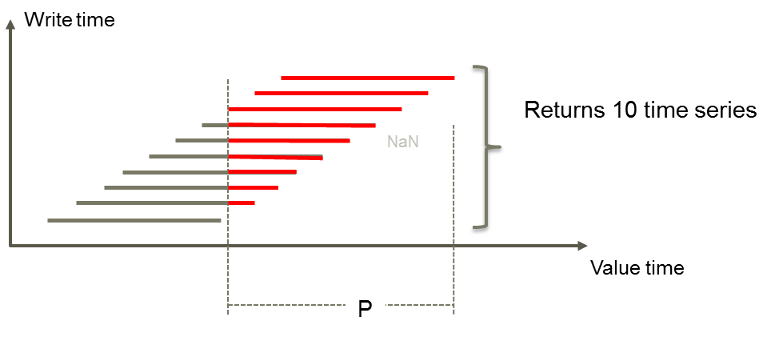

## GetAllForecasts

Returns all time series versions that have values within the requested time period.

### Syntax

- GetAllForecasts(t) - returns an array of time series

### Example

Example data is described [here](./history.md#hourly-example-data).

`## = @AT(@GetAllForecasts(@t('.Temperature_forecast')),3)`

| Time | Current | Result |
|---|---|---|
| 2025-11-05T23:00:00Z |       1.00 |            |
| 2025-11-06T00:00:00Z |       1.00 |            |
| 2025-11-06T01:00:00Z |       1.00 |            |
| 2025-11-06T02:00:00Z |       1.00 |            |
| 2025-11-06T03:00:00Z |       2.00 |       2.00 |
| 2025-11-06T04:00:00Z |       2.00 |       2.00 |
| 2025-11-06T05:00:00Z |       2.00 |       2.00 |
| 2025-11-06T06:00:00Z |       2.00 |       2.00 |
| 2025-11-06T07:00:00Z |       3.00 |       2.00 |
| 2025-11-06T08:00:00Z |       3.00 |       2.00 |
| 2025-11-06T09:00:00Z |       3.00 |       2.00 |
| 2025-11-06T10:00:00Z |       3.00 |       2.00 |

The expression is wrapped with a call to [AT](./at.md) function to extract one of
the series in the returned array.
