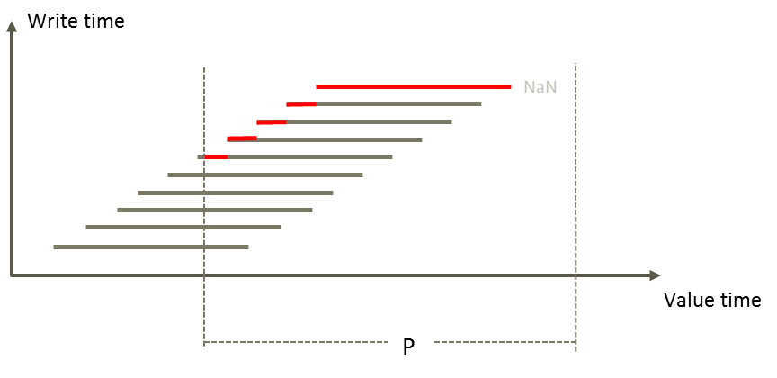

## GetBestForecast

**_Note!_** This function is now obsolete.
It returns the latest written value at all time points part of requested time period.

The figure below illustrates this. The returned series is a merge of the red segments.

### Example

The following expressions give the same result.

`## = @t('.Temperature_forecast')`

`## = @GetBestForecast(@t('.Temperature_forecast'))`

The `GetBestForecast` function is no longer available.

