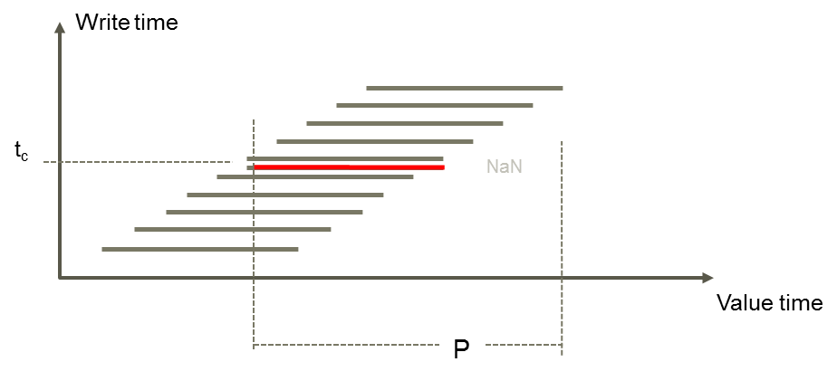
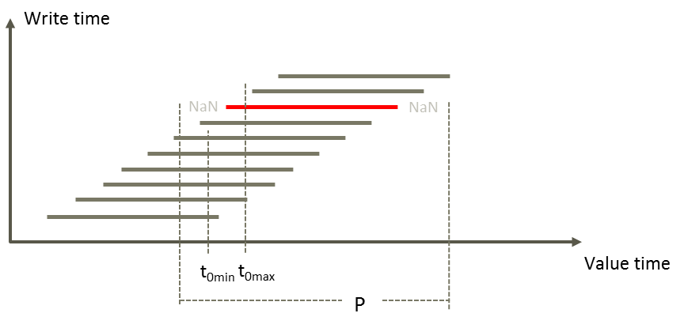

# GetForecast

A forecast is typically received with a frequency and contains data for a duration, for instance 2 times a day with hourly data for 10 days forward.

The figure below is illustrating write events for a forecast series.
The time series versions associated having these characteristics is
called forecast set.

There might be multiple versions that cover the same value time period.

## Syntax

- GetForecast(t)
- GetForecast(t,d|s,d|s)
- GetForecast(t,d|s,d|s,d|s)

The second, third and fourth arguments are time point definitions, either given as a number (tick value) or a definition having a syntax described [here](../timepoint-macros.md).

The first value in a forecast write operation is associated with time point t0.

## Description

| # | Type | Description |
|---|---|---|
| 1 | t | Time series reference identifying a forecast set. |

Uses the start of requested time period (*tstart*) to look up the version
to retrieve. Finds the newest version that includes a write to value at *tstart*.

| # | Type | Description |
|---|---|---|
| 1 | t | Time series reference identifying a forecast set. |
| 2 | d or s | t0Min |
| 3 | d or s | t0Max |
| 4 | d or s | Optional. Condition for save time, tc |

The function uses t0Min and t0Max to find the relevant forecast instead of using
the start of the requested period. It requires that the forecast series' t0 is
less than or equal to t0Max and larger than t0Min. Argument 2 has an additional
condition that the write time for the forecast series is less than or equal to
the time the argument represents. If no forecast series has its start time
within the given interval, the function returns a time series with NaN.

## Examples

The data used in these examples are described [here](./history.md#hourly-example-data).

### Get forecast based on requested time period

`## = @GetForecast(@t('.Temperature_forecast'))`

Requested start time (*tstart*) is `UTC2025110602`, a time point just before the second version of the example series was written. In the first store operation the value 1 was written to the series, in the second store operation the value 2 was written.

| Time (UTC) | Current | Result |
|---|---|---|
| 2025-11-06T02:00:00Z |       1.00 |       1.00 |
| 2025-11-06T03:00:00Z |       2.00 |       1.00 |
| 2025-11-06T04:00:00Z |       2.00 |       1.00 |
| 2025-11-06T05:00:00Z |       2.00 |       1.00 |
| 2025-11-06T06:00:00Z |       2.00 |       1.00 |
| 2025-11-06T07:00:00Z |       3.00 |       1.00 |
| 2025-11-06T08:00:00Z |       3.00 |       1.00 |
| 2025-11-06T09:00:00Z |       3.00 |       1.00 |
| 2025-11-06T10:00:00Z |       3.00 |       1.00 |
| 2025-11-06T11:00:00Z |       4.00 |       1.00 |
| 2025-11-06T12:00:00Z |       4.00 |       1.00 |
| 2025-11-06T13:00:00Z |       4.00 |       1.00 |
| 2025-11-06T14:00:00Z |       4.00 |       1.00 |
| 2025-11-06T15:00:00Z |       4.00 |       1.00 |
| 2025-11-06T16:00:00Z |       4.10 |       1.00 |

The same expression, but now with a *tstart* one hour later: `UTC2025110603`.

| Time (UTC) | Current | Result |
|---|---|---|
| 2025-11-06T04:00:00Z |       2.00 |       2.00 |
| 2025-11-06T05:00:00Z |       2.00 |       2.00 |
| 2025-11-06T06:00:00Z |       2.00 |       2.00 |
| 2025-11-06T07:00:00Z |       3.00 |       2.00 |
| 2025-11-06T08:00:00Z |       3.00 |       2.00 |
| 2025-11-06T09:00:00Z |       3.00 |       2.00 |
| 2025-11-06T10:00:00Z |       3.00 |       2.00 |
| 2025-11-06T11:00:00Z |       4.00 |       2.00 |
| 2025-11-06T12:00:00Z |       4.00 |       2.00 |
| 2025-11-06T13:00:00Z |       4.00 |       2.00 |
| 2025-11-06T14:00:00Z |       4.00 |       2.00 |
| 2025-11-06T15:00:00Z |       4.00 |       2.00 |
| 2025-11-06T16:00:00Z |       4.10 |       2.00 |

### Get forecast with forecast start arguments

The first forecast write (value 1) has a first value at  `UTC2025110523`.
The second forecast write (value 2) has a first value at `UTC2025110603`, i.e. 4 hours later.

`## = @GetForecast(@t('.Temperature_forecast'),'UTC2025110602','UTC2025110605')`

| Time (UTC) | Current | Result |
|---|---|---|
| 2025-11-05T23:00:00Z |       1.00 | nan        |
| 2025-11-06T00:00:00Z |       1.00 | nan        |
| 2025-11-06T01:00:00Z |       1.00 | nan        |
| 2025-11-06T02:00:00Z |       1.00 | nan        |
| 2025-11-06T03:00:00Z |       2.00 |       2.00 |
| 2025-11-06T04:00:00Z |       2.00 |       2.00 |
| 2025-11-06T05:00:00Z |       2.00 |       2.00 |
| 2025-11-06T06:00:00Z |       2.00 |       2.00 |
| 2025-11-06T07:00:00Z |       3.00 |       2.00 |

