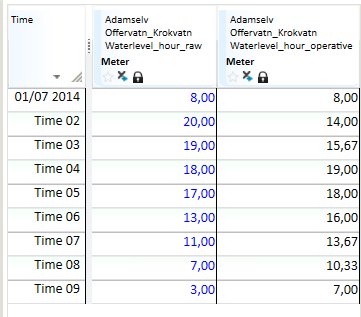
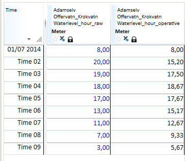

## GLIDING_TREND_AVERAGE
## About the function
Reduces major fluctuations in a time series by calculating the future value on
the basis of previous values.

The result series has the same resolution as the input time series.

## Syntax
- GLIDING_TREND_AVERAGE(t,d[,d|D])

**Description**

| # | Type | Description |
|---|---|---|
| 1 | t | Time series of numerical values. |
| 2 | d | Numerical value. Indicates how many surrounding values that are used to produce the average value. d must be an uneven number. |
| 3 | d | Optional. Numerical value. If the value is different from 0, there will not be calculated any trend values outside the end period of the time series. |
| 3 | D | Optional. D is a weighted array where the user can define which value is the most important. |

## Example
Example 1: GLIDING_TREND_AVERAGE(t,d)

`Waterlevel_hour_operative = @GLIDING_TREND_AVERAGE(@t('Waterlevel_hour_raw'),3)`

This example takes the average values of a selected number of previous values,
and gives the anticipated values on the basis of these. `d` represents the
number of previous values from which average values are calculated. For
instance, in the table the average of the three closest previous values to Time
3 (including the value in Time 3) (8+20+19)/3 = 15,67.

Example 2: GLIDING_TREND_AVERAGE(t,d,D)

`Waterlevel_hour_operative = @GLIDING_TREND_AVERAGE(@t('Waterlevel_hour_raw'),3,{3,2,1})`

This example gives a trend where the closest value counts three times as much,
and the second closest values counts twice as much as the third closest value
for the trend. The array must contain the same number as the value used in
argument 2. The sum is divided on the total number of weight factors.

