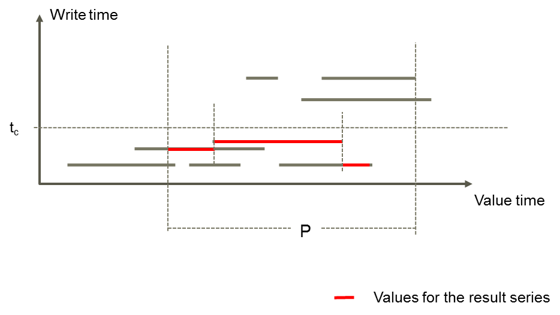
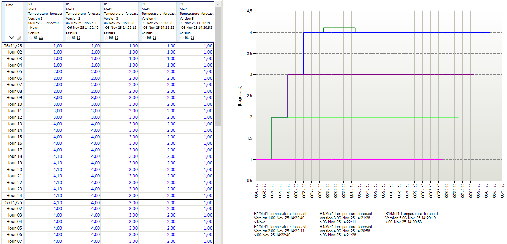
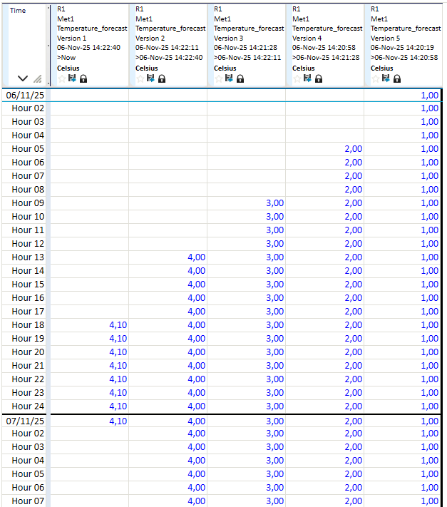

# History group functions

## About historical values
Historical values means that previously saved values are not overwritten when saving new values. The figure below shows a time series having values with various write times. The Calculator returns the values indicated by red when you ask for the most recently written historical values written before tc.

## Hourly example data

In the function descriptions there are some examples based on a sequence of write operations. These values are presented in a Nimbus client view shown below. The header text for each version give information on the validity interval for which the time series had the values shown associated column:

The values within given time period scope are created from 5 separate write operations taking place at 06 November 2025:

- At 14:20:19 (UTC+1) value 1.0 is stored on 48 hours from beginning of day (UTC+1)
- At 14:20:58 (UTC+1) value 2.0 is stored on 48 hours from 04:00 (UTC+1)
- At 14:21:28 (UTC+1) value 3.0 is stored on 48 hours from 08:00 (UTC+1)
- At 14:22:11 (UTC+1) value 4.0 is stored on 48 hours from 12:00 (UTC+1)
- At 14:22:40 (UTC+1) value 4.1 is stored for 8 hours from 17:00 (UTC+1)

The value write operations are also shown below:

