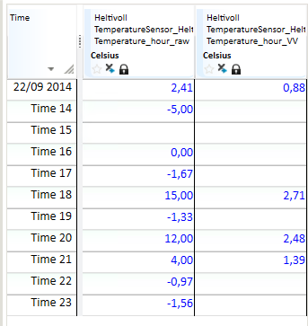

# LN
## About the function
Finds the ln value of the values in a time series or of a number.

Logarithms with base numbers that equal euler's number (e= 2,718281828…) is
called natural logarithms. The logarithm to a number x, is the exponent c, which
the base number must be raised with to get the number x.

ec = x -> ln xe = c

The input value must be a positive, real number lager than 0, if not, the
function returns an empty value.

## Syntax
- LN(t|d)

## Description

| # | Type | Description |
|---|---|---|
| 1 | t | Time series |
| 1 | d | Number |

## Example
Example 1: LN(t)

```
Temperature_hour_VV = @LN(@t('Temperature_hour_raw'))
```



Example 2: LN(d)

```
ResultTs = @LN(1)
```

Example 2 returns the number 0 for all rows.
