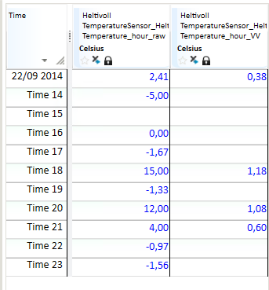

# LOG

This function is used to find the logarithm of values in a time series or a
number.

Briggs logarithms use the base number 10. The logarithm to a number x, is the
exponent c, which the base number must be raised with to get the number x.

$$
10^c = x \leftrightarrow \log x = c
$$

The input value must be a positive number larger than 0. If not, the function
returns an empty value.

## Syntax

- LOG(t|d)

## Description

| # | Type | Description |
|---|---|---|
| 1 | t | Time series |
| 1 | d | Number |

## Examples
### Example 1: @LOG(t)

`Temperature_hour_VV = @LOG(@t('Temperature_hour_raw'))`

### Example 2: @LOG(d)

`ResultTs = @LOG(1)`

Example 2 returns the number 0 for all rows.

