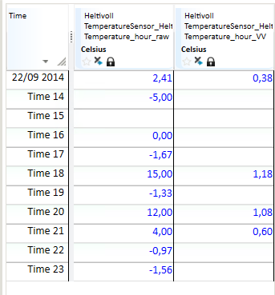

# LOG
## About the function
This function is used to find the logarithm of values in a time series or a
number.

Briggs logarithms use the base number 10. The logarithm to a number x, is the
exponent c, which the base number must be raised with to get the number x.

10c = x -> log x10 = c

The input value must be a positive number larger than 0. If not, the function
returns an empty value.

**S****yntax**

- LOG(t|d)

| # | Type | Description |
|---|---|---|
| 1 | t | Time series |
| 1 | d | Number |

## Example
Example 1: @LOG(t)

`Temperature_hour_VV = @LOG(@t('Temperature_hour_raw'))`

Example 2: @LOG(d)

`ResultTs = @LOG(1)`

Example 2 returns the number 0 for all rows.

