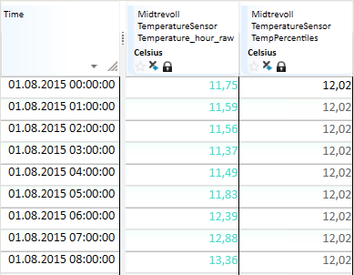
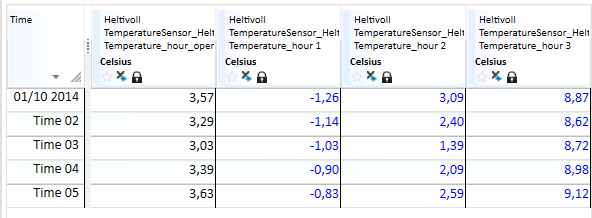

## MEAN
## About the function
  Takes the average value of time series, arrays and number series.

  The result series has the same resolution as the input time series.

## Syntax
- MEAN(t|T|D)

## Description

| # | TYPE | DESCRIPTION |
|---|---|---|
| 1 | t or T or D | Time series Array of time series Array of numbers |

## Example
  Example 1: @MEAN(t)

  `TempPercentiles = @MEAN(@t('Temperature_hour_raw'))`

The result values are the average value of the values in
@t('Temperature_hour_raw') for the requested time period, repeated throughout
the entire result series as a break point series.

  

**Tip!** If you want to calculate the mean value for a period different from the
requested time period, you can use the
[PushExtPeriod](../functions/push_ext_period.md)/[PopExtPeriod](../functions/pop_ext_period.md) function
to explicitly define the input period to the function.

  Example 2: @MEAN(T)

  `Temperature_hour_operative = @MEAN(@T('Temperature_hour'))`

The **Temperature_hour_operative** column gives the average value of all the
time series in the array for every time step.

  For instance at 01:00: (-1,26+3,09+8,87)/3 = 3,57

  

  Example 3: @MEAN(D)

  Res = @MEAN(1,5,8,2.5,11)

  Res = 5.5
