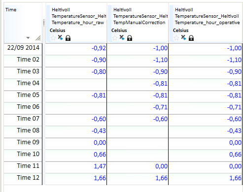

# MIX
## About the function
The variations of this function combine two series to form a new one by
retrieving values from one or the other series according to specific rules. This
function is a compact form of if-then-else operation.

All of the time series included must have the same time resolution. The result
series has the same time resolution as the input time series.

## Syntax
- MIX(t,t,[s|t])

The different variations of this function are described below. For MIX(t,T) and
MIX(t,T,t), see [MIX by selecting from time series
array](../functions/mix_by_selecting_from_time_series_array.md).

Description MIX(t,t) and MIX(t,t,s)

| # | Type | Description |
|---|---|---|
| 1 | t | Time series. |
| 2 | t | Time series. |
| 3 | s | Optional. Possible values are described in the table below. |

| Value of symbol | Description |
|---|---|
| END | The values on the result are retrieved from the first time series until defined end point of time for this time series. |
| Time macro | General syntax for stating point of time, normally relative to a start of hour, day, week, etc. The result retrieves values from the first time series until the point of time given by the time macro. Examples of valid time macros: HOUR Star of current hour HOUR-1h Start of last hour DAY Start of current 24-hour period DAY+1d Start of next 24-hour period WEEK+2d Start of Wednesday in current week |
| MERGE | Retrieves values to result series from the second time series if functional value on time series 1 at this point of time is NaN. That is values from the second time series are visible on result where time series 1 has gaps. |
| MERGE_ADD | Retrieves value from the second time series if this is a real value (not NaN). |
| MERGE_POINTS | As the MERGE version, but checks whether there is a point value for the point of time on the first time series. If no, the value from the second time series is used on this point of time. Will only have the intended effect if you have a breakpoint series. |

## Example
@MIX(tt)

```
Temperature_hour_operative = @MIX(@t('TempManualCorrection'),@t('Temperature_hour_raw'))
```

Values in the result time series return a value from the first time series if
this exists, otherwise the value from the second time series is retrieved, as
shown in the table.



Description MIX(t,t,t)

| # | Type | Description |
|---|---|---|
| 1 | t | The argument is used as a logical test series, in which the values are interpreted as TRUE or FALSE. All defined values which are not equal to 0 or NaN are considered to be TRUE values. |
| 2 | t | The function gets its values from this time series if the first argument returns TRUE. |
| 3 | t | Optional. The function gets its values from this time series if the first argument returns FALSE. |

## Example
@MIX(t,t,t)

```
Temperature_hour_operative = @MIX(@t('Temperature_hour_raw'),@t('TempPercentiles'),@t('TempManualCorrection'))
```


**Tip!** See also [MIX0](../functions/mix0.md).
