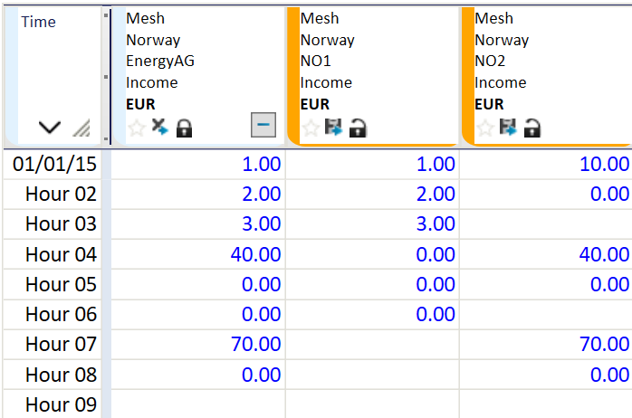
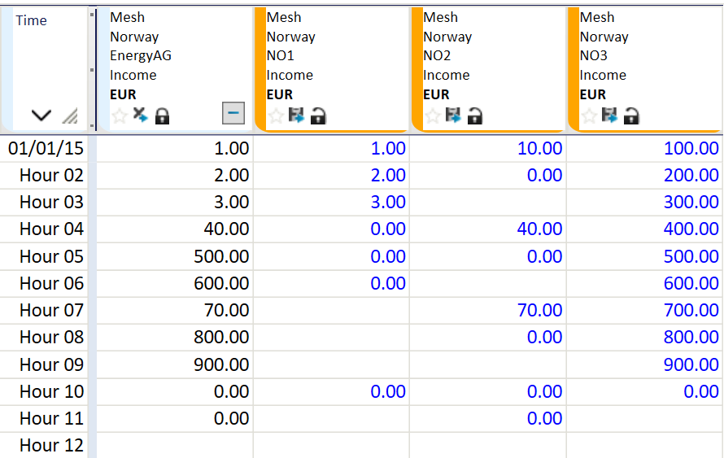

## MIX0
## About the function
Construct a new time series as follows: given two or more fixed-interval time series,
for each time period select the first existing value different from zero. 
If all the input values are zero, the result value is zero. If all the input values
are missing, the result value is also missing.

## Syntax
- MIX0(t,t)
- MIX0(T)

The time series are fixed interval series, i.e. hour, day, week, etc.

## Example
Example 1: @MIX0(t,t)

Given two objects called `NO1` and `NO2` with time series attributes
called `Income`, we can have the following:

```
income1 = @t('../*[.Name=NO1].Income')
income2 = @t('../*[.Name=NO2].Income')

## = @MIX0(income1, income2)
```



Example 2: @MIX0(T)

Here we have an array holding three `Income` time series:

```
array = {@t('../*[.Name=NO1].Income'), @t('../*[.Name=NO2].Income'), @t('../*[.Name=NO3].Income')}

## = @MIX0(array)
```


