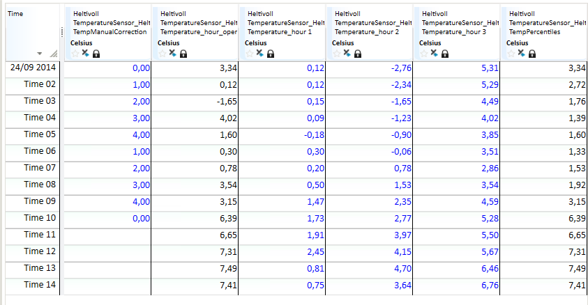

## MIX0
## About the function
Returns values from the first series of the argument (time series or an array of
time series) different from 0. If both/all series return the value 0, 0 is
returned. If both/all series have a missing value, missing value is returned.

## Syntax
- MIX0(t,t)
- MIX0(T)

The time series are fixed interval series, i.e. hour, day, week, etc.

## Example
Example 1: @MIX0(t,t)

`Temperature_hour_operative = @MIX0(@t('TempManualCorrection'),@t('Temperature_hour_raw'))`

For each time step the MIX0 function returns values from the first time series
if the value is different from 0, otherwise it uses values from the second time.
If both series have value 0, 0 is returned. If both series have missing value,
missing value is returned. Result is shown in the last column of the table.

Example 2: @MIX0(T)

`Temperature_hour_operative = @MIX0(@T('Temperature_hour'))`

For each time step the MIX0 function returns values from the first series in the
array different from 0. If all series have 0, 0 is returned. If all series have
missing values, missing value is returned. Result is shown in the last column of
the table.

