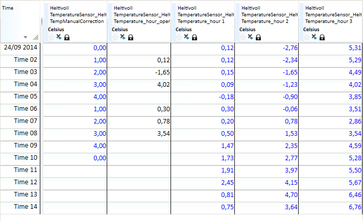

# MIX by selecting from time series array
About this function

MIX is a function that calculates result series by mixing contribution from a
set of input time series. A typical usage is to handle multiple 'if-elseif-else’
constructions defined by index criteria. The main purpose of this function is to
effectively set up and calculate multiple choice logic, typical defined by if –
elseif – elseif – else constructs.

## Syntax
- MIX(t,T[,t])

## Description

| # | Type | Description |
|---|---|---|
| 1 | t | A time series with contribution index is used for lookup in an array of contributions defined by the next argument. The values are transformed to nearest integer before use. This argument might be a series with any resolution. |
| 2 | T | The array of contribution series contains potential contributions to the result and is associated with the index found in the previous argument. The lookup index is defined from 1 to n where n is the number of series in the array. |
| 3 | t | Optional. Default series. The function gets its values from this time series if argument 1 is false. |

The time series in the array can have different resolutions. The resolution of
the result series is defined like this:

- Default series not defined: The result series has the same resolution as the highest resolution found. The result values are copied from first series in array for periods when contribution index found in argument 1 series is 1, from second series when contribution index is 2 etc.
- Default series defined: If contribution index is out of range, the corresponding result values are retrieved from default series.

## Example
Example 1: @MIX(t,T)

`Temperature_hour_operative = @MIX(@t('TempManualCorrection'),@T('Temperature_hour'))`

TempManualCorrection contains index values. Temperature_hour 1,2 and 3 are time
series in the array. In the case of an empty index or values outside of 1,2,3 an
undefined value is returned. The result is shown in the second column of the
table.

Example 2: @MIX(t,T,t)

`Temperature_hour_operative = @MIX(@t('TempManualCorrection'),@T('Temperature_hour'),@t('TempPercentiles'))`

In the case of an empty index or values outside of 1,2,3 values from the time
series in the 3.rd argument are used. The result is shown in the second column
of the table.

Example 3: @MIX(t,T,t)

`## = @MIX(@t('TsSelector'),{@t('Ts1'),@t('Ts2'),@t('Ts1')*2.3,@t('Ts1')+@t('Ts2')},@t('TsDefault'))`

Array-members can be defined as an expression. These expressions can be more or
less complicated as long as they return a single series.

The example represents the following "pseudocode":

if ( selection equals 1 ) then

result = Ts1

else if ( selection equals 2 ) then

result = Ts2

else if ( selection equals 3 ) then

result = Ts1 * 2.3

else if ( selection equals 4 ) then

result = Ts1+Ts2

else

result = TsDefault

In this case the series TsSelector Default with values 1,2,3,4 finds
corresponding values from series found in an array. For TsSelector values less
than 1 and larger than 4 the resulting values comes from the TsDefault-series,
if defined. If not, the function assign the value NaN (Not a Number).
