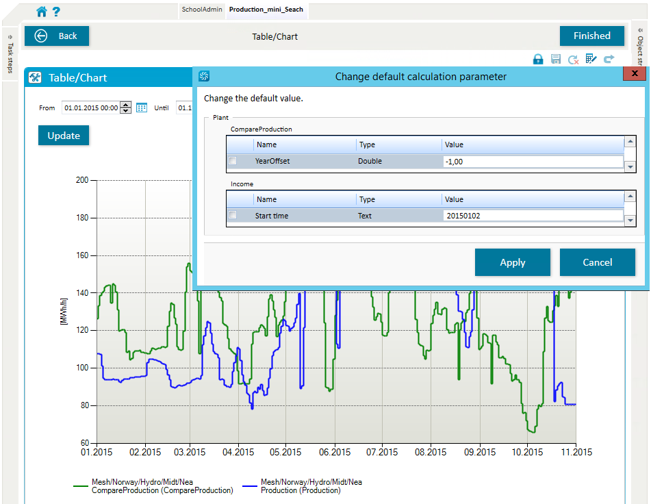

# Parameter
## About the function
This allows you to change parameter values used in a function to analyse
scenarios differently than the default parameter definition. You can change
these default parameter values from Nimbus (see screen example below).

The changes are done in memory in your Nimbus session. When you close the Nimbus
session or reset the calculation parameters, the values return to the default
parameter definition.

## Syntax
- Parameter(sd)
- Parameter(st)
- Parameter(ss)

## Description

| # | Type | Description |
|---|---|---|
| 1 | s | Parameter name. |
| 2 | d | Default value. Double or integer. |
| 2 | t | Default time series |
| 2 | s | Default text string |

**Note!** References to attributes for objects do not work as default
parameters.

If the @Parameter calculation expression contains a time point or time macro,
you need to convert the value as a text string in the calculator function.

## Example
`@TimeToString(@Time(@Parameter('Start time', '20150102')))`

`@TimeToString(@Time(@Parameter('Start time', 'YEAR+1m')))`

In a time series template calculation expression, you can use the @Parameter
function to define the parameters you want to expose for change in a Nimbus
process. The use of the parameter function is generic and can be used in all
functions and accessed from any Nimbus time series view.

