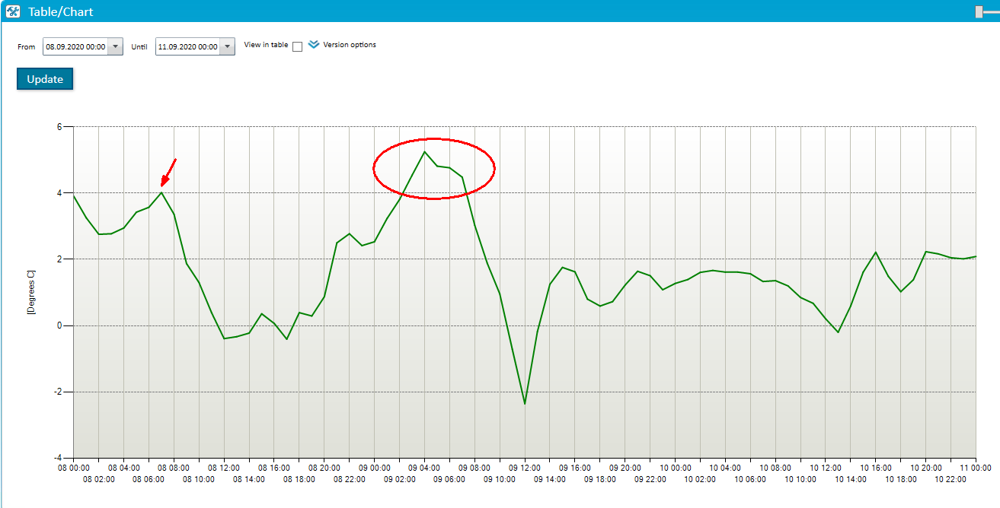
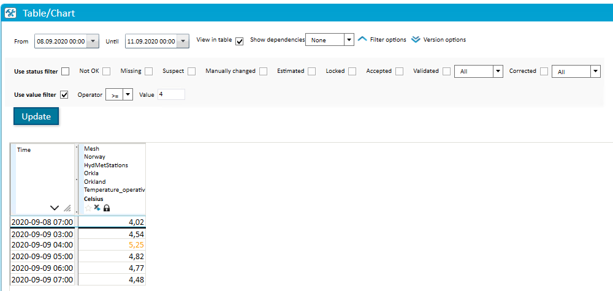
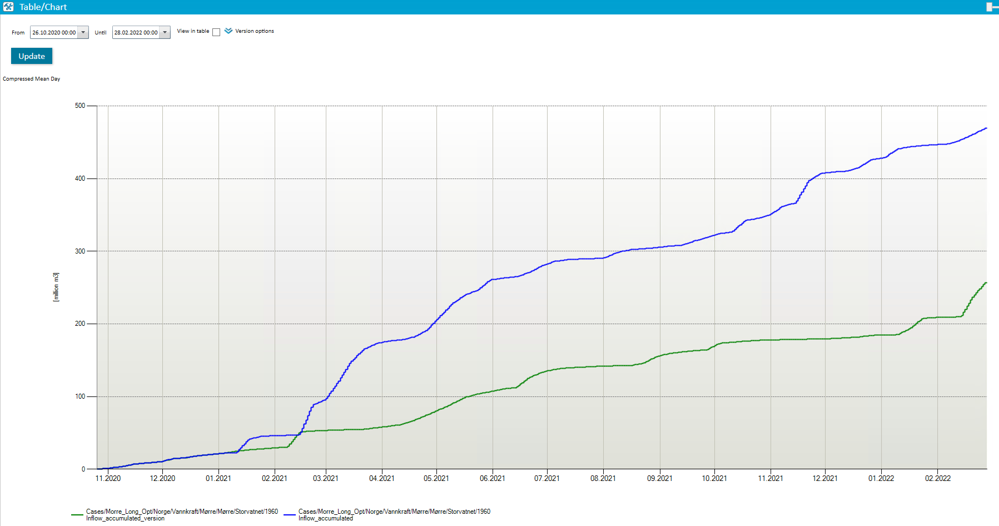

# PDLOG
  About this function

The PDLOG function is used to give messages to SmG Event Log based on events
occurring in SmG Calculator.

## Syntax
- PDLOG(d,s[,t])
- PDLOG(d,s,t,d)


| # | Type | Description |
|---|---|---|
| 1 | d | Type of message to Event Log: 1010 = Information, 1011 = Warning, 1012 = Error. |
| 2 | s | Message to be written to Event Log. The string may contain several macros to give the general message a more specific content. The macros are:<br/> <ul><li>$start: Start of calculation period. </li><li>$end: End of calculation period.</li><li>$nvalues: Number of values being TRUE (value = 1) in time series.</li><li>$first: Point of time for first value being TRUE in time series.</li><li>$last: Point of time for last value being TRUE in time series.</li><li>$path: Full object path.</li></ul> |
| 3 | t | Time series in the log message. |
| 4 | d | Number of values to be written to Event Log from the time series. |


## Example 1
```
Difference =@MEAN(@T('To_MetSensor.Temperature_operative'))-
@MEAN(@T('To_NeighbourMetStation.Temperature_used'))
Deviation = @ABS(Difference) > 4
IF (@SUM(Deviation)) THEN
  @PDLOG(1011,'Temperature deviates, $nvalues, first time $first, last time $last',Deviation)
ENDIF
## = Difference
```


  

This image shows the result of the Difference time series in the calculation
expression.

The calculation of the temporary time series called Deviation gives the
following result:

  

  This gives the following message in the Event Log:

  

It is also possible to verify the result by using the built-in filtering
function in Mesh:

  

## Example 2
Compares an inflow accumulated time series with a historical version of the same
time series. If the accumulated end value change exeeds 10% absolute value a
message is created in SmG Event Log:

```
InflowSource = @t('.Inflow')
TransformHour = @TRANSFORM(InflowSource,'HOUR','AVG')
InflowAccumulated = @ACCUMULATE(0, '+0h'),TransformHour)* (3600/1000000)
AccumulatedDeviation= (@MAX(InflowAccumulated)-@MAX(@t('.Inflow_accumulated_version')))/@MAX(InflowAccumulated)
IF @ABS(AccumulatedDeviation) > 0.1 THEN
  @PDLOG(1010,'Inflow forecast deviates on time series,$path, period start $start, period end $end ', InflowSource)
ENDIF
## = InflowAccumulated
```
  

The following message in written in Event Log:

```
12:23:15 Inflow forecast deviates on time series, Model/MeshTEK/Cases.has_OptimisationCases/Morre_Long_Opt.has_cAreas/Norge.has_cHydroProduction/Vannkraft.has_cWaterCourses/Mørre.has_cProdriskAreas/Mørre.has_cProdriskModules/Storvatnet.has_cProdriskScenarios/1960.Inflow_accumulated/Inflow_accumulated, period start 10/25/2020 11:00:00 PM UTC, period end 2/27/2022 11:00:00 PM UTC
```
