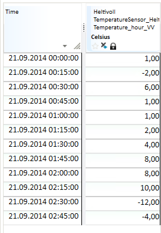

## PROFILE
This topic describes a PROFILE variant ([R12](#r12)) for transforming from one
time resolution to another.

To get an overview of all the variants of the function, see:

[Which functions can be used when?](../functions/transform_what_when.md)

###### R12
## About the function
PROFILE lets you create values on a series in periods where values do not exist
based on the length of the input time series.

The length of the profile series must be equal to a calendar unit, for example
year.

## Syntax
- PROFILE(t)

## Description

| # | Type | Definition |
|---|---|---|
| 1 | t | Time series. |

The function analyzes input data time series and checks whether this is defined
in the current profile period, like a day or a week. If yes, these values are
perceived as a profile and placed in the requested period and repeated if
necessary.

The function returns a time series with the same resolution as the input series
with values created by repetition of the values found on the input series.

## Example
`@PROFILE(t)`

`Result time series = @PROFILE(@t('TSPH'))`

The figure shows the profile series defined with data for a 24-hour period at
September 21st 2014. The result of @PROFILE(@t('TSPH')) for any other requested
day will give the same values.

**Note!** The values in the summer time are shifted one hour, related to the
defined profile. The PROFILE function has no argument for defining which
calendar the profile should show. It implicitly uses the calendar defined for
the database.
