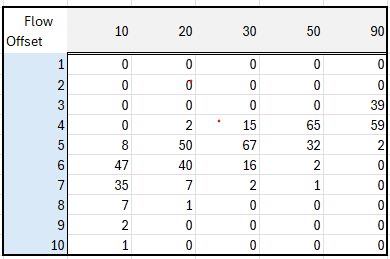

# TimeDelayed

This function uses an [XY set](../../concepts/modelling/xy-sets.md) to calculate a time-delayed output based on an input time series. A typical use case is simulating how water discharge at one point arrives downstream over time: a sudden increase in flow does not appear instantly at the output; instead, it spreads out over several time steps, with some fractions arriving early and the rest arriving progressively later.

The function takes each value in the input time series and distributes it forward in time according to a delay distribution curve stored in the XY set.

**_Note!_** The distribution preserves the total volume; i.e. volume in equals volume out. When several input values contribute to the same output time step, their delayed contributions are summed, which can produce transient peaks or dips in the output (e.g., when a fast-flow "front" catches up with the tail of an earlier slow-flow period).

### The XY set

| Axis | Meaning | Example (water flow) |
|------|---------|----------------------|
| **X** | The delay offset, expressed as a number of time steps relative to the input time series resolution. | 3 with an hourly series means a 3-hour delay. |
| **Y** | The percentage of the input value that is contributed at the corresponding delay offset. | 50 means 50% of the input value arrives at that offset. |
| **Z** | The input value threshold at which this XY curve applies (i.e. a "valid-from" level). | A flow rate of 20 m3/s. |

### How the calculation works

For each time step `i` in the input series:

1. Read the input value `v` at time step `i`.
2. Look up the matching Z segment (or interpolate between two segments if `v` falls between thresholds).
3. Produce a set of `(offset, fraction)` pairs from the corresponding XY curve.
4. For each pair, add `v * fraction` to the output at time step `i + offset`.

`NaN` values in the input are treated as 0 (they produce no delayed contribution).

## Syntax

- TimeDelayed(t,s)

## Description

| # | Type | Description |
|---|---|---|
| 1 | t | Reference to a fixed-interval time series. Breakpoint series are not supported. |
| 2 | s | Search specification targeting the XY set to use. |

### Example table

  

## Example

Given an input value of exactly 20 at time `t` and an XY curve for the Z = 20 segment, the value is distributed as follows:

- At `t` + 4h: 20 * 0.02 = 0.40
- At `t` + 5h: 20 * 0.50 = 10.00
- At `t` + 6h: 20 * 0.40 = 8.00
- At `t` + 7h: 20 * 0.07 = 1.40
- At `t` + 8h: 20 * 0.01 = 0.20

(The percentages sum to 100%, preserving total volume)

## Usage

```
DelayedFlow = @TimeDelayed(@t('.FlowTimeSeries'), '.FlowDelayXySetAttributeName')
```

## Worked example with constant and changing flow

The table below shows the function applied to an hourly time series that has values of 20 for some time, then steps up to 30, and finally steps back down to 20.

| Time (UTC) | FlowSeries | DelayedFlow | Description |
|---|---|---|---|
| 2025-11-05T22:00:00Z | NaN        |       0.00 | NaN is treated as 0 |
| 2025-11-05T23:00:00Z |      20.00 |       0.00 | |
| 2025-11-06T00:00:00Z |      20.00 |       0.00 | |
| 2025-11-06T01:00:00Z |      20.00 |       0.00 | |
| 2025-11-06T02:00:00Z |      20.00 |       0.00 | |
| 2025-11-06T03:00:00Z |      20.00 |       0.40 | First contribution: 2% |
| 2025-11-06T04:00:00Z |      20.00 |      10.40 | Added 50% at this hour |
| 2025-11-06T05:00:00Z |      20.00 |      18.40 | Added 40% at this hour |
| 2025-11-06T06:00:00Z |      20.00 |      19.80 | |
| 2025-11-06T07:00:00Z |      20.00 |      20.00 | |
| 2025-11-06T08:00:00Z |      20.00 |      20.00 | |
| 2025-11-06T09:00:00Z |      20.00 |      20.00 | |
| 2025-11-06T10:00:00Z |      20.00 |      20.00 | |
| 2025-11-06T11:00:00Z |      30.00 |      20.00 | Flow steps up to 30 |
| 2025-11-06T12:00:00Z |      30.00 |      20.00 | |
| 2025-11-06T13:00:00Z |      30.00 |      20.00 | |
| 2025-11-06T14:00:00Z |      30.00 |      20.00 | |
| 2025-11-06T15:00:00Z |      30.00 |      24.10 | |
| 2025-11-06T16:00:00Z |      30.00 |      34.20 | Peak: fast flow catches slow flow tail |
| 2025-11-06T17:00:00Z |      30.00 |      31.00 | |
| 2025-11-06T18:00:00Z |      30.00 |      30.20 | |
| 2025-11-06T19:00:00Z |      30.00 |      30.00 | |
| 2025-11-06T20:00:00Z |      30.00 |      30.00 | |
| 2025-11-06T21:00:00Z |      30.00 |      30.00 | |
| 2025-11-06T22:00:00Z |      30.00 |      30.00 | |
| 2025-11-06T23:00:00Z |      30.00 |      30.00 | |
| 2025-11-07T00:00:00Z |      30.00 |      30.00 | |
| 2025-11-07T01:00:00Z |      30.00 |      30.00 | |
| 2025-11-07T02:00:00Z |      30.00 |      30.00 | |
| 2025-11-07T03:00:00Z |      30.00 |      30.00 | |
| 2025-11-07T04:00:00Z |      30.00 |      30.00 | |
| 2025-11-07T05:00:00Z |      20.00 |      30.00 | Flow steps back down to 20 |
| 2025-11-07T06:00:00Z |      20.00 |      30.00 | |
| 2025-11-07T07:00:00Z |      20.00 |      30.00 | |
| 2025-11-07T08:00:00Z |      20.00 |      30.00 | |
| 2025-11-07T09:00:00Z |      20.00 |      25.90 | First reduced-flow values reflected |
| 2025-11-07T10:00:00Z |      20.00 |      15.80 | Dip: reduced flow meets slow flow tail |
| 2025-11-07T11:00:00Z |      20.00 |      19.00 | |
| 2025-11-07T12:00:00Z |      20.00 |      19.80 | |
| 2025-11-07T13:00:00Z |      20.00 |      20.00 | |
