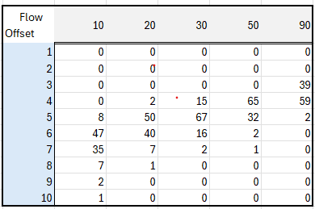

## TimeDelayed
### About this function
The function uses an XYZ table to calculate a value-dependent delayed output
based on an input series. The XYZ table is identified by a symbol referring to
the Mesh attribute that holds the table. The table contains the following
information, using a typical delayed water flow case as example:

- Z value defines the flow level where this XY vector definition is applied, i.e. a valid from definition.
- X value defines the delay given as offset value with respect to actual resolution of the input times series. If resolution is 1 hour, value 3 means 3 hours output delay.
- Y value gives the percentage of value from input series that is added as the time delayed contribution to time point defined by value time + offset given by X value.

#### Example table
  

#### Example
`DelayedFlow = @TimeDelayed (@t('.FlowSeries'), 'FlowDelayTableAttributeName')`

If the value in the input series is exactly 20 at time **t**, this value is
distributed like this:

- At t+4h, value = 20*0,02
- At t+5h, value = 20*0,5
- Etc.

If the value is close to 30, like 29, then the multiplication factor is
approximately 0,15 and 0,67 etc., because the factor is found as a linearisation
between the current segment and the next segment.

### Syntax
- TimeDelayed(t,s)

## Description

| # | Type | ## Description |
|---|---|---|
| 1 | t | Reference to a fixed interval time series. |
| 2 | s | Attribute name that holds the XYZ table. |
