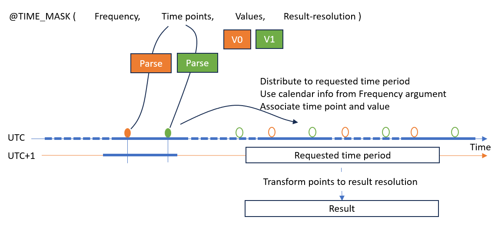
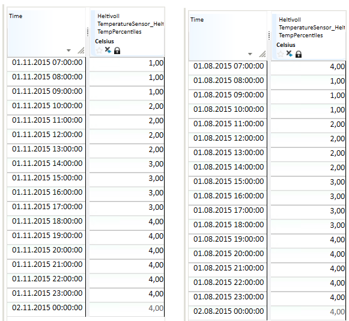
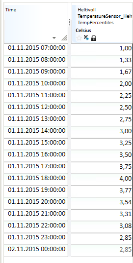
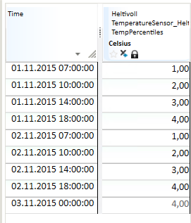
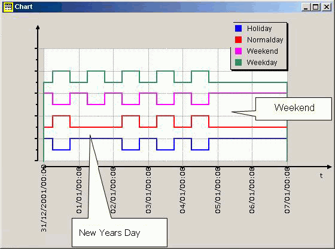

## TIME_MASK

### About the function

This function creates time series from its arguments, normally used as time
masks (a series with 1 or 0 as value), but not limited to only this type.

### Syntax

There are two main categories of this function. The recommended variants:

- TIME_MASK(s,S,D,s)
- TIME_MASK(s,S,D)
- TIME_MASK(S,D)

And a less used variant:

- TIME_MASK(s,s)

### TIME_MASK(s,S,D,s)

The principle for the function is that you specify a repeat frequency, an array
of time points and a corresponding array of function values. The time points are
repeated at the frequency given as the first argument. The last argument allows
you to specify the resolution for the result series.

| # | Type | Description |
|---|---|---|
| 1 | s | Repeat frequency. For values, see Repeat frequency. |
| 2 | S | Time point description array in any format. See Time point description array. |
| 3 | D | Array of values which apply to the time points given in the preceding argument. |
| 4 | s | Result series resolution. For values, see Resolution. |

If the first and last symbol arguments are omitted, default values are applied.
Default repeat frequency is 'NONE' and default result series resolution is 'HOUR'.

Unless the repeat frequency is 'NONE', the time points specified are moved and repeated so that they establish a functional value for the whole requested time period. That means when frequency is 'DAY' it has no meaning to use macros that add days to a time point, like 'DAY+3d+2h'. In this example the time point specification 'DAY+2h' would give the same result. 

See [time macro specification](../timepoint-macros.md).

This figure illustrate the implemented algorithm to convert arguments into a time series.



- Every time point specification is parsed and added to a timeline.
- There are values to be associated with each time point based on the index in collection.
  The effective size of the time points specification and values specification must be the same. 
- The frequency argument determine which part of the time point that is going to be used.
  - For instance a frequency code 'DAY' means that the hour and minute part is used and the year/month/day part is neglected.
- The frequency argument also describes how the parsed time points are distributed into the requested time period for a calculation. The frequency is illustrated in the figure as blue dotted and solid line sections.
- The distributed points have to provide a functional value for the complete requested time period. Observe the first and last green time point in the figure are both outside the requested area. The last point is only needed in case the curve type is linear.
- The native distribution of points
  creates a breakpoint series, so unless the last argument is 'VARINT' a standard transformation
  is applied to create the result.

#### Repeat frequency

This argument consists of a time span code in addition to some options. The time
span code can be one of the following calendar codes:

The following frequency codes can be used:

| Symbol | Definition |
|---|---|
| MIN15 | Quarter of an hour |
| MIN30 | Half an hour |
| HOUR | Hour |
| DAY | 24-hour period |
| WEEK | Week |
| MONTH | Month |
| YEAR | Year |
| NONE | Absolute time points, no repetition frequency |

The options to frequency code are defined in <> brackets, for instance `HOUR<LT>`.

| Symbol | Definition |
|---|---|
| Linear  | The result series gets linear curve type. |
| LT | Local DST calendar used when moving time points with given frequency. |
| DB | Database configured calendar used when moving time points with given frequency. |
| UTC | UTC calendar used when moving time points with given frequency. |

Tip! You may incorporate calendar options into frequency codes as a prefix
code. Valid calendar prefix codes are LOCAL, STANDARD, UTC and DB. For example
frequency code LOCALDAY is the same as DAY. STANDARD is default and can be omitted.

The calendar info is used also used when parsing time points.

#### Time point description array

  You can use the following special codes instead of a list of definitions.

| Symbol | Definition |
|---|---|
| MONTHLY | Transformed to 12 time points representing start of each month, starting with January |
| WEEKLY | Transformed to 52 time points representing start of each week |
| DAILY | Transformed to 7 time points representing start of Monday, Tuesday etc |
| HOURLY | Transformed to 24 time points representing, from hour 0 to 23 |
| QUARTERLY | Transformed to 4 time points |

If you use one of these codes, you must still supply the correct number of
values in the next argument.

#### Resolution

| Symbol | Definition |
|---|---|
| MIN15 | Quarter of an hour |
| HOUR | Hour |
| DAY | 24-hour period |
| WEEK | Week |
| MONTH | Month |
| YEAR | Year |
| VARINT | Breakpoint |

## Examples

**Note!** All time points shown in tables are written as UTC time points.

### Day frequency

#### Example 1

`Result = @TIME_MASK('DAY', {'DAY+07h', 'DAY+10h', 'DAY+14h','DAY+18h'}, {1,2,3,4},'VARINT')`

| Time UTC | Result | Comment |
|---|---|---|
| 2021-12-31T17:00:00Z |       4.00 | The point that cover start of requested period |
| 2022-01-01T06:00:00Z |       1.00 | From DAY+7h, parsed as UTC+01 zone |
| 2022-01-01T09:00:00Z |       2.00 |  |
| 2022-01-01T13:00:00Z |       3.00 |  |
| 2022-01-01T17:00:00Z |       4.00 |  |
| 2022-01-02T06:00:00Z |       1.00 |  |
| 2022-01-02T09:00:00Z |       2.00 |  |
| 2022-01-02T13:00:00Z |       3.00 |  |

Default calendar for time points are standard time zone, i.e. UTC+1:00 with **no** 
Daylight Saving Time (DST) definition applied.

We can observe that the values provided are repeated daily.

Switching to a request inside inside a DST period, still gives the same result.

`##=@TIME_MASK('DAY', {'DAY+07h', 'DAY+10h', 'DAY+14h','DAY+18h'}, {1,2,3,4},'VARINT')`

| Time UTC | Result |
|---|---|
| 2021-12-31T17:00:00Z |       4.00 |
| 2022-01-01T06:00:00Z |       1.00 |
| 2022-01-01T09:00:00Z |       2.00 |
| 2022-01-01T13:00:00Z |       3.00 |
| 2022-01-01T17:00:00Z |       4.00 |
| 2022-01-02T06:00:00Z |       1.00 |
| 2022-01-02T09:00:00Z |       2.00 |

#### Example 2

`Result = @TIME_MASK('DAY<UTC>', {'DAY+07h', 'DAY+10h', 'DAY+14h','DAY+18h'}, {1,2,3,4},'VARINT')`

| Time UTC | Result | Comment |
|---|---|---|
| 2021-12-31T18:00:00Z |       4.00 |  |
| 2022-01-01T07:00:00Z |       1.00 | From DAY+07h, parsed as UTC zone (frequency option)|
| 2022-01-01T10:00:00Z |       2.00 |  |
| 2022-01-01T14:00:00Z |       3.00 |  |
| 2022-01-01T18:00:00Z |       4.00 |  |
| 2022-01-02T07:00:00Z |       1.00 |  |
| 2022-01-02T10:00:00Z |       2.00 |  |

The time points are now interpreted as UTC time points and 'DAY+07h' with associated value 1.0 is
found in the result series at '2022-01-01T07:00:00Z' and '2022-01-02T07:00:00Z'.

Switching to a request inside inside a DST period and using zone `LT` - local zone with DST enabled.

`Result = @TIME_MASK('DAY<LT>', {'DAY+07h', 'DAY+10h', 'DAY+14h','DAY+18h'}, {1,2,3,4},'VARINT')`

| Time UTC | Result |
|---|---|
| 2022-03-31T16:00:00Z |       4.00 |
| 2022-04-01T05:00:00Z |       1.00 |
| 2022-04-01T08:00:00Z |       2.00 |
| 2022-04-01T12:00:00Z |       3.00 |
| 2022-04-01T16:00:00Z |       4.00 |
| 2022-04-02T05:00:00Z |       1.00 |
| 2022-04-02T08:00:00Z |       2.00 |

#### Example 3

Switch to hourly result resolution. Then the function will perform a transformation from breakpoint series as described in the previous examples to hour resolution based on the functional value at time points.

`Result = @TIME_MASK('DAY<UTC>', {'DAY+07h', 'DAY+10h', 'DAY+14h','DAY+18h'}, {1,2,3,4},'HOUR')`

| Time UTC | Result |
|---|---|
| 2022-01-01T00:00:00Z |       4.00 |
| 2022-01-01T01:00:00Z |       4.00 |
| 2022-01-01T02:00:00Z |       4.00 |
| 2022-01-01T03:00:00Z |       4.00 |
| 2022-01-01T04:00:00Z |       4.00 |
| 2022-01-01T05:00:00Z |       4.00 |
| 2022-01-01T06:00:00Z |       4.00 |
| 2022-01-01T07:00:00Z |       1.00 |
| 2022-01-01T08:00:00Z |       1.00 |
| 2022-01-01T09:00:00Z |       1.00 |
| 2022-01-01T10:00:00Z |       2.00 |
| 2022-01-01T11:00:00Z |       2.00 |
| 2022-01-01T12:00:00Z |       2.00 |
| 2022-01-01T13:00:00Z |       2.00 |
| 2022-01-01T14:00:00Z |       3.00 |
| 2022-01-01T15:00:00Z |       3.00 |
| 2022-01-01T16:00:00Z |       3.00 |
| 2022-01-01T17:00:00Z |       3.00 |
| 2022-01-01T18:00:00Z |       4.00 |
| 2022-01-01T19:00:00Z |       4.00 |
| 2022-01-01T20:00:00Z |       4.00 |
| 2022-01-01T21:00:00Z |       4.00 |
| 2022-01-01T22:00:00Z |       4.00 |
| 2022-01-01T23:00:00Z |       4.00 |
| 2022-01-02T00:00:00Z |       4.00 |
| 2022-01-02T01:00:00Z |       4.00 |

As we can see the functional value at each hour in this day is based on a curve type 'Step' or 'Start of step'.

Adding an option to the first argument like this:

`Result = @TIME_MASK('DAY<UTC><Linear>', {'DAY+07h', 'DAY+10h', 'DAY+14h','DAY+18h'}, {1,2,3,4},'HOUR')`

Due to `<Linear>` option in first argument the functional value at a time point is found from a linearisation between two points.


| Time UTC | Result |
|---|---|
| 2022-01-01T00:00:00Z |       2.91 |
| 2022-01-01T01:00:00Z |       2.64 |
| 2022-01-01T02:00:00Z |       2.36 |
| 2022-01-01T03:00:00Z |       2.09 |
| 2022-01-01T04:00:00Z |       1.82 |
| 2022-01-01T05:00:00Z |       1.55 |
| 2022-01-01T06:00:00Z |       1.27 |
| 2022-01-01T07:00:00Z |       1.00 |
| 2022-01-01T08:00:00Z |       1.33 |
| 2022-01-01T09:00:00Z |       1.67 |
| 2022-01-01T10:00:00Z |       2.00 |
| 2022-01-01T11:00:00Z |       2.25 |
| 2022-01-01T12:00:00Z |       2.50 |
| 2022-01-01T13:00:00Z |       2.75 |
| 2022-01-01T14:00:00Z |       3.00 |
| 2022-01-01T15:00:00Z |       3.25 |
| 2022-01-01T16:00:00Z |       3.50 |
| 2022-01-01T17:00:00Z |       3.75 |
| 2022-01-01T18:00:00Z |       4.00 |
| 2022-01-01T19:00:00Z |       3.73 |
| 2022-01-01T20:00:00Z |       3.45 |
| 2022-01-01T21:00:00Z |       3.18 |
| 2022-01-01T22:00:00Z |       2.91 |
| 2022-01-01T23:00:00Z |       2.64 |
| 2022-01-02T00:00:00Z |       2.36 |
| 2022-01-02T01:00:00Z |       2.09 |

#### Example 4

Some examples where results are shown in Nimbus client where time points are _presented_ in local time zone with DST.

`Result = @TIME_MASK('DAY', {'DAY+07h', 'DAY+10h', 'DAY+14h',
'DAY+18h'}, {1,2,3,4},'HOUR')`

This gives a time series where time points are repeated daily and where the result has hourly time resolution.
The presentation of data values is step wise.

The table shows the result from a day on winter time (normal time). The
definition of the expression has no reference to a defined time zone and uses
the time zone of the database.

Note! If the same expressions are run for a day in summer time, the values
are shifted to one hour later.



`Result = @TIME_MASK('DAY', {'DAY+07h', 'DAY+10h', 'DAY+14h',
'DAY+18h'}, {1,2,3,4},'HOUR')`

This gives a time series with daily repeat frequency and hourly time resolution.
The presentation of data values is linear.

  

`Result = @TIME_MASK('DAY', {'DAY+07h', 'DAY+10h', 'DAY+14h',
'DAY+18h'}, {1,2,3,4},'VARINT')`

This gives a time series with daily repeat frequency and breakpoint time
resolution. The presentation of data values is step wise.

  

## Examples - less used variant

### TIME_MASK(s,s)

This function lets you define a logical time series from criteria given by the parameters in a text resource file specified as the second argument. The values on the result series is either 0 or 1 depending on the arguments to the function.
The default resolution is hour.

As an example, the function can be used to create time series masks, for instance, to
find the power usage in specific periods of the day, like low load, peak load etc.

@TIME_MASK(s,s)

| # | Type | Description |
|---|---|---|
| 1 | s | One of the codes explained in the table below. |
| 2 | s | A resource file reference. The format of this file and how to install it is described below. |

The available codes are:

| Symbol | Definition |
|---|---|
| WEEKDAY | Weekdays at daytime. Gives the value 1 at time steps within 'workhours'. |
| WEEKEND | Night and weekend - the opposite of WEEKDAY for all days except WEEKEND. |
| NORMALDAY | Weekday at daytime, except for holidays - same as 'WEEKDAY', but holidays are excluded (see 'holiday' and 'mholidays' sections in the file format description). |
| HOLIDAY | Night, weekends and holidays - the opposite of 'NORMALDAY'. |

#### Format of the resource file

The `MyHolidayfile.txt` is a user defined calendar file:
```
  # Filename: MyHolidayfile.txt
  # Tariff template: time definitions

  workhours 06:00 22:00
  weekend 6 7

  # Fixed holidays (date in format year/month/day)
  holiday 1/1 1/6 4/30 5/1 12/24 12/25 12/26 12/31 1997/6/20 1997/08/22

  # Moveable holidays relative easter 
  mholiday es-3 es-2 es+1 es+39 es+40 es+50
  seasons 12/1 4/1 6/1 9/1
  lseason 4/1 11/1
```

To make this file available to the function it must be installed in the Mesh resource
section. This can be done like this using a Mesh command line tool:

- Assume the file on disk is named `MyHolidayfile.txt`
- In a terminal window, apply this command:
  - `Powel.Mesh.CommandLineRequests.exe -w ImportTextFile -i .\MyHolidayfile.txt -w Resource/ConfigFiles/MyHolidayfile.txt -S`
  - To see which resource files that are available, you can apply the following command
    - `Powel.Mesh.CommandLineRequests.exe -w ListTextFiles`
  - To see the contents on a resource file in Mesh you can apply this command
    - `Powel.Mesh.CommandLineRequests.exe -w ExportTextFile -w Resource/ConfigFiles/MyHolidayFile.txt`

#### Examples

The function returns the following according to the calendar file definition:

| Expression | Result mask |
|---|---|
| @TIME_MASK('WEEKDAY',’MyHolidayfile.txt’) | 1 for all hours from 06:00 to 22:00 on all days except for weekends, i.e. Monday to Friday inclusive. 0 otherwise. |
| @TIME_MASK('WEEKEND',’MyHolidayfile.txt’) | 1 for all hours from 22:00 to 06:00 from Monday to Friday, and 1 for the entire day on Saturday and Sunday. 0 otherwise. |
| @TIME_MASK('HOLIDAY',’MyHolidayfile.txt’) | Same mask as for "WEEKEND", in addition to 1 for all fixed and moveable public holidays defined in the current file. See "holiday" and "mholidays" sections on file. 0 otherwise. |
| @TIME_MASK('NORMALDAY',’MyHolidayfile.txt’) | Opposite of WEEKDAY. |

The result above can be illustrated in a figure showing the difference between
the various masks:

  
