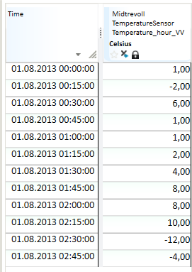
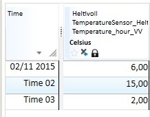
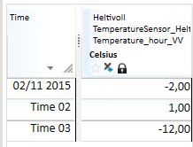
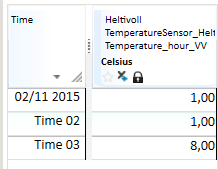
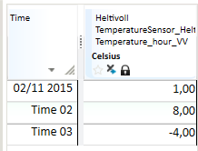

# TRANSFORM

This topic describes the [`TRANSFORM(t, s, s)`](#transformt-s-s),
[`TRANSFORM(t, t, s)`](#transformt-t-s), [`TRANSFORM(t, d, s)`](#transformt-d-s)
and [`TRANSFORM(t, s, s, s)`](#transformt-s-s-s) functions for transforming
from one time resolution to another. To get an overview of all the
transformation function variants, see [which functions can be used when?](../functions/transform_what_when.md)

## Output resolution

Transformation of time series from one resolution to another resolution is
specified by symbols like HOUR, DAY, WEEK etc. Some of these symbols have a time
zone foundation. For example, DAY can be related to European Standard Time
(UTC+1), which is different from the DAY scope in Finland (UTC+2). When the time
zone argument to TRANSFORM is omitted, the configured standard time zone with no
Daylight Saving Time enabled is used.

| Symbol | Description               |
| ------ | ------------------------- |
| MIN    | Fixed 1 minute interval   |
| MIN5   | Fixed 5 minute interval   |
| MIN10  | Fixed 10 minute interval  |
| MIN15  | Fixed 15 minutes interval |
| MIN30  | Fixed 30 minutes interval |
| HOUR   | Fixed hour interval       |
| DAY    | Fixed day interval        |
| WEEK   | Fixed week interval       |
| MONTH  | Fixed month interval      |
| YEAR   | Fixed year interval       |

## Transformation methods

All the `TRANSFORM` functions take a a transformation method argument which
determines the values and flags of the output time series. The following
subsections document the valid transformation methods.

Transforming from breakpoint to any resolution uses the "finer to coarser"
table, as does the `@TRANSFORM(t, t, s)` function.

### Transforming from a finer to a coarser resolution

| Symbol | Description |
| ------ | - |
| SUM    | The sum of the values included in the base for this value.  Does not consider how long the values are valid, i.e. a break point series with two values in the current interval that will give the sum of these two values. |
| SUMI   | Integral based sum with resolution second. Calculates the sum of value multiplied with number of seconds each value is valid.  Value equal 1 at the start of the day will give 86400 as day value if the base is one break point series and 3600 if this is an hour series with only one value on first hour. |
| AVG    | For fixed interval series. Sum of all values in accumulation period divided by number of values in the accumulation period (24 for hour series that is transformed to day series).  For break point series: Mean value of the values included in the base for this value. Does not consider how long the values are valid, i.e. a break point series with two values in the current interval that will give the mean value of these two values. |
| AVGI   | Integral based mean value, i.e. considers how much of the accumulation period that a given value is valid (to next value that can be NaN for a fixed interval series). This value is presented as mean value in the summary part of the presentation in Table. |
| FIRST  | First value in the accumulation period. This is the functional value at the start of the accumulation period, unless there exists an explicit value. |
| LAST   | Last value in the accumulation period. This is the functional value at the end of the accumulation period, unless there exists an explicit value. |
| MIN    | Smallest value in the accumulation period. |
| MAX    | Largest value in the accumulation period. |

### Transforming from a coarser to a finer resolution

| Symbol | Description                                                                                         |
| ------ | --------------------------------------------------------------------------------------------------- |
| SUM    | The sum of the result values for expanded period equals the value in the input data series.         |
| AVG    | The mean values of the result values for expanded period equals the value in the input data series. |

For `@TRANSFORM(t, s, s)`, `@TRANSFORM(t, s, s, s)`, and `@TRANSFORM(t, d, s)`
the implementation chooses `SUM` if the method string contains (case insensitive)
`SUM`, and `AVG` otherwise. This behaviour is deprecated and may be removed in
a future version, preceded by tooling to identify erroneous cases. We strongly
recommend using `SUM` or `AVG` instead of for example `SUMV` or `AVERAGE`.

If the input time series is time zone aware we only allow `SUM` or `AVG`.

## `TRANSFORM(t, s, s)`

This is the most common conversion function. You can use it to convert both
ways, i.e. both from finer to coarser resolution, and the other way. The most
common use is accumulation, i.e. transformation to coarser resolution. Most
transformation methods are available for this latter use.

### Description
| # | Type | Description |
|---|---|---|
| 1 | t | Time series to be converted. |
| 2 | s | Time resolution of the result, given as a RESOLUTION symbol (see separate table). |
| 3 | s | Conversion method, given as a TRANSMETHOD symbol (see separate table). |

### Example

  Example 1: @TRANSFORM(t,s,s) Create week sums from a time series

  Res1 = @TRANSFORM(@t('HourTs'), 'WEEK', 'SUM')

  Example 2: @TRANSFORM(t,s,s) Create day average from a break point series

  Res2 = @TRANSFORM(@t('BrpTs'), 'DAY', 'AVGI')

  Example 3: Shows variants and their resulting time series

  Input series:

  

  Uses conversion from quarter to hour resolution:

  ResSum = @TRANSFORM(@t(‘Ts15Min’,'HOUR','SUM')

  

  ResMean = @TRANSFORM(@t(‘Ts15Min’),'HOUR','MEAN')

  

  ResMin = @TRANSFORM(@t(‘Ts15Min’),'HOUR','MIN')

  

  ResMax = @TRANSFORM(@t(‘Ts15Min’),'HOUR','MAX')

  

  ResFirst = @TRANSFORM(@t(‘Ts15Min’),'HOUR','FIRST')

  

  ResLast = @TRANSFORM(@t(‘Ts15Min’),'HOUR','LAST')

  

## `TRANSFORM(t, t, s)`

Conversion to periods given by points of time on the series given as argument 2.
The result is a break point series. This function enables periods that are not
standard calendar units, e.g. 3 hours, 10 days, etc.

### Description
| # | Type | Description |
|---|---|---|
| 1 | t | Time series to be converted. |
| 2 | t | Time resolution on result, given as a break point series. The result series contains values on the points of time that exist on this series for current period. The values on this series are not used. |
| 3 | s | Conversion method, given as a TRANSMETHOD symbol. |

### Example
If you want to create an 8 hour accumulation for a time series you may do like
this:

  Create time mask series defining accumulation points of time:

  TM = @TIME_MASK('DAY', {'DAY','DAY+8h','DAY+16h'}, {1,2,3}, 'VARINT')

  Res = @TRANSFORM(@t('HourTs'), TM, 'SUM')

  Res is a result series with break point resolution.

## `TRANSFORM(t, d, s)`

Conversions given by the number given as argument 2. The number represents
number of seconds in the period.

### Description
| # | Type | Description |
|---|---|---|
| 1 | t | Time series to be converted. |
| 2 | d | Time resolution on the result, given as number of seconds in each period. |
| 3 | s | Conversion method, given as a TRANSMETHOD symbol. |

### Example
If d is defined as the value 864000 this means a period of 10 days
(60*60*24*10). The result is a break point series.

## `TRANSFORM(t, s, s, s)`

Corresponding functionality as in [`TRANSFORM(t, s, s)`](#transformt-s-s), but
with an additional argument that decides which time zone that is the base for
the conversion. This gives the possibilities to user periods that are different
from the rest of the environment.

### Description
| # | Type | Description |
|---|---|---|
| 1 | t | Time series to be converted. |
| 2 | s | Time resolution on result, given as a RESOLUTION symbol. |
| 3 | s | Conversion method, given as a TRANSMETHOD symbol. |
| 4 | s | Symbol stating time zone. 'LOCAL', 'LOKAL' and 'LT' give local time zone, 'NORMAL', 'STANDARD' and 'NT' gives normal time zone. Otherwise, the system will perform a lookup and see whether the value of the symbol is the name on an explicitly stated time zone in the system. Unknown zone equals no zone and then normal time zone is used. |

### Example

If you wish to calculate the DAY average on every hour of the day with Daylight
Saving Time (DST), you can make an expression like this:

    @TRANSFORM(@TRANSFORM(@t(‘HourSeries’), 'DAY', 'AVG', 'LT'), 'HOUR', 'AVG')
