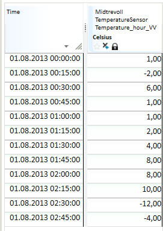
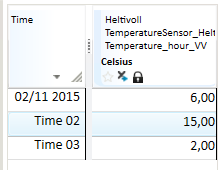
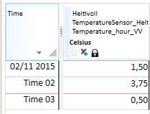
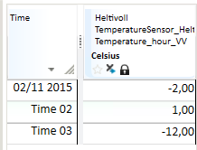
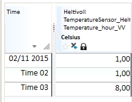

## TRANSFORM
This topic describes the TRANSFORM variants ([R1](#r1), [R2](#r2), [R3](#r3),
[R4](#r4), [R5](#r5)) for transforming from one time resolution to another. To
get an overview of all the transformation function variants, see:

[Which functions can be used when?](../functions/transform_what_when.md)

Transformation of time series from one resolution to another resolution is
specified by symbols like HOUR, DAY, WEEK etc. Some of these symbols have a time
zone foundation. For example, DAY can be related to European Standard Time
(UTC+1), which is different from the DAY scope in Finland (UTC+2). When the time
zone argument to TRANSFORM is omitted, the configured standard time zone with no
Daylight Saving Time enabled is used.

The TRANSFORM function is also used internally in the system when there is a
request for time series values with a resolution that is different from its
native definition. For example, it can be used as part of presenting a DAY based
series into an HOUR based presentation, or vice versa. When doing this, the
system will check if there are presentation hints available, as well as inspect
the time series type and value unit to come up with reasonable arguments to the
TRANSFORM operation.

**Note!** In the mentioned example, the time zone used will always be the
configured standard time zone. If this default behaviour appears to be wrong for
your business process, you have to make a transformation that uses explicit
TRANSFORM expressions in virtual time series or as part of a time series report.

If the transformation is done from a fixed interval series to a variable
interval series (breakpoint resolution), you may need to use additional status
mask filtering to achieve the result you expect. This is mostly relevant when
there are NaN values in the fixed resolution source series, because such value
points are transformed to a NaN value with time from the start of each fixed
resolution interval. If you want the breakpoint series to not contain explicit
NaN values you have to combine the TRANSFORM function with STATUS_MASK as shown
in example below:

`## = @STATUS_MASK(@TRANSFORM(@t('.FixedSourceSeriesWithNaNValues'),'VARINT','DEFAULT'), 'missing', 'remove')`

The STATUS_MASK wrapper removes values with status missing from the transformed
time series.

### R1
## About the function
This is the most common conversion function. You can use it to convert both
ways, i.e. both from finer to coarser resolution, and the other way. The most
common use is accumulation, i.e. transformation to coarser resolution. Most
transformation methods are available for this latter use.

## Syntax
- TRANSFORM(t,s,s)

## Description

| # | Type | Description |
|---|---|---|
| 1 | t | Time series to be converted. |
| 2 | s | Time resolution of the result, given as a RESOLUTION symbol (see separate table). |
| 3 | s | Conversion method, given as a TRANSMETHOD symbol (see separate table). |

## Example
  Example 1: @TRANSFORM(t,s,s) Create week sums from a time series

  Res1 = @TRANSFORM(@t('HourTs'), 'WEEK', 'SUM')

  Example 2: @TRANSFORM(t,s,s) Create day average from a break point series

  Res2 = @TRANSFORM(@t('BrpTs'), 'DAY', 'AVGI')

  Example 3: Shows variants and their resulting time series

  Input series:

  

  Uses conversion from quarter to hour resolution:

  ResSum = @TRANSFORM(@t(‘Ts15Min’,'HOUR','SUM')

  

  ResMean = @TRANSFORM(@t(‘Ts15Min’),'HOUR','MEAN')

  

  ResMin = @TRANSFORM(@t(‘Ts15Min’),'HOUR','MIN')

  

  ResMax = @TRANSFORM(@t(‘Ts15Min’),'HOUR','MAX')

  

  ResFirst = @TRANSFORM(@t(‘Ts15Min’),'HOUR','FIRST')

  

  ResLast = @TRANSFORM(@t(‘Ts15Min’),'HOUR','LAST')

  

### R2
## About the function
Conversion to periods given by points of time on the series given as argument 2.
The result is a break point series. This function enables periods that are not
standard calendar units, e.g. 3 hours, 10 days, etc.

## Syntax
- TRANSFORM(t,t,s)

## Description

| # | Type | Description |
|---|---|---|
| 1 | t | Time series to be converted. |
| 2 | t | Time resolution on result, given as a break point series. The result series contains values on the points of time that exist on this series for current period. The values on this series are not used. |
| 3 | s | Conversion method, given as a TRANSMETHOD symbol. |

## Example
If you want to create an 8 hour accumulation for a time series you may do like
this:

  Create time mask series defining accumulation points of time:

  TM = @TIME_MASK('DAY', {'DAY','DAY+8h','DAY+16h'}, {1,2,3}, 'VARINT')

  Res = @TRANSFORM(@t('HourTs'), TM, 'SUM')

  Res is a result series with break point resolution.

### R3
## About the function
Conversions given by the number given as argument 2. The number represents
number of seconds in the period.

## Syntax
- TRANSFORM(t,d,s)

## Description

| # | Type | Description |
|---|---|---|
| 1 | t | Time series to be converted. |
| 2 | d | Time resolution on the result, given as number of seconds in each period. |
| 3 | s | Conversion method, given as a TRANSMETHOD symbol. |

## Example
If d is defined as the value 864000 this means a period of 10 days
(60*60*24*10). The result is a break point series.

### R4
## About the function
Corresponding functionality as to [R1](#r1), but with an additional argument
representing a mask series. This decides which values in the base series that
should contribute to converted value. If you should transform to a time series
with finer resolution, you must use the DISTRIBUTE function.

## Syntax
- TRANSFORM(t,s,s,t)

## Description

| # | Type | Description |
|---|---|---|
| 1 | t | Time series to be converted. |
| 2 | s | Time resolution on result, given as a RESOLUTION symbol. |
| 3 | s | Conversion method, given as a TRANSMETHOD symbol. |
| 4 | t | Mask series deciding which values on the time series in argument 1 that should contribute to the result. |

## Example
If you wish to calculate a day series with the sum of values for 6am to 8pm, you
can define the following expression:

Create a time mask series that define hours to be included in the sum (value
equals 1 on the mask series):

  TM = @TIME_MASK('DAY', {'DAY+6h','DAY+20h'}, {1,0})

  Res = @TRANSFORM(@t('HourTs'), 'DAY', 'SUM', TM)

### R5
## About the function
Corresponding functionality as in [R1](#r1), but with an additional argument
that decides which time zone that is the base for the conversion. This gives the
possibilities to user periods that are different from the rest of the
environment.

## Syntax
- TRANSFORM(t,s,s,s)

## Description

| # | Type | Description |
|---|---|---|
| 1 | t | Time series to be converted. |
| 2 | s | Time resolution on result, given as a RESOLUTION symbol. |
| 3 | s | Conversion method, given as a TRANSMETHOD symbol. |
| 4 | s | Symbol stating time zone. 'LOCAL', 'LOKAL' and 'LT' give local time zone, 'NORMAL', 'STANDARD' and 'NT' gives normal time zone. Otherwise, the system will perform a lookup and see whether the value of the symbol is the name on an explicitly stated time zone in the system. Unknown zone equals no zone and then normal time zone is used. |

  **Example**

If you wish to calculate the DAY average on every hour of the day with Daylight
Saving Time (DST), you can make an expression like this :

Res = @TRANSFORM(@TRANSFORM(@t(‘HourSeries’), 'DAY', 'MEAN', 'LT'), 'HOUR',
'MEAN', 'LT')
