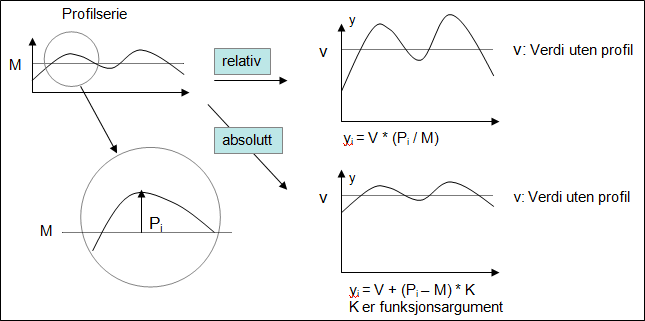

# Terms used in the functions

## Mask series

In some of the functions the term mask series is used. This is a time series where you separate between the values NaN, 0 and all other values. NaN and 0 are logically perceived as logically untrue value (FALSE) and all other values are perceived as logically true value (TRUE). A mask series can e.g. be used to define which hours that should be included in the calculation of a day value with method SUM.

## Profile series

In some of the functions the term profile series is used. This is a time series that can be used in transformation to finer resolution, e.g. from day to hour. In this function you can either use mean value or sum consideration, i.e. if the mean value from calculated values should equal the value they were derived from or if it is the sum of the values that should equal the start point value.

## Handling profile

The profile series can be used in two ways, relative or absolute. Current functions exist in two versions, one using relative profile and one using the profile directly (called absolute). The latter version can be scaled using a coefficient that is an argument to the function.

The figure shows that use of relative profile will strengthen the variation if the mean value for the input data series (V) is large compared to the mean value on the profile series (M). By using absolute profile the variation will equal the profile series, possibly adjusted with a factor different from 1 that is given as first argument to the functions using absolute profile.

## Input data series

In all functions the first time series is argument to the time series to be converted in one way or the other.
