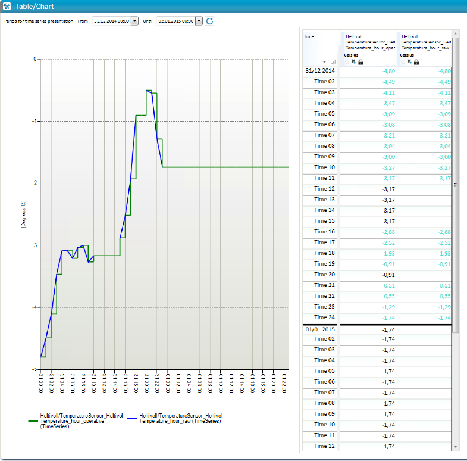

# TS_EXPAND
## About the function
Replaces empty values in a fixed interval series. If the series has the linear
curve type, the function interpolates between real values. Otherwise, the
previous real value is used.

## Syntax
- TS_EXPAND(t[,s])
- TS_EXPAND(t,s[,s])

## Description

| # | Type | Description |
|---|---|---|
| 1 | t | Input time series with a fixed interval with potential missing values (defined as NaN values). |
| 2 | s | Optional argument where you can specify curve type and potentially override the curve type definition on the input time series. The LINEAR value (case insensitive) gets linear behaviour on expansion. The STEP value, gets step behaviour on expansion. |

Example 1: @TS_EXPAND(t)

`Temperature_hour_operative = @TS_EXPAND(@t('Temperature_hour_raw'))`

Example 2: @TS_EXPAND(t,s)

`Temperature_hour_operative = @TS_EXPAND(@t('Temperature_hour_raw'),’step’)`

The original time series has a linear curve type.

Description TS_EXPAND(t,s,s)

| # | Type | Description |
|---|---|---|
| 1 | t | Input time series with potential missing values (defined as NaN values). |
| 2 | s | Specification of time resolution for the result time series. The same behavior as [@TRANSFORM](../functions/transform.md) with method FIRST. E.g. ‘HOUR’, ‘DAY’ etc. |
| 3 | s | Optional argument where you can specify curve type and potentially override the curve type definition on the input time series. The LINEAR value (case insensitive) gets linear behaviour on expansion. The STEP value, gets step behaviour on expansion. |
