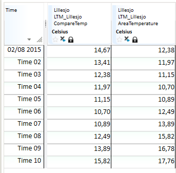
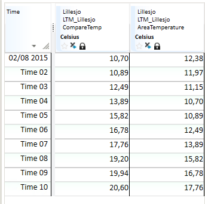
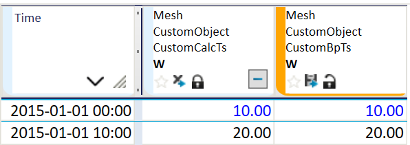

# TS_OFFSET

This function time-shifts a time series, i.e. uses values from a period which is
different from the current calculation period. More precisely, TS_OFFSET will
produce points at the same timestamps as those of the input time series,
but use the offset to determine their functional values and flags. This may have
unexpected results when the input is a breakpoint time series; see the examples
below for more details.

The result time series has the same resolution as the input.

## Syntax
- TS_OFFSET(t,d[,s])

## Description
TS_OFFSET(t,d[,s]) reads values relative to the current period. Each result
point at time T takes the source value from `T + d * unit`.

| # | Type | Description | Example |
|---|---|---|---|
| 1 | t | Series to read values from. | @t('AreaTemperature') |
| 2 | d | Offset amount in the unit specified in argument 3. | -2 |
| 3 | s | Offset unit code (default: `'HOUR'`) | 'DAY' |

The table below shows the valid offset unit codes.

| UNIT code | Time span |
|---|---|
| MIN | 1 minute |
| MIN5 | 5 minutes |
| MIN10 | 10 minutes |
| MIN15 | 15 minutes |
| MIN30 | 30 minutes |
| HOUR | 1 hour |
| DAY | 1 day |
| WEEK | 7 days |
| MONTH | 30 days |
| YEAR | 365 days |

**_Note!_** `MONTH` and `YEAR` are always 30 and 365 days respectively; i.e. they are not
calendar-aware.

## Examples

Example 1:
`CompareTemp = @TS_OFFSET(@t('AreaTemperature'),-2)`

With d = -2, each `CompareTemp` point shows the `AreaTemperature` value
from 2 hours earlier.

Example 2:
`CompareTemp = @TS_OFFSET(@t('AreaTemperature'),3)`

With d = 3, each `CompareTemp` point shows the `AreaTemperature` value
from 3 hours later.

Example 3:
`CustomCalcTs = @TS_OFFSET(@t('CustomBpTs'), 2)`

`CustomBpTs` is a staircase breakpoint time series with two points:
10 at 00:00 and 20 at 10:00. Even though we specify a 2-hour offset,
the resulting `CustomCalcTs` time series is the same as the input `CustomBpTs`
because the input has no points at 08:00 where the value 20 could be placed.

