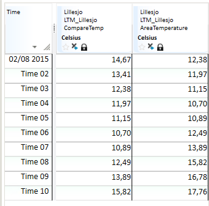
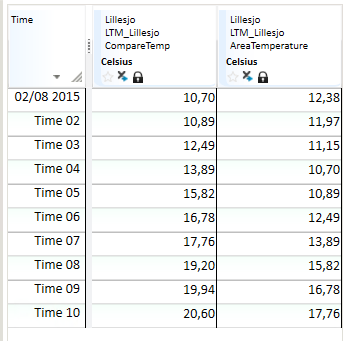

## TS_OFFSET
## About the function
This function time-shifts a time series, i.e. uses values from a period which is
different from the current calculation period.

  The result series has the same resolution as the input time series.

## Syntax
- TS_OFFSET(t,d[,s])

## Description
  TS_OFFSET(t,d,[s]) is used relative to current period.

| # | Type | Description | Example |
|---|---|---|---|
| 1 | t | Series from which you have to retrieve values. |   |
| 2 | d | Offset in hours or the unit as specified in argument 3. |   |
| 3 | s | Offset unit code. Default value hours. | 'DAY' |

  The table below shows the valid offset unit codes.

Additionally, the unit codes can be combined with a zone code, representing the
local time, standard time, UTC time and database time. For instance LOCALDAY.

  ***Note!*** LOCAL can only be combined with time unit DAY or coarser.

| UNIT code |
|---|
| MIN15 |
| HOUR |
| DAY |
| WEEK |
| MONTH |
| YEAR |
| LOCAL |
| STANDARD |
| UTC |
| DB |

  **Example**

  Example 1: @TS_OFFSET(t,d)

  `CompareTemp = @TS_OFFSET(@t('AreaTemperature'),-2)`

The values of AreaTemp are time-shifted. "d" determines the number of time
intervals by which the time series is to be shifted. We can see that the result
moves backwards in time for negative numbers.

  

  Example 2: @TS_OFFSET(t,d)

  `CompareTemp = @TS_OFFSET(@t('AreaTemperature'),3)`

The values of AreaTemp are time-shifted. "d" determines the number of time
intervals by which the time series is to be shifted. We can see that the result
moves forward in time for positive numbers.

  
