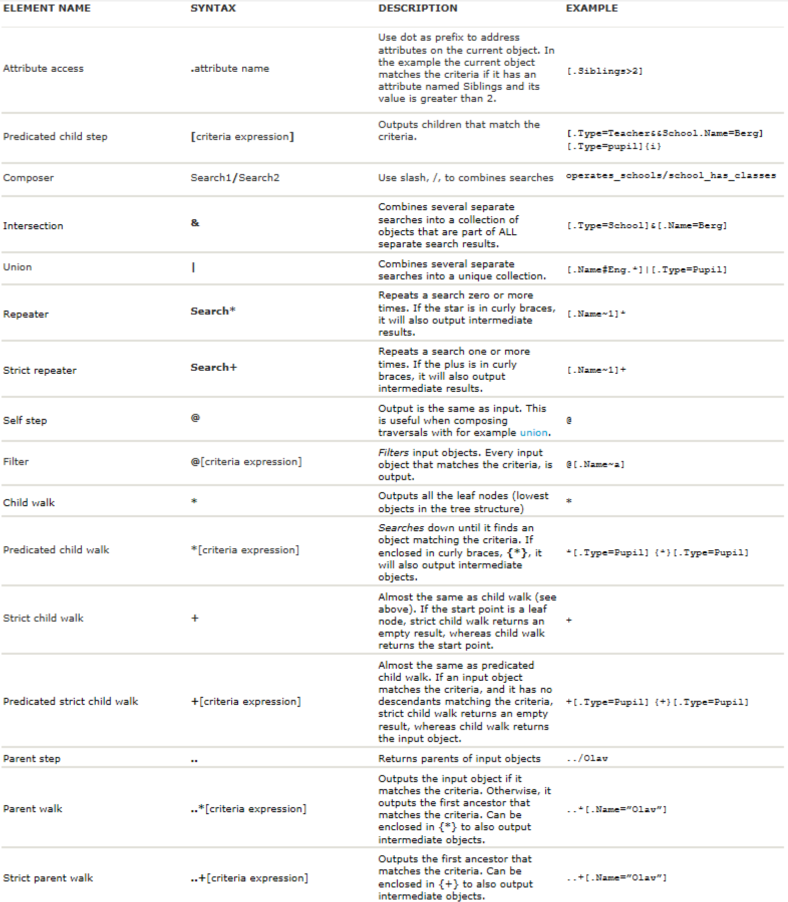

# Mesh search language

The Mesh search language can be used to find Mesh objects.

To be able to search for a Mesh object you need to specify which model to
search in, where in the model the search should start and the query matching
the criteria of the Mesh object you are searching for.

## Query syntax

A search consists of a traversal, optionally followed by an [attribute](./modelling/general.md#attribute)
access (".AttributeName"). A search takes an object (the start point) as input
and produces a set of objects or attributes as output (the result). If the
attribute access is specified, the result objects are all attributes (attribute
search), otherwise they are all objects (object search).

### Traversal

A traversal describes a set of relative paths in the Mesh object structure. It takes a set of objects as an input (the start points) and produces a set of objects as an output (the result) by following the paths from each start point and collecting endpoints. The start point is used to form a set and input into the traversal. The attribute access is applied to the output of the traversal. Some of the traversals are parametrized on criteria (e.g.: `[Criteria]` or `\*[Criteria]`). For example, the traversal `..` will output the parent, if it exists, for each input object. Traversals can be combined with operators to form new traversals.

### Criteria

Some traversals are parametrized on criteria (see predicated child walk and child step). The criteria controls which objects the traversal will accept as output, and will either accept an object by outputting true or reject it by outputting false. You can combine criteria with operators to form new criteria (see AND, OR). For example, the traversal ‘[.Name=N]’ will for each input object, output the set of child objects whose name equals ‘N’. The traversal ‘\*[.Name=N]’ will for each input object output the set of closest descendant objects whose name is ‘N’.

Criteria are always enclosed in square brackets, [].

You may specify options for the criteria within suffix curly brackets {}, for example to ignore case insensitivity on text based comparison. {i} means the search is case insensitive.

## Combining multiple search operations

You can combine search operations with the following operators:

- **INTERSECTION, &**:
    - The result is the intersection between each result set.
    - Syntax: *Search1&Search2*
- **UNION, \|**:
    - The result is the union between each result set.
    - Syntax: *Search1|Search2*
- **COMPOSITION, /**:
    - Uses the output from Search1 as input to Search2.
    - Syntax: *Search1/Search2*

    When using INTERSECTION and UNION between searches, you only use a single character, & or \|, respectively. Inside an object criteria, you use double character to specify a logic AND, &&, or logic OR, \|\|, respectively
