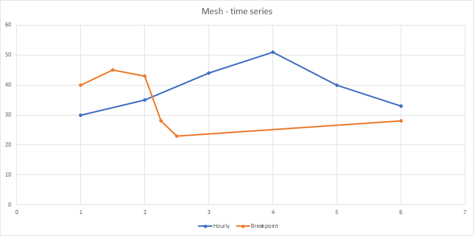

# Time series

The primary data retrieved from the Mesh server is time series. A time series
is a sequence of data points that occur in successive order over some period of
time. They can represent different kinds of data depending on its properties.
For example: how much power a hydro plant generates at any given time or how
much water passes a gate per hour can be represented as a time series.

## Mesh time series

Each point in Mesh time series contains the following fields:

* `utc_time`:
    - timestamp of the point (milliseconds since UNIX epoch 1970-01-01) in UTC
* `flags`:
    - status flag, 32-bit flags providing extra information like: is the point
      value correct or missing.  
      When working with existing time series preserve the flags unless you have
      a reason to set it to something else. When creating new time series, flags
      can be set to the default, which is `OK = 0`.
* `value`:
    - double-precision floating point value of the point

## Resolution

The resolution defines time step of the time series points. Some examples are
hourly or daily resolutions. A special type of resolution is **breakpoint**. It
means there is no time step restriction and points can be provided for any
timestamps.



## Types

There are 3 main types of time series in Mesh.

### Physical time series

Physical time series are stored (e.g.: in database) as points with timestamps,
flags and values. They are identified by unique **time series keys** and have
meta-information like:

* curve type
* resolution
* unit of measurement (which can be undefined)

Physical time series can be connected to a Mesh [object](./modelling/general.md#object)
via [time series attribute](./modelling/general.md#attribute). Either directly
or as part of a calculation.

### Virtual time series

Virtual time series do not contain actual data points but an expression that is
used to compute data points as result. The [calculation expressions](../calculations/calculations.md)
may reference other virtual or physical time series or constants. For example:
```
    "##= %'/TestResourceCatalog/physicalTimeSeries' + 3\n"
```

Both virtual and physical time series are not stored on Mesh model level, but
in a storage called *resources*.

**We strongly suggest to use calculation time series for new models.**

### Calculation time series

Calculation time series is similar to virtual time series, but they are
a newer concept and are more flexible. They do not contain actual data points
but a [calculation expressions](../calculations/calculations.md) that may
reference other time series types, attribute values or constants. For example:
```
    "##= @d('.DoubleAttribute') + @t('.TimeSeriesAttributePhysical') + @t('...TimeSeriesAttributeCalculation')\n"
```

The important difference is that calculation time series use model paths in
calculation expressions whereas virtual time series may only use in
calculation expressions other virtual or physical time series from the
*resources*. As a result calculation time series may also use in
expressions other attribute types, like for example an attribute of type
double.

## Expressions

Virtual or calculation time series expressions can use also functions like sum
all values in a time series, find values and status for a time series at
a given historical time, transform time series values from one resolution to
another and many more. These functions are loosely arranged into groups
representing a theme for those functions. Refer to
[Mesh calculations](../calculations/calculations.md) and
[Mesh calculation functions](../calculations/functions/introduction.md) for more information.
