# AddIn-Excel User Guide for Mesh

- [AddIn-Excel User Guide for Mesh](#addin-excel-user-guide-for-mesh)
  - [About this document](#about-this-document)
    - [Documentation overview](#documentation-overview)
    - [Writing conventions](#writing-conventions)
  - [Introduction](#introduction)
    - [Prerequisites](#prerequisites)
    - [Functionality in Emulated TsApi for Mesh](#functionality-in-emulated-tsapi-for-mesh)
  - [Install Smart Power AddInExcel](#install-smart-power-addinexcel)
    - [Installation on a shared disk](#installation-on-a-shared-disk)
    - [Define TsApi or Emulated TsApi](#define-tsapi-or-emulated-tsapi)
    - [Emulated TsApi configuration](#emulated-tsapi-configuration)
    - [Installation for each user](#installation-for-each-user)
    - [Upgrade](#upgrade)
  - [LoadFromDB worksheet](#loadfromdb-worksheet)
    - [Logon setup](#logon-setup)
    - [Status codes and colours setup](#status-codes-and-colours-setup)
    - [Time series search](#time-series-search)
    - [Time series report setup](#time-series-report-setup)
      - [Full name/TS Code part](#full-namets-code-part)
      - [Information part](#information-part)
      - [Show date/time part](#show-datetime-part)
      - [Different period part on load](#different-period-part-on-load)
      - [Comments part](#comments-part)
      - [Status part](#status-part)
      - [Where to store part](#where-to-store-part)
      - [Data function part](#data-function-part)
      - [Bulk group](#bulk-group)
      - [Message part on load](#message-part-on-load)
    - [Load data](#load-data)
  - [SaveToDB worksheet](#savetodb-worksheet)
    - [Time series save setup](#time-series-save-setup)
      - [TS Code part](#ts-code-part)
      - [Store part](#store-part)
      - [Different period part on save](#different-period-part-on-save)
      - [Where it is stored part](#where-it-is-stored-part)
      - [Save values part](#save-values-part)
      - [Function part](#function-part)
      - [Resolution part](#resolution-part)
      - [Stop criteria part](#stop-criteria-part)
      - [Message part on save](#message-part-on-save)
    - [Save data](#save-data)
  - [Hide the worksheets LoadFromDB and SaveToDB](#hide-the-worksheets-loadfromdb-and-savetodb)
  - [Add Smart Power AddIn Excel into existing workbook](#add-smart-power-addin-excel-into-existing-workbook)
    - [Add the LoadFromDB and SaveToDB worksheets](#add-the-loadfromdb-and-savetodb-worksheets)
    - [Set up the Times series to report](#set-up-the-times-series-to-report)
  - [Updates to PowelAddIn.xls](#updates-to-poweladdinxls)
  - [Updates to worksheets](#updates-to-worksheets)

## About this document

This document describes how to use the application. It is intended for a technical audience.

### Documentation overview

|DOCUMENT|WHEN|TARGET GROUP|LOCATION|
|--------|----|------------|--------|
|Smart Generation Release notes|Overview|System owner, system administrator/IT operations, end user|myVolue|
|Smart Generation Installation guide|Setup|System administrator/IT operations|myVolue|

### Writing conventions

- **Bold** is used for menu items, dialogue boxes, buttons and functions in GUI.
- `>` is used to separate a sequentially selection of menu items, e.g., File > Save as
- The typewriter font is used in code examples.
- Numbered lists are used for steps in a process.
- Bulleted lists are used for items without priority.
- ***Note!*** is used in front of important information.
- ***Tip!*** is used in front of additional information.

## Introduction

Smart Power AddInExcel includes two Excel workbooks (FlexibleLoadStore and PowelAddIn) and is a skeleton for easy reporting into Excel with Mesh REST API from the Mesh service. The FlexibleLoadStore workbook consists of 3 worksheets and PowelAddIn workbook has the code in VBA (Visual Basic for Application). The skeleton can be used as a starting point for a report or can be imported into an existing report and replace the existing use of TsApi in code and cell references. AddInExcel can also be used as for input to the Mesh service and database.

The use of AddInExcel will ensure a consistent use of Mesh REST API and will make it easier to make new reports for the users. Updates/upgrades of the Smart Power software will contain tested versions of the AddInExcel.

The FlexibleLoadStore workbook has three worksheets:

- LoadFromDB
- Present
- SaveToDB

In the first worksheet the logon information and time series to load and present are specified. The second one is used as an example for presentation and the last one the time series to save are specified. The first (LoadFromDB) and last (SaveToDB) will be described, the second is empty.

The PowelAddIn workbook has one sheet saying that this is an Add-In to Excel.

### Prerequisites

- You must install Mesh Emulated TsApi before you can use AddInExcel.
- Mesh Emulated TsApi supports both 64-bit and 32-bit clients like Excel.

### Functionality in Emulated TsApi for Mesh

The functionality that is provided in the Mesh version is limited. The intended functionality is intended for reading time series values from the Mesh server in an efficient and consistent way.

The following functionality exists:

- Reading and writing of Mesh time series is done directly from and to the Mesh time series without any conversion of values, resolution or time zone (aka `getTVQR` and `setTVQR`) using the FlexibleLoadStore module.
- Convert resolution when reading time series values from Mesh(aka `getTVQ`).
- Searches for time series paths in Mesh.
- Access security based on user identity in Active Directory (Kerberos) or EntraId.

## Install Smart Power AddInExcel

Smart Power AddInExcel consists of two workbooks where one is a plain Excel workbook for setting up time series, and one is an Excel Add-In.

### Installation on a shared disk

The PowelAddIn.xls workbook must be saved as an Excel Add-In. To save a workbook as an Add-In, open the workbook and use the `File\Save as …` menu. In the `Save as` dialogue select the Save as type `Microsoft Excel Add-In (*.xlam)`.

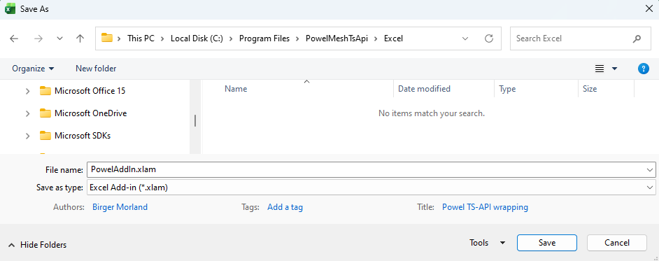

Excel will change to the directory where the Excel Add-Ins are stored. If you want to save it on a shared disk instead, navigate to the area where you want to store the Add-In. Save and close the file.

To make use of the Add-In please observe that the Add-In must be selected in the `Tools\Add-Ins …` menu. If `Powel TsApi wrapping` does not appear in the dialogue box, press the `Browse…` button and navigate to the shared disk where it is, select it and answer No to question if you want to copy the Add-In to your private directory.

***Note!*** Some Excel versions don’t accept text in the AddIn workbook. If you get the error message ‘PowelAddIn.xla is not a valid add-in’, then try to delete all text in the worksheet in PowelAddIn.xls and save it as a .xlam file once more.

### Define TsApi or Emulated TsApi

You define whether to use TsApi or Emulated TsApi (Mesh or TSS) in the VBA code in PowelAddIn.xlam, by defining the `bDefTSS` and `bDefMesh` variables:

- TsApi: bDefTSS = False and bDefMesh = False
- Emulated TsApi for TSS (default): bDefTSS = True and bDefMesh = False
- Emulated TsApi for Mesh: bDefTSS = False and bDefMesh = True

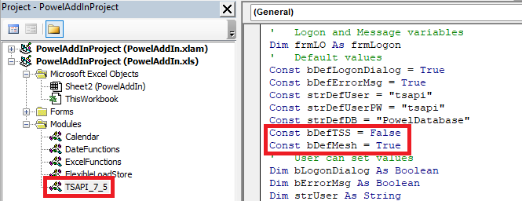

***Note!*** Emulated TsApi for Mesh has also made changes to the Calendar and FlexibleLoadStore modules. And only limited functionality is supported, mainly related to reading and writing time series values.

### Emulated TsApi configuration

Emulated TsApi includes the Close method. This method helps improving the performance when several clients run towards Mesh at the same time. The emulated TsApi configuration file contains two configuration keys, which ensure session integrity and efficient resource use.

You can edit these key values (in milliseconds):

```xml
<add key="KeepAliveIntervalInMsec" value="60000"/>
<add key="SessionsInactivityTimeLimitInMsec" value="300000"/>
```

- `KeepAliveIntervalInMsec` defines how often the client sends a keep alive message to the service. It ensures that the service does not automatically disconnect an idle client.
- `SessionsInactivityTimeLimitInMsec` defines how long an idle client session keeps its connection to the service.

  After `SessionsInactivityTimeLimitInMsec` expires, the client disconnects from the service automatically. If the client attempts to call the service after that, automatic LogOn is performed with the last known credentials.

***Notes!***

- At least one of `KeepAliveIntervalInMsec`, `SessionsInactivityTimeLimitInMsec` should be less than the service binding attribute.

  Otherwise, the service may disconnect the client automatically with unpredictable consequences.

### Installation for each user

After the installation, each user must select the Add-In in the `Tools\Add-Ins …` menu. If Powel TsApi wrapping does not appear in the dialogue box, press the `Browse…` button and navigate to the shared disk where it is, select it and answer `No` to question if you want to copy the Add-In to your private directory.

If the user by mistake answer `Yes` to the question and have a private copy of the Smart Power AddInExcel, the user will not benefit from upgrades and error correction. To change to the AddIn on the shared disk, do as follows:

- Deselect the Powel TsApi wrapping in the Tools\Add-Ins dialogue box
- Close Excel
- Open Excel and open the tools\Add-Ins dialogue
- Choose Browse...
- Delete the private PowelAddIn.xla
- Select the shared PowelAddIn.xla and answer No on the question to copy the AddIn to the private area

### Upgrade

To upgrade the Add-In with a new version, you must ensure that nobody has Excel open with the `Add-In Powel TsApi wrapping` activated. Remember that you must deselect the Add-In yourself, too.

Then just follow the procedure above for installing the Add-In.

## LoadFromDB worksheet

This worksheet is used to setup logon information and all fetching of values from the Mesh service. The worksheet has 5 separate functions:

- Logon setup
- Status codes and colours setup
- Time series search
- Time series report setup
- Load data

In addition, there is a short user guide to the right of the time series report setup.

The layout looks like this:

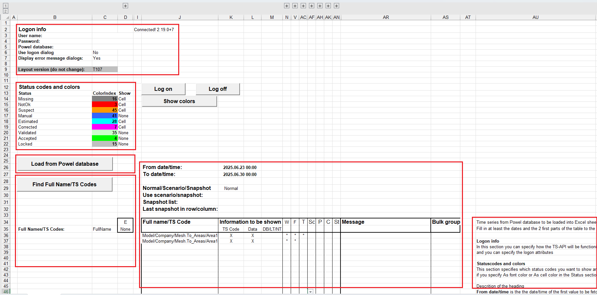

### Logon setup

The logon setup looks like this:

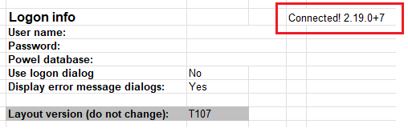

Please observe that the Layout version cell is used to ensure that the correct parts of the TsApi are used. Do not change the value, if you do the code behind can give unwanted results.

***Note!*** For bulk functionality, Layout version must be "T107".

`User name`, `Password` and `Powel database` is not in use when running on Smart Power, then it is only using the logged in user (for Active Directory) or the authenticated user (for EntraId).

In addition, you can specify whether you want a logon dialogue or not. The logon dialogue will show the User name, Password (as stars) and database you enter here. If you don’t want a logon dialogue the User name, Password and database must be specified here.

The result of the logon is shown in the worksheet as the connect string. The connect string is placed in a named cell: `LogonStr`. This name can be used in any other worksheet to show the logon status.

The last setup is whether a message box will be shown if any error occurs or not.

When the logon setup is done, this part of the worksheet can be expanded/collapsed by pressing the +/- in the left margin.

### Status codes and colours setup

The Status codes and colours setup looks like this:

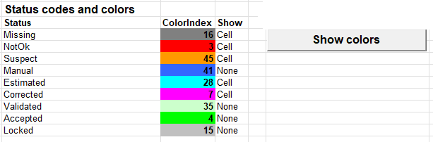

All the possible status codes are listed and in the column for ColorIndex you can specify an index of the colour palette for Excel (value from 0 to 56, 0 is the default which is no background colour and black font). Press the `Show colors` button and the colours will be shown as background colours. In the `Show` column you can specify how each status will be shown in the presentation if you choose As `Color` in the status part (see the [Status part](#status-part) later on). The possibilities are `Cell` – then background colour is set to the selected colour, `Font` – the font colour is set and `None` – the status will not be presented at all.

### Time series search

The time series search part looks like this:

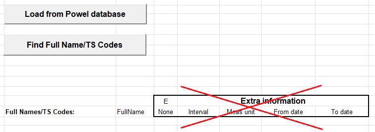

When the `Find Full Name/TS Codes` button is pressed, a search dialogue will be shown:

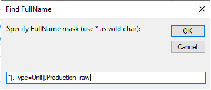

Type in the search mask. The search mask is case sensitive and must follow the Mesh search expression rules, which are the same as in for instance Nimbus searches. (The search mask shown will get the `Production_raw` time series attributes on all items of type `Unit` in the Physical Mesh model.)

***Note!*** The Mesh version of the Excel AddIn only supports searches on time series attributes.

Each time you make a search, the information area for the search is cleared. The result of the search is placed below the button:

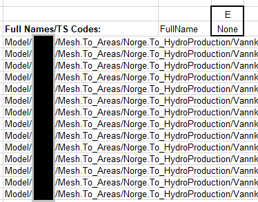

### Time series report setup

Time series report setup allows you to specify time series from the Mesh service and where, what, how and which period to present.

The report setup has a heading where a period and type of report can be given and detailed part where each time series is specified. For each time series there are 10 sections of information, each one will be described.

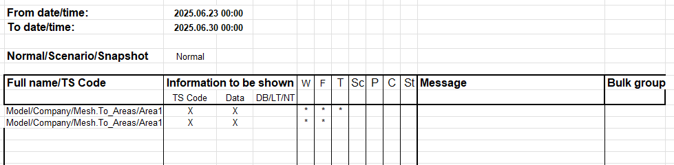

From date/time gives the starting point of the period, and To date/time specifies the end time. The From date/time is including the time specified, but the To date/time is up to but not including. This means that the example above specifies seven days of values.

***Note!*** In the detailed part there are three parts that must be filled out, `Full name/TS Code`, `Information to be shown` and `Where to store`. The other parts are used to refine the presentation.

#### Full name/TS Code part

The detailed part starts with the time series `Full name/TSCode`. The result from the time series search is used as a pick list for the cell or you can just copy the paths from the returned list (or somewhere else).

***Note!*** The first blank time series Full name/TSCode stops the loading of data. If you want a ‘blank line’ for one reason or another, please type in a * or whatever.

#### Information part

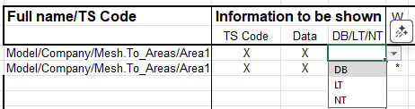

Mark the `Data` column if the time series are to be shown. If the `Data` column is blank the information in `Full Name/TSCode` is ignored. The mark in the `Data` column can be a user defined code to get time series loaded in different sequences. (How to do different sequences see: [Hide the worksheets LoadFromDB and SaveToDB](#hide-the-worksheets-loadfromdb-and-savetodb).)

Mark the `TS Code` column to get the `Full name/TSCode` presented. The name/code is presented over or to the left of the data depending on the direction the data is presented.
The column `DB/LT/NT` is a combo box where you can select if data will be presented in `Local time (LT)` or in `Standard time (NT)` or the `Database time (DB)` or leave it blank (default value is DB). Please observe that due to the way values is stored on time series with resolution day, week, month and year, the selection in DB/LT/NT is overridden and set to NT.

#### Show date/time part

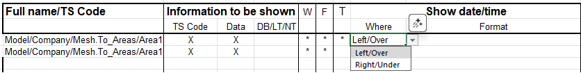

Select `Where` to present the date/time for each value: `Left/Over` or `Right/Under`. If the column is blank, the date/time will not be presented. The date/time will follow the selection in DB/LT/NT.

In the Format column you can specify the format of the date/time:

- `%Y` - Year with 4 digits (ex: 1992)
- `%2Y` - Year with 2 digits (ex: 92)
- `%y` - Year related to week number with 4 digits.
- `%2y` - Year related to week number with 2 digits.
- `%M` - Month (1-12)
- `%W` - Week number (1-53)
- `%D` - Day in month (1-31)
- `%w` - Weekday (1-7)
- `%h` - Hour (0-23)
- `%H` - Hour-number (1-24)
- `%m` - Minute (0-59)
- `%s` - Second (0-59)
- `$M` or `#M` - Month presented by name (ex. January)
- `$w` or `#w` - Weekday presented by name (ex. Monday)

Examples:

- `$w %D $M %Y kl.%02h:%02m` - Sunday 17 May 1992 kl.12:30
- `Week %W %y` - Week 20 1992
- `%2Y-%02M-%02D` - 92-05-17
- `$.3w %02D/%02M` - Sun 17/05

If the Format column is blank, the Date/Time returned from the database is presented as is.

The `T` column will display a `*` if there are valid information in Where/Format. If there are information in Format but not in Where, the column will display a `!`.

#### Different period part on load

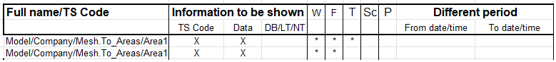

If you wish to display information from a `Different period` than specified in the `From date/time` and `To date/time` in the heading, you can fill in a period here. If there are information in this part the date/time from here will be used instead of the period in the heading.

There are several functions available to be used here (or in the heading). These functions take a date as the parameter:

- `startOfWeek` - Date of the last Monday
- `endOfWeek` - Date of the next Monday
- `startOfFirstWeek` - Date of Monday in Week 1
- `endOfLastWeek` - Date of Monday in Week 1 next year
- `startOfMonth` - First date in the month
- `endOfMonth` - First date in the next month
- `startOfYear` - January 1. of the year
- `endOfYear` - January 1. of the next year
- `clearHMS` - set the hh:mm:ss part of the date to 00:00:00

These functions take a year and week/month number as the parameters:

- `startOfWeekNo` - Date of Monday in given Year/Week
- `endOfWeekNo` - Date of next Monday in given Year/Week
- `startOfMonthNo` - Date of the first day in given Year/Month
- `endOfMonthNo` - Date of the first day of the next month of the given Year/Month

This function takes a year, month and day number as the parameters:

- `dateYMD` - Date of given Year/Month/Day

Example of call formula:

- =startOfWeek(FromDate)
- =startOfWeekNo(1999,20)
- =dateYMD(1999,3,31)

Remember that Excel can calculate with dates. The `From date/time` in the heading is a named cell: `FromDate`. Last week can be calculated as =FromDate – 7.

The `P` column will display a `*` if there are valid information in the two dates. If there are information in one date and blank the other one column will display a `!`.

#### Comments part

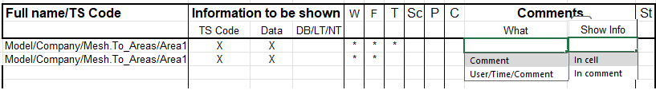

If you want to display `Comments` stored with the time series, select `What` to display and where to `Show Info`. You can select to display only the comment or the comment together with the user who entered it and the time it was entered. The comment can be shown as an Excel comment (red triangle in upper right corner) or in the cell to the right of or under the value.

The `C` column will display a `*` if there are valid information.

#### Status part

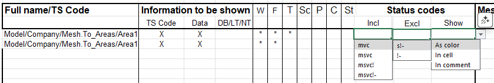

If you want to be specific about which values that are returned based on `Status codes`, the status part allows you to specify status codes to be included as values and which one is excluded and will be returned as `-1,#IND/-1.#IND` and displayed as blank.

The status values can be displayed as colour (background colour/font colour is selected in the [Status codes and colours setup](#status-codes-and-colours-setup)), as Excel comment (concatenated with any comments) or in the cell to the right of or under the value. (The status codes to be marked is setup in the [Status codes and colours setup](#status-codes-and-colours-setup) section.)

The status codes are:

- `m` - manual
- `v` - validated
- `c` - corrected
- `s` - suspect
- `!` - not OK
- `-` - missing

Default handling is exclude `!-` (`!` not OK, `-` missing).

The column `St` will display a `*` if there are valid information.

#### Where to store part

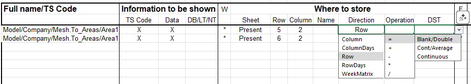

The `Where to store` part must be filled out to specify where the data are stored in the workbook. In the `Sheet` column you must fill in the worksheet where the presentation should be presented. The `Row/Column/Name` columns specifies which cell the presentation should start in, and `Direction` specifies if the data should be presented as one Column, one Column per Day, one Row, one Row per day or a Week matrix (one Column per Day). In the `Name` column you can specify a named Excel range. The `Row/Column` and `Name` column is alternatives for specifying the start cell; the `Row/Column` value is only used if Name is not specified.

The `Direction` column also determines if information like Full name/TS code, Date/time, Comments and Status will be shown to the left/right of the values (Direction = Column) or over/under the value (Direction = Row).

The `Operation` column is used to do calculations with the already existing information in a cell. If a time series is presented at the same location as another time series, the first time series will be overwritten if there is no `Operation` specified. If you specify +, the new value will be added to the value already in the cell a.s.o. Please observe that if you specify an + operation for one time series alone, the time series will be added to itself each time you load a time series.

The `DST` column is used when data is presented in local time. The `Continuous` selection presents the time series with continuous values even in the transition days. The `Blank/Double` selection presents the data with an empty hour in the spring and a double value in the autumn. This is special useful for Week presentations.

Please observe that `Operation` other than =, + or blank together with `DST Blank/Double` will not work for the Double hour in the autumn.

The column `W` will contain a `!!` if there are no information given for time series that should be presented, a `!` if there are missing values and a `*` in valid information is given.

#### Data function part

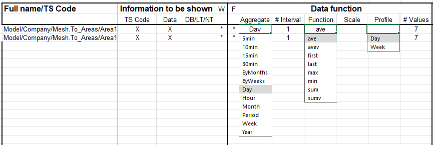

The `Data function` part can be used to specify `Aggregation` of values to a longer period that the interval on the time series or distribution of values to a shorter period. The `Function` to be used is important if you specify a different period that the interval of the time series.

***Note!*** Break point series without aggregation given will be presented as stored.

The aggregation `ByWeeks` and `ByMonths` will report on week/month boundary. Typically, you select this to ensure reporting on a period where you want data on weeks/months but the first and/or last interval is not a full week/month. The aggregation `Period` ensures that there is only presented one value and the value can be aggregated for any period. The `# Interval` gives the opportunity to aggregate on a multiple of the `Aggregate` specified (or the interval on the time series). If not specified, `# Interval` is set to 1.

The `Function` specifies how to aggregate/distribute values to a different aggregation period. The default function used is `first`.

The difference between `avev/sumv` and `ave/sum` is that the first two functions use the values found on the time series to make an average/sum and the two last functions makes an integral under the function the values described and then makes an average/sum. The interval of the answer is also different: the `avev/sumv` uses the interval of the aggregation level and the `ave/sum` uses seconds as the interval.

In the `Scale` column you can specify any factor to scale the read values before presenting them. Useful for e.g., presenting kWh form a MWh time series.

In the `Profile` column you can specify if the time series should be used to generate a profile based on the values selected. The profile can be calculated as a Day profile (24 hours) with 15 minutes or Hourly resolution and as Week profile with 15 minutes, hourly or daily resolution. The resolution is given in the Aggregate column. Each time step is calculated as an average based on the selected values.

The last column is useful to ensure that the data area is blanked before new values are presented. The value specified in `# Values` defines how many cells that will be blanked before the presentation is done.

The `F` column will display a `*` if there are any valid information specified.

#### Bulk group

To read series by bulk, the series must be located together in the Excel-sheet and belong to the same bulk group (the same value in the column `Bulk group`). Layout version must be T107 and Emulated TsApi (TSS) must be used. Every time series in a bulk group must have the same interval type and same period. The first row with a value in the "Show date/time", "Data function", "Different period", "Comments" or "Status codes" columns must have a new group. If using bulk, all series should have bulk. If not, the result of the read can fail.

#### Message part on load

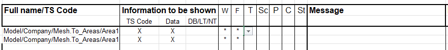

If there are any problems when loading data or inconsistent selection in the different specification parts, a `Message` with an explanation will be displayed here. If everything is OK when loading, the message part will be blank.

### Load data

To load data from the database, just press the `Load from Powel database` button. If there are any problems with the database or the times series and selections, a message will be shown in the `Message` part.

***Note!*** The first blank time series `Full name/TSCode` stops the loading of data. If you want a ‘blank line’ for one reason or another, please type in a `*` or whatever.

The following setup (layout from an earlier version):

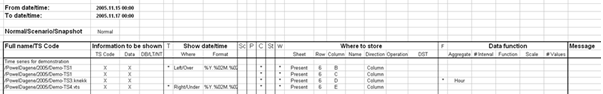

will result in the following report:

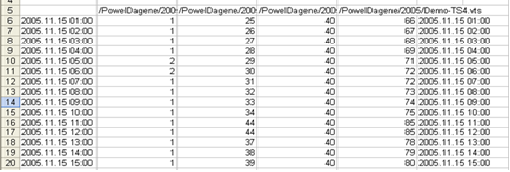

## SaveToDB worksheet

This worksheet is used to setup all saving of values to the Mesh service and database. The worksheet has 2 separate functions:

- Time series save setup
- Save data

In addition, there is a short user guide to the right of the time series report setup.

The layout looks like this:

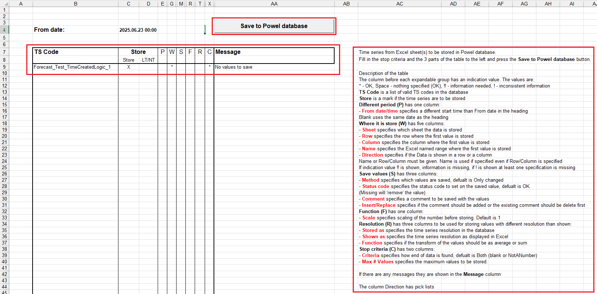

### Time series save setup

The worksheet has the same principles as the `LoadFromDB` worksheet. There is a heading where the `From date/time` is specified and a detailed section with 7 parts to specify time series and what to save. The `TS Code`, `Store` and `Where` it is stored parts must be specified, the other parts are refinements.

#### TS Code part

The `TS Code` part uses the same pick list as in the LoadFromDB worksheet. But you can copy the list from the LoadFromDB worksheet or from anywhere else.

#### Store part

The first column is used to mark which of the time series to store. The mark can be a user defined code to save time series in different sequences. (How to do different sequences see: [Hide the worksheets LoadFromDB and SaveToDB](#hide-the-worksheets-loadfromdb-and-savetodb).)

In the `LT/NT` column you can specify if the date/time is given in local or standard/normal time.

#### Different period part on save

If you want a different `From date/time`, specify it in this column. Values in this column will be used instead of the values in the heading.

The `P` column will display a `*` if there are valid information here.

#### Where it is stored part

This part is the same as the `Where to store part` in LoadFromDB worksheet. The only difference is that the saving of values expects that data are saved as `Continuous`. If you present data with DST with `Blank/Double` value, the save will stop on the missing hour in the spring or at the 25. hour in the autumn.

The column `W` will contain a `!!` if there are no information given for time series that should be saved, a `!` if there are missing values and a `*` in valid information is given.

#### Save values part

In the `Save values` part you can decide which values that will be saved (`All` or `Only changed`) and set the `Status` of the value in the database. Default values are `Only changed` values are saved with `OK` status. In addition, you can specify a comment to be saved together with the values. The comment is stored for the whole period and not for each hour that are saved. When saving comments, you can decide if the last comment should be added (Insert) to existing comments or the last should replace all comments in the given period.

The status codes are:

- Accepted
- Locked
- Manual
- Missing
- OK
- M&A (Manual and Accepted)
- M&L (Manual and Locked)
- A&L (Accepted and Locked)
- M&A&L (Manual, Accepted and Locked)

If you set `Locked` status on a value, you cannot unlock the value from the FlexibleLoadStore.xls (unavailable in the TsApi).

If you set `Missing` status on a value, the value is treated as not existing in the system.

The `S` column will display a `*` if there are any information given in Method and/or Status.

#### Function part

In the `Function` part there is a possibility to specify a `Scale` factor that will be used when storing values. The default value is 1.

The `F` column will display a `*` if there are specified any scale factor.

#### Resolution part

In the `Resolution` part it is possible to specify that values should be stored with a different resolution than shown. Especially when saving breakpoint time this part is of interest. If not transformation between resolutions is needed, skip this part.

The `Stored` as column must have the same resolution as the time series. Only `bp` (breakpoint) and `15min` is allowed.

The `Shown as` column specify the interval between the values in the excel sheet. For time series with 15 minutes resolution, only `15min`, `30min` and `Hour` are allowed, for breakpoint time series all other selections are allowed.

The `Function` part contains the function to be used when transforming values before saving. With the `ave` (average) function the same value is stored in all sub values (storing an hour series in 15 minutes resolution will give 4 sub values per value) and with the `sum` function the sub values will be the same values but the sum of them will the original value. The default value is `sum`.

The `R` column will display an `*` in there are values in all three columns, a `blank` if no values are specified and a `!` otherwise.

#### Stop criteria part

In this part you define when to stop reading values to save. The possibilities are `Blank` (stops with the first blank cell), `NotANumber` (will accept blank cells, but stops at the first text cell) or `Both` (stops with the first blank or text cell). Default is `Both`. In addition, you can specify a maximum number of values that will be read from the Excel.

The `C` column displays a `*` if there are selected a stop criterion.

#### Message part on save

The `Message` part displays the result of the save or any problems with the time series or database.

### Save data

To save data to the database, just press the `Save to Powel database` button. If there are any problems with the database or the times series and selections, the message will be shown in the `Message` part.

***Note!*** The first blank time series TS Code stops the saving of data. If you want a ‘blank line’ for one reason or another, please type in a * or whatever.

## Hide the worksheets LoadFromDB and SaveToDB

After the `LoadFromDB` and `SaveToDB` worksheet are setup and tested, it may be convenient to hide the worksheets to ensure that other users don’t tamper with the setup or get confused with the information in the worksheet.

Hiding a worksheet is very simple: select the worksheet and use the menu `Format\Sheet\Hide`. To unhide a worksheet, use the menu `Format\Sheet\Unhide…` and select the worksheet in the dialogue box with all the hidden worksheets.

But when you hide the worksheets the buttons to Load and Save data will also be hidden. To add the functionality to a worksheet, display the Control Toolbar menus (View\Toolbars\Control Toolbox menu). Set the work sheet in Design mode and select the Command button and use the mouse to place the command button in the worksheet. Then display the properties and set the Caption (text in the button) and the Font. See the properties dialogue below.

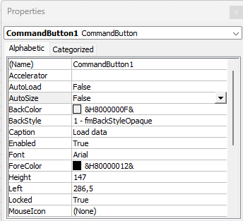

Then double click the button and you will be transferred to the Visual Basic editor and an empty routine:

```vb
Private Sub CommandButton1_Click()
End Sub
```

Fill in the routine you want to use (loadFromDatabase or saveToDatabase) with a given code or an empty string. The code given will load/save all the time series with the given code specified in Data column in the Information to be shown for load and in Store part for save.

An example for loading all time series with A and B:

```vb
Private Sub CommandButton1_Click()
    Call Application.Run("loadFromDatabase", Me.Parent.Name, "A")
    Call Application.Run("loadFromDatabase", Me.Parent.Name, "B")
End Sub
```

Or if you want to display any messages from the routine:

```vb
Private Sub CommandButton1_Click()
    Dim res As Variant
    res = Application.Run("loadFromDatabase", Me.Parent.Name, "A")
    If res <> "OK" Then
        MsgBox res, , "Load from DB"
    End If
    res = Application.Run("loadFromDatabase", Me.Parent.Name, "B")
    If res <> "OK" Then
        MsgBox res, , "Load from DB"
    End If
End Sub
```

Save the code and close the Visual Basic editor. Set worksheet in normal mode again and the button is ready for use.

## Add Smart Power AddIn Excel into existing workbook

The FlexibleLoadStore can be added to an existing report by the following steps:

- Install Smart Power AddInExcel (see earlier in this document)
- Add the LoadFromDB and SaveToDB worksheet to the existing report
- Set up the time series to read and present

### Add the LoadFromDB and SaveToDB worksheets

To move/copy a worksheet from one workbook to another is standard Excel functionality. Do as follows:

- Open the FlexibleLoadStore.xls
- Open the workbook where the worksheets will be copied
- Select the LoadFromDB worksheet
- Use the menu Edit\Move or Copy Sheet …
- Mark the Create a copy, select the workbook in the To book, select a sheet in the Before sheet list and press the OK button.
- Repeat the copy procedure for the SaveToDB worksheet

It is not necessary to copy the SaveToDB sheet if you do not want to save data in the workbook.

### Set up the Times series to report

See [LoadFromDB worksheet](#loadfromdb-worksheet) and  [SaveToDB worksheet](#savetodb-worksheet).

## Updates to PowelAddIn.xls

New updates to PowelAddIn.xls are installed the same way as the first time. Remember to deselect the Add-In in Excel, save the new version as an Excel Add-In and reselect as Add-In.

## Updates to worksheets

If the layout of LoadFromDB and/or SaveToDB worksheets is updated and the workbooks must be updated, the safest way is (to ensure the right named cells):

1. Open the workbook to be updated.
2. Rename the LoadFromDB and/or SaveToDB worksheets.
3. Open the FlexibleLoadStore.
4. Copy the LoadFromDB and/or SaveToDB worksheets into the workbook to be updated.
5. Copy the information from the old worksheet to the new one, column by column.
6. Delete the old worksheets.
