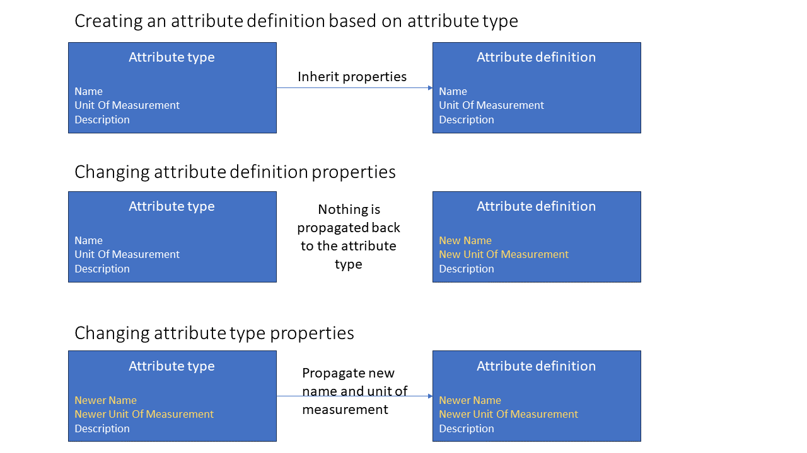
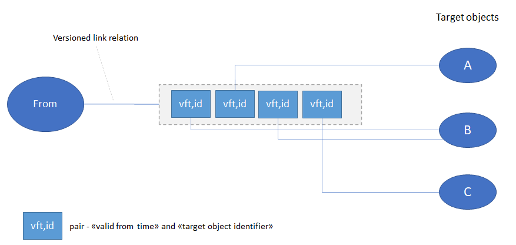
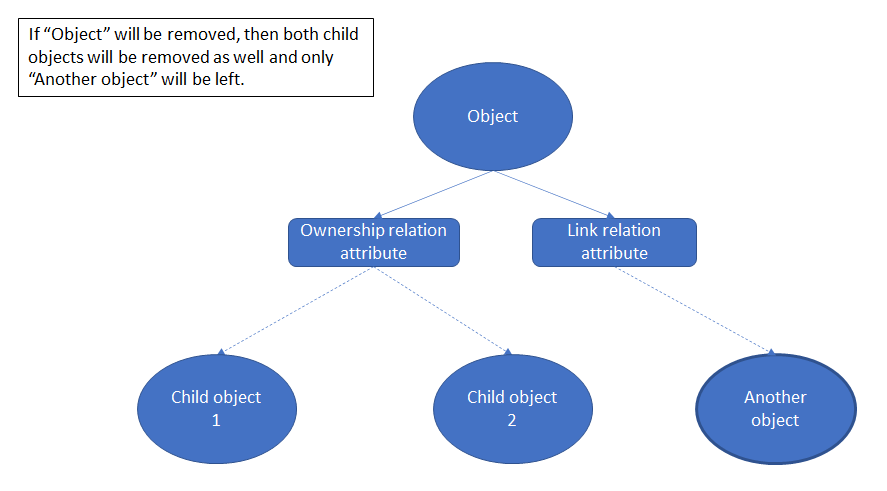

# Mesh glossary

## Model definition
  * Model definition - Consists of object definitions, attribute types and namespaces. The model definition is also a top-level namespace.
  * Object definition - Consists of attribute definitions. You can compare it to a C++ class.
  * Attribute definition - You can compare it to a C++ class member. May be
    based on an `attribute type` (for more details refer to `attribute type`).
    Attribute definitions may be singular or an array of one of the following
    types:
    * String, boolean, int, double or UTC time. These are known as 
      _simple types_.
    * XY set, enumeration, rating curve or `time series attribute` (time series
      can be a calculation or a reference to a `physical time series` or
      `virtual time series` from resource). These are known as _complex types_.
    * Ownership or link relation to an object definition. Refer to
      `relation attributes` paragraph for more information.

    Additionally, depending on the attribute type, the attribute definitions
    specify parameters like default value, accepted value ranges, etc.

    Changing the name of an attribute definition will also change the names of
    all already existing attributes in the model to the new value.

  * Attribute type - Used for creating *re-usable* `attribute definitions`.
    Once defined could be used by different `object definitions` for creating
    an `attribute definition` based on it.

    Every `attribute definition` that is based on an attribute type will
    inherit name, description and unit of measurement (if applicable) of that
    attribute type. For enumeration attribute types the definitions will also
    inherit default value if not provided explicitly when creating the
    attribute definition.

    Updates of all above mentioned properties (name, description and unit of
    measurement) can be done on attribute definition level. In such case the
    attribute type and attribute definition may have different property values.
    However, there is a special way of handling changes to name and unit of
    measurement done on attribute type level. Updating an attribute type name
    or unit of measurement will update also names and unit of measurements in
    all attribute definitions that were created based on the given attribute
    type. Other properties like description will change just the property on
    the attribute type level. See examples below:

    

  * Namespace - Used for grouping and filtering purposes in
    a `model definition`. You can compare it to a C++ namespace. Namespace may
    contain:
    * object definitions
    * attribute types
    * other (nested) namespaces
  * Template calculation definition - Defines calculation expression that could be used by `time series attributes`.
  * Tags - special enumeration values that can be attached to attribute types
    and object definitions. Similar to namespaces they are used for grouping
    and filtering purposes.


## Model
  * Model - `Model definition` instance.
  * Object - `Object definition` instance.
  * Attribute - `Attribute definition` instance. Name of the attribute is
    inherited from attribute definition.

## Resource
  * Resource - Container storing data (e.g.: time series), used by `Model(s)`.
  * Physical time series - Time series data (timestamps, values and flags) and meta data (e.g.: curve type, resolution, etc.).
  * Virtual time series - Has defined an expression to calculate time series data (similar to `calculation time series`) but is stored in resources.
  * Catalog - Used for grouping and filtering purposes. `Catalog` typically contains `physical time series`, `virtual time series` or other `catalogs`. Similar to `namespaces` in `model definition`.

## Time series attributes
  * `Time series attribute` - can be a:
    * reference to a `physical time series` or `virtual time series` from resource
    * `calculation time series`, where the expression is defined on the following levels:
      * `local expression` - defined on `model` level
      * `template expression` - defined on `model definition` level in `template calculation`


## Relation attributes

Objects in Mesh model can relate to each other. Relation between objects is
done using relation attributes. The relation attribute defines type of the
relation, target object type and other parameters.


There are two groups of relations between objects in Mesh model.

### Ownership relation

Each object is owned by some other object (owner). It is called ownership
relation.

Ownership relations can be:
* one-to-one
* one-to-many (collection): where value of *many* is in range defined by
  *minimum* and *maximum cardinality* on relation `attribute definition` level.

By convention ownership relation attribute names start with 'has_...', e.g.:
*has_PowerPlant*. Removing an object will remove recursively all of its owned
objects as well, if there were any.

### Link relation

Link relation is a relation where one object may point to another object, but
does not own it. There is also a versioned link relation, which is a link
relation where the target object can change over time. It consists of a list of
pairs:
* Target object identifier.
* Timestamp which indicates start of the period where the target object is
  active (linked to), the target object is active until the next target object
  in the list, if any, becomes active.



There are four types of link relation attributes:
* one-to-one
* one-to-many (collection)
* versioned one-to-one
* versioned one-to-many (collection)

Similar to `ownership relation` the value of *many* is in range defined by
*minimum* and *maximum cardinality* on relation `attribute definition` level.


By convention link relation attribute names start with 'to_...', e.g.:
'to_EnergyMarket'. Removing an object that had link relations to other objects
will NOT remove the linked objects.




## XY curves

An **XY curve** is a set of `(x, y)` pairs where `x` and `y` are 64 bit
floating point values.

|      x |         y |
| ------ | --------- |
|      1 |         2 |
|      2 |       1.5 |
|      3 |       0.5 |
|     10 |        -1 |

An **XY set** is a set of XY curves, each curve indexed by a 64 bit floating
point reference value. These reference values are sometimes called Z. We often
visualize **XY sets** like so:

|  x | z<br/>y | z<br/>y |
| -- | ------- | ------- |
|    |   **0** | **180** |
|  2 |     1.5 |     0.3 |
|  3 |     0.5 |       1 |
| 10 |      -1 |       9 |

- The first non-header row contains the reference/Z values for that column.
- Usually the headers will have actual names, see further below.

A **versioned XY set** is a versioned list of XY sets. Each XY set in the list
has a timestamp which indicates the start of the active period for that XY set,
and the XY set is active until the next time-sorted XY set in the versioned XY
set becomes active.

Mesh has attribute types for **XY sets** (`XYSetAttribute`) and **versioned XY
sets** (`XYZSeriesAttribute`). In the attribute definitions of those attributes
we store a description and a unit of measurement for each of X, Y, and Z. For
example if we have the following axis definitions...

| Axis | Description    | Unit of measurement |
| ---- | -------------- | ------------------- |
| X    | Wind speed     | m/s                 |
| Y    | Production     | MW                  |
| Z    | Wind direction | degrees             |

...Nimbus will visualize the above XY set as:

|  Wind speed \[m/s\] | Wind direction \[degrees\]<br/>Production \[MW\] | Wind direction \[degrees\]<br/>Production \[MW\] |
| ------------------- | ------------------------------------------------ | ------------------------------------------------ |
|                     |                                            **0** |                                          **180** |
|                   2 |                                              1.5 |                                              0.3 |
|                   3 |                                              0.5 |                                                1 |
|                  10 |                                               -1 |                                                9 |


## Rating curves

A **rating curve** is used to convert water level in river measurements \(x\) in
a watercourse to discharge. In Mesh we use the \(f(x) = a * (x + b)^c\) formula
to approximate discharge, and we store rating curves as a set of segments where
each segment contains values for the 64 bit floating point factors \(a\), \(b\),
and \(c\). Additionally each segment \(i\) stores a 64 bit floating point
`x_range_until` value and is valid for a range of \(x\) values
`[x_range_until[i-1], x_range_until[i])`.

For example, with a segment...

| x_range_until | a     | b     | c     |
| ------------- | ----- | ----- | ----- |
| 10            | 1.24  | 13.7  | 11.1  |
| 50            | 11.2  | 1.0   | 6.65  |
| 100           | 4.27  | 1.55  | 0.87  |

...we'd have the following rating curve function:

$$
f(x) =
\begin{cases}
	1.24 * (x + 13.7)^{11.1} & \text{if } 0 \leq x \lt 10\\
	11.2 * (x + 1.0)^{6.65} & \text{if } 10 \leq x \lt 50\\
	4.27 * (x + 1.55)^{0.87} & \text{if } 50 \leq x \lt 100\\
	\text{nan} & \text{otherwise}
\end{cases}
$$

Rating curves can change over time because of for example changes in a river
due to erosion and sedimentation. Such changes affect the discharge function
and the function equation factors need to be adjusted. To reflect that the
rating curve segments in Mesh are grouped into **rating curve versions**. Each
version is timestamped with the time at which the version becomes active, and
the version is active until the next version, if any, becomes active.

| version | x_range_until | a     | b     | c     |
| ------- | ------------- | ----- | ----- | ----- |
| 2019    | 10            | 1.24  | 13.7  | 11.1  |
| 2019    | 50            | 11.2  | 1.0   | 6.65  |
| 2019    | 100           | 4.27  | 1.55  | 0.87  |
| 2020    | 10            | 3.31  | 11.7  | 12.1  |
| 2020    | 50            | 10.1  | 1.5   | 5.45  |
| 2020    | 100           | 5.00  | 1.32  | 0.96  |
| 2021    | 10            | 2.22  | 12.7  | 10.1  |
| 2021    | 50            | 11.1  | 1.3   | 5.65  |
| 2021    | 100           | 3.27  | 2.55  | 0.37  |

In addition each version has an `x_range_from` field, with the minimal $x$ value
for the curve. For `x < x_range_from` for the given version the `f(x) = nan`.

In Mesh **rating curve attributes** contain a set of rating curve versions.


## Extended metadata

Extended metadata is an additional and optional information that can be set on:
- Namespaces and model definition (which is also a namespace)
- Attribute definitions
- Object definitions

It is a list of key-value pairs: category name and a JSON object.
Maximum size of the JSON object serialized to a string is 4000 characters.

If a given attribute definition, object definition or namespace has more
than one extended metadata, then the category names must be unique.

For example, an object definition may have 2 extended metadata entries:
* Category name `MyCategory1` with associated JSON object:
```json
{
    "Labels" : ["Label A","Label B"],
    "Something" : {"MaxValue":100}
}
```

* Category name `MyCategory2` with associated JSON object:
```json
{
    "Active": true
}
```


## Mapping

From now on it is strongly advised to use new definitions, but some of them were already known under different names:

* Model definition - object model, meta model, repository (in Mesh Explorer)
* Object definition - element type, object type (in Mesh Configurator)
* Model - physical model
* Object - physical object
* Attribute - property
* Versioned XY set - `XYZSeries`
