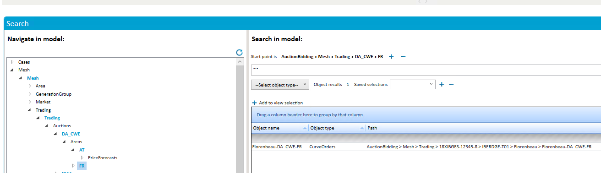
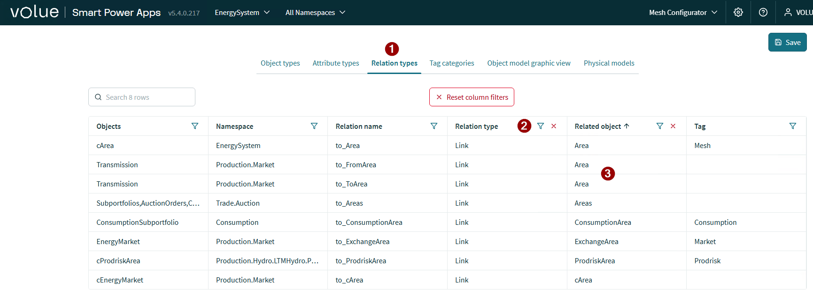

# Mesh model backup strategy and restore procedures

This document recommends a setup for backing up/restoring the Mesh model in case unintended/undesired changes have been made, such as deleting large parts of the model which would be complex to recreate manually.

## Scheduled Backup

The recommended setup is to have periodic backups of the production Mesh model, ideally on a daily basis. That way, if a restore is needed at some point during the next day, the latest backup should be relatively similar to the state of the model before the damaging changes were done. Backups and restores are done by using the `Model.ImportExport` tool; the backups themselves are .mdump binary files. We also provide a script called MeshModelBackup.ps1 which can be used to perform such backups in an easy way; the script in turn uses the `Model.ImportExport` tool internally.

## Restoring the Mesh model state from a backup

There are two options for this:

### Full restore

This is the recommended option. In this way we're performing an "on-top" import of the backup as described [here](ModelMaintenanceConcepts.md#assign-based-on-top-updates):

1. Any missing parts of the model that are present in the backup are restored.
2. Any objects and attributes in the model that differ from those of the backup are replaced by the latter, including link relations. This is useful for cases where e.g. a part of the model is accidentally deleted, thus nulling out any link relations pointing to deleted objects.
3. No objects are deleted from the model, even if they're not present in the backup.

While this approach is not recommended for model definition updates, it's safe to use for restoring a model from a backup. Note that there are a few caveats:

1. Any non-additive changes made since the backup will be lost.
2. If the model definition has changed since the backup, the issues described [here](ModelMaintenanceConcepts.md#assign-based-on-top) may appear.

As mentioned before, the recommended way to mitigate these issues is to have frequent backups so that a restore operation should not cause too much recent work to be lost.

To perform a full restore, run the following:

```
Powel.Mesh.Model.ImportExport.exe -i <path_to_backup> -S
```

Replace `<path_to_backup>` with the path to the `*_fm.mdump` file produced by `MeshModelBackup.ps1`. Note that this command will check whether any of the imported objects refers to a time series resource that doesn't exist; if so, it will create it (as an empty time series). You can pass the `-T` option to `Model.ImportExport` to disable this behavior; in this case the attributes will still be created but not connected to a time series.

### Partial restore

This option can be used if there are changes to the model since the last backup that need to be preserved. In this case, we'll only import the part of the model that needs to be restored, instead of the entire model.

This option is a bit more complicated than doing a full restore since there's no way to "extract" a part of the model directly from an .mdump file. Therefore, we need to import the backup to a non-production environment first, export the desired part of the model to a separate .mdump, and finally import that .mdump to the production model. The non-production environment should ideally be the customer test environment; if necessary, create a backup of its current state so it can be restored later once you've finished fixing the production model.

Another disadvantage of partial restores is that they're not able to automatically restore link relations to deleted objects as a full restore does. These will need to be fixed separately.

Finally, note that this assumes there haven't been any changes to the model definition since the last backup that could affect the part of the model that we're restoring. If there are, you must replicate those changes in the test environment before doing the export to avoid having conflicts later when importing to the production model. Since we'll still do an "on-top" import, it should not be necessary to replicate changes that only added new objects. To view the differences between the test and production environments, you can first export each of them into an .mdump file and then compare them by running the following:

```
Powel.Mesh.Model.ImportExport.exe -w SummaryOfChangesReport -w <test_mdump> -w <prod_mdump> -o Report.md
```

Replace `<test_mdump>` and `<prod_mdump>` with the paths to the test and production .mdump files respectively.

To perform the partial restore, follow these steps:

#### On the test environment

1. Import the latest backup:

```
Powel.Mesh.Model.ImportExport.exe -i <path_to_backup> -S
```

2. Find the GUID of the root object to restore. A way to do it is to run the following:

`IntMeshQuery.exe -a Lookup -p <path_to_object>`

and replace `<path_to_object>` with the path to the desired object within the model. Alternatively, you can run:

```
IntMeshQuery.exe -a ModelStructure -m <model_name> --verbose > ModelStructure.txt
```

and replace `<model_name>` with the name of the target model, then locate the object's GUID in `ModelStructure.txt` (make sure this is the GUID of an `AttributeElement`).

3. Export this part of the model:

```
Powel.Mesh.Model.ImportExport.exe -o objects_to_restore.mdump -c <object_guid>
```

Replace `<object_guid>` with the GUID from step 2.

#### On the production environment

Import the .mdump file we created from the test environment:

```
Powel.Mesh.Model.ImportExport.exe -i objects_to_restore.mdump -S
```

#### Adding missing links

Objects linking to restored objects can be identified by using the search expression `~~` when standing on an object instance in Mesh Search on the object in the test environment:



You can check in Mesh Configurator whether a link could exist before checking all object instances:


