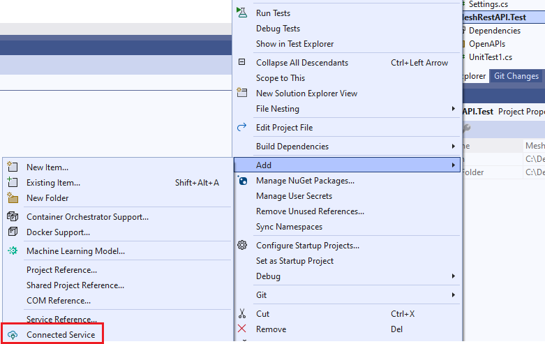
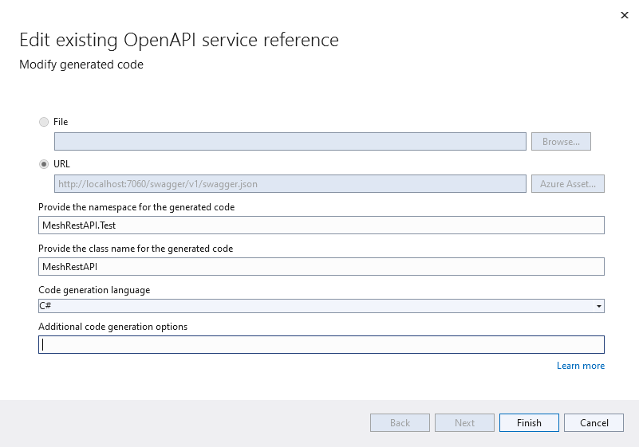
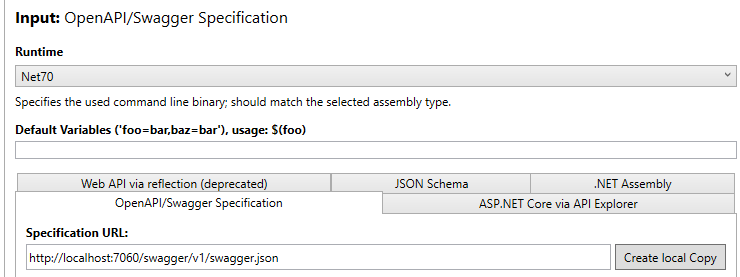
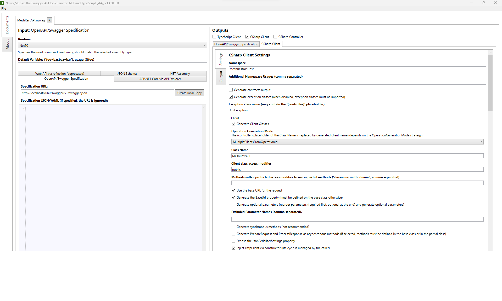

# How to generate C# API from the swagger.json OpenAPI definition

## Using Visual Studio 2022

The easiest solution is just to add a connected service to the project:



and then configure the API code creation:



When choosing `Finish`, the code is created as `.\obj\swaggerClient.cs`.

The only problem with the created code is that nullable object references in the OpenAPI description are not created as nullable in the C# code:

```json
"timeseriesResource": {
            "allOf": [
              {
                "$ref": "#/components/schemas/MeshTimeseriesResource"
              }
            ],
            "description": "Path to the time series in the Resources definition.",
            "nullable": true
          },
```

is converted to:

```C#
/// <summary>
/// Path to the time series in the Resources definition.
/// </summary>
[Newtonsoft.Json.JsonProperty("timeseriesResource", Required = Newtonsoft.Json.Required.Default, NullValueHandling = Newtonsoft.Json.NullValueHandling.Ignore)]
public MeshTimeseriesResource TimeseriesResource { get; set; }
```

which is not correct.

## Make it right using the NSwagStudio

The utility may be downloaded from [here].

[here]: https://github.com/RicoSuter/NSwag/wiki/NSwagStudio

### Configure a NSwagStudio project

Do the following steps:

1. Specify input:
   - Select which runtime to use (e.g. `Net70`).
   - In the `OpenAPI/Swagger Specification` folder, enter the URL to the Mesh Rest API (e.g. `http://localhost:7060/swagger/v1/swagger.json`).

   

2. Specify outputs:
   - Select `CSharp Client` and select the `CSharp Client` page.
   - Enter relevant text into the following attributes:
     - `Namespace` (same as the project the code is added to, f.ex. `MeshRestAPI.Test`).
     - `Class Name` (f.ex. `MeshRestAPI`).
     - Select the `Generate Nullable Reference Type (NRT) annotations (C# 8)` option.
     - `Output file path` (f.ex. `C:\Dev\energy-mesh-rest-api\src\MestRestAPI.Test\MeshRestAPI.cs`).

     

3. Generate the code by choosing `Generate Files` in the lower right corner.

4. Save the configuration using the `File\Save` options to a file in your project (e.g. `C:\Dev\energy-mesh-rest-api\src\MestRestAPI.Test\MeshRestAPI.nswag`).

You are then ready to use the API from your code.
