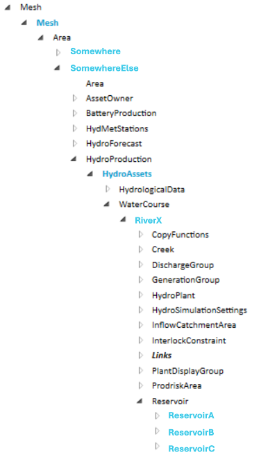
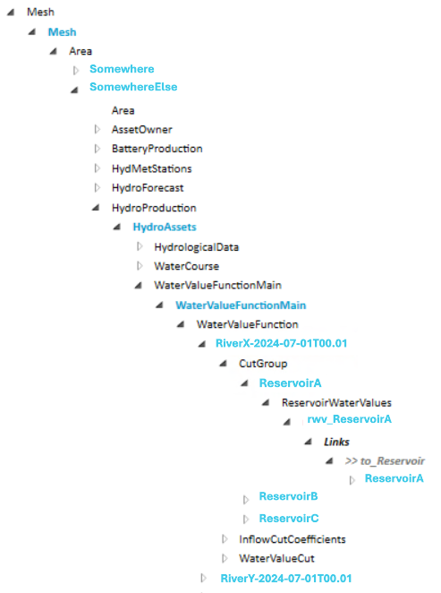
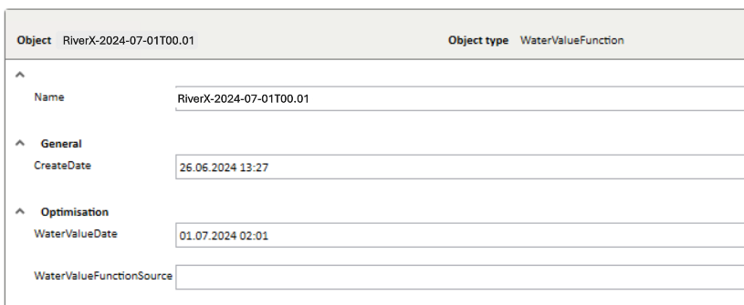
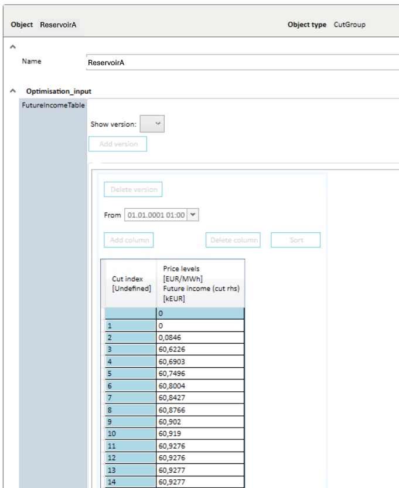
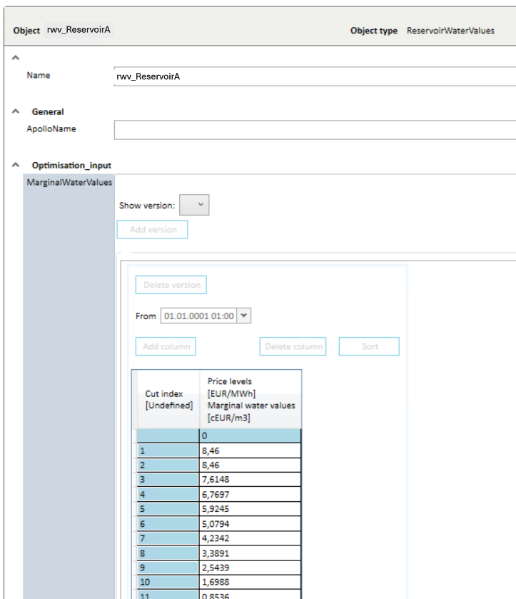
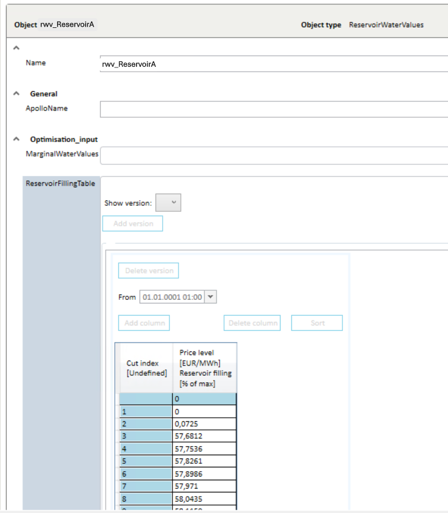

# How to use the ImportMultistepWaterValueFunctions

This ImportMultistepWaterValueFunctions methos was added to the 1.5.0 version of the Mesh REST API.

This ImportMultistepWaterValueFunctions method supports the same functionality that was earlier only provided by Optimal Gateway and the usage of a Powershell script, and populate the WaterValueFunctions structure with converted input data.

## How it looks in Nimbus

Reservoirs exists below the water course object: 



The water value function structure: 



A water value function below the water value main object: 



Cut group below the water value function: 



Reservoir water values below the cut group:

 


## Old solution

This script needed the input as a text file. This is an example of this input file:

````text
Multi-step marginal water values per reservoir (tuples of Mm3 and EUR/Mm3)
ReservoirA; 0.000 8176.960; 105.600 8152.450; 119.690 8127.940; 127.790 8103.430; 127.930 8078.920; 128.070 8054.410; 128.220 8029.900; 128.360 8005.390; 128.500 7980.880; 128.650 7956.360; 128.790 7931.850; 128.930 7907.340; 129.070 7882.830; 129.220 7858.320; 129.360 7833.810; 129.500 7809.300; 129.640 7784.790; 129.790 7760.280; 129.930 7735.760; 130.070 7711.250; 130.220 7686.740; 130.360 7662.230; 130.500 7637.720; 130.640 7613.210; 130.790 7588.700; 130.930 7564.190; 131.070 7539.680; 131.210 7515.160; 132.140 7490.650; 146.230 7466.140; 172.020 0.000
ReservoirB; 0.000 84600.000; 0.001 84599.999; 0.796 76148.460; 0.797 67696.920; 0.798 59245.380; 0.799 50793.840;  0.800 42342.300; 0.801 33890.760; 0.802 25439.220; 0.803 16987.680; 0.804 8536.140; 0.805 84.601; 0.806 84.600; 1.380 0.000;
ReservoirC; 0.000 12500.000; 0.001 12499.999; 9.496 11251.250; 9.497 10002.500; 9.498 8753.750; 9.499 7505.000; 9.500 6256.250; 9.501 5007.500; 9.502 3758.750; 9.503 2510.000; 9.504 1261.250; 9.505 12.501; 9.506 12.500; 11.150 0.000;
````

An example of how to run the powershell script is shown below:

```` powershell
#Example for multistep water value file
RunWaterValueImporter -ModelName "CompanyMesh" -MultiStepWaterValueFile "MultiStepWaterValueRiverX.txt" -Area "SomewhereElse" -WaterValueFunctionMainName "WaterValueFunctionMain" -WaterValueFunctionName "RiverX" -WaterValueDate "202407010001" -WaterCourses "RiverX"
````

## Using the ImportMultistepWaterValueFunctions method

The method has the following input parameters:

- `waterCoursePath` or `waterCourseId` is pointing to the WaterCourse object where the reservoirs are located below.
- `wvfMainPath` or `wvfMainId` is pointing to the WaterValueFunctionMain object where the water values will be located below.
- `wvfName` is name of the WaterValueFunction to create.
- `waterValueDate` is the date and time that the water value function is created for.
- `sessionId` is id of the session the call is a part of.
- In addition will the body contain the water values for the different reservoirs as a list reservoir data where each reservoice data element contains of:
  - `reservoirName` is the name of a reservoir below the WaterCourse object,
  - `volumesInMm3` is a list of reservoir volumes (as doubles) in Mm3 (million qubic meters), and 
  - `valuesInEuroPerMm3` is a list of water values (as doubles) in Euro per Mm3.
  - The number of items in both lists must be the same.

The method returns true if everything runs successful, otherwise an exception is thrown.

The method will automatically remove water value functions older than a given number of days back in time. The number of days is specified in as the `DeleteWaterValuesOlderThanDays` parameter in the appsettings.json configuration file of the Mesh REST API.

**Notice!** Changes done by the method will not be visible for other users before the Commit method is run.

### Example of usage

The example using the text file and powershell script above will be like this:

- waterCoursePath = `Model/CompanyMesh/Mesh.To_Areas/SomewhereElse.To_HydroProduction/HydroAssets.To_WaterCourses/RiverX`
- wvfMainPath = `Model/CompanyMesh/Mesh.To_Areas/SomewhereElse.To_HydroProduction/HydroAssets.has_WaterValueFunctionsMain/WaterValueFunctionMain`
- wvfName = `RiverX-2024-07-01T00:01`
- wvfDate = `2024-07-01T00:01:00+02:00`
- body =

  ```json
  [
    {
      "reservoirName": "ReservoirA",
      "volumesInMm3" : [0.000, 105.600, 119.690, 127.790, 127.930, 128.070, 128.220, 128.360, 128.500, 128.650, 128.790, 128.930, 129.070, 129.220, 129.360, 129.500, 129.640, 129.790, 129.930, 130.070, 130.220, 130.360, 130.500, 130.640, 130.790, 130.930, 131.070, 131.210, 132.140, 146.230, 172.020],
      "valuesInEuroPerMm3": [8176.960, 8152.450, 8127.940, 8103.430, 8078.920, 8054.410, 8029.900, 8005.390, 7980.880, 7956.360, 7931.850, 7907.340, 7882.830, 7858.320, 7833.810, 7809.300, 7784.790, 7760.280, 7735.760, 7711.250, 7686.740, 7662.230, 7637.720, 7613.210, 7588.700, 7564.190, 7539.680, 7515.160, 7490.650, 7466.140, 0.000]
    },
    {
      "reservoirName": "ReservoirB",
      "volumesInMm3": [0.000, 0.001, 0.796, 0.797, 0.798, 0.799,  0.800, 0.801, 0.802, 0.803, 0.804, 0.805, 0.806, 1.380],
      "valuesInEuroPerMm3": [84600.000, 84599.999, 76148.460, 67696.920, 59245.380, 50793.840, 42342.300, 33890.760, 25439.220, 16987.680, 8536.140, 84.601, 84.600, 0.000]
    },
    {
      "reservoirName": "ReservoirC",
      "volumesInMm3": [0.000, 0.001, 9.496, 9.497, 9.498, 9.499, 9.500, 9.501, 9.502, 9.503, 9.504, 9.505, 9.506, 11.150],
      "valuesInEuroPerMm3": [12500.000, 12499.999, 11251.250, 10002.500, 8753.750, 7505.000, 6256.250, 5007.500, 3758.750, 2510.000, 1261.250, 12.501, 12.500, 0.000]
    }
  ]
  ```

And below is also an example of a similar call using C# (taken from the Mesh REST API tests):

```c#
var now = DateTime.Now;
var wvfName = $"RiverX-{now.ToString("u").Replace(" ","T").Substring(0,16)}";
var multiStepWaterValues = new List<MultiStepWaterValues>();
var wtrValue = new MultiStepWaterValues()
{
  ReservoirName = "ReservoirA",
  VolumesInMm3 = new List<double>(),
  ValuesInEuroPerMm3 = new List<double>()
};
wtrValue.VolumesInMm3.Add(0.000);wtrValue.ValuesInEuroPerMm3.Add(8176.960);
wtrValue.VolumesInMm3.Add(105.600);wtrValue.ValuesInEuroPerMm3.Add(8152.450);
wtrValue.VolumesInMm3.Add(119.690);wtrValue.ValuesInEuroPerMm3.Add(8127.940);
wtrValue.VolumesInMm3.Add(127.790);wtrValue.ValuesInEuroPerMm3.Add(8103.430);
wtrValue.VolumesInMm3.Add(127.930);wtrValue.ValuesInEuroPerMm3.Add(8078.920);
wtrValue.VolumesInMm3.Add(128.070);wtrValue.ValuesInEuroPerMm3.Add(8054.410);
wtrValue.VolumesInMm3.Add(128.220);wtrValue.ValuesInEuroPerMm3.Add(8029.900);
wtrValue.VolumesInMm3.Add(128.360);wtrValue.ValuesInEuroPerMm3.Add(8005.390);
wtrValue.VolumesInMm3.Add(128.500);wtrValue.ValuesInEuroPerMm3.Add(7980.880);
wtrValue.VolumesInMm3.Add(128.650);wtrValue.ValuesInEuroPerMm3.Add(7956.360);
wtrValue.VolumesInMm3.Add(128.790);wtrValue.ValuesInEuroPerMm3.Add(7931.850);
wtrValue.VolumesInMm3.Add(128.930);wtrValue.ValuesInEuroPerMm3.Add(7907.340);
wtrValue.VolumesInMm3.Add(129.070);wtrValue.ValuesInEuroPerMm3.Add(7882.830);
wtrValue.VolumesInMm3.Add(129.220);wtrValue.ValuesInEuroPerMm3.Add(7858.320);
wtrValue.VolumesInMm3.Add(129.360);wtrValue.ValuesInEuroPerMm3.Add(7833.810);
wtrValue.VolumesInMm3.Add(129.500);wtrValue.ValuesInEuroPerMm3.Add(7809.300);
wtrValue.VolumesInMm3.Add(129.640);wtrValue.ValuesInEuroPerMm3.Add(7784.790);
wtrValue.VolumesInMm3.Add(129.790);wtrValue.ValuesInEuroPerMm3.Add(7760.280);
wtrValue.VolumesInMm3.Add(129.930);wtrValue.ValuesInEuroPerMm3.Add(7735.760);
wtrValue.VolumesInMm3.Add(130.070);wtrValue.ValuesInEuroPerMm3.Add(7711.250);
wtrValue.VolumesInMm3.Add(130.220);wtrValue.ValuesInEuroPerMm3.Add(7686.740);
wtrValue.VolumesInMm3.Add(130.360);wtrValue.ValuesInEuroPerMm3.Add(7662.230);
wtrValue.VolumesInMm3.Add(130.500);wtrValue.ValuesInEuroPerMm3.Add(7637.720);
wtrValue.VolumesInMm3.Add(130.640);wtrValue.ValuesInEuroPerMm3.Add(7613.210);
wtrValue.VolumesInMm3.Add(130.790);wtrValue.ValuesInEuroPerMm3.Add(7588.700);
wtrValue.VolumesInMm3.Add(130.930);wtrValue.ValuesInEuroPerMm3.Add(7564.190);
wtrValue.VolumesInMm3.Add(131.070);wtrValue.ValuesInEuroPerMm3.Add(7539.680);
wtrValue.VolumesInMm3.Add(131.210);wtrValue.ValuesInEuroPerMm3.Add(7515.160);
wtrValue.VolumesInMm3.Add(132.140);wtrValue.ValuesInEuroPerMm3.Add(7490.650);
wtrValue.VolumesInMm3.Add(146.230);wtrValue.ValuesInEuroPerMm3.Add(7466.140);
wtrValue.VolumesInMm3.Add(172.020);wtrValue.ValuesInEuroPerMm3.Add(   0.000);
multiStepWaterValues.Add(wtrValue);
wtrValue = new MultiStepWaterValues()
{
  ReservoirName = "ReservoirB",
  VolumesInMm3 = new List<double>(),
  ValuesInEuroPerMm3 = new List<double>()
};
wtrValue.VolumesInMm3.Add(0.000);wtrValue.ValuesInEuroPerMm3.Add(84600.000);
wtrValue.VolumesInMm3.Add(0.001);wtrValue.ValuesInEuroPerMm3.Add(84599.999);
wtrValue.VolumesInMm3.Add(0.796);wtrValue.ValuesInEuroPerMm3.Add(76148.460);
wtrValue.VolumesInMm3.Add(0.797);wtrValue.ValuesInEuroPerMm3.Add(67696.920);
wtrValue.VolumesInMm3.Add(0.798);wtrValue.ValuesInEuroPerMm3.Add(59245.380);
wtrValue.VolumesInMm3.Add(0.799);wtrValue.ValuesInEuroPerMm3.Add(50793.840);
wtrValue.VolumesInMm3.Add(0.800);wtrValue.ValuesInEuroPerMm3.Add(42342.300);
wtrValue.VolumesInMm3.Add(0.801);wtrValue.ValuesInEuroPerMm3.Add(33890.760);
wtrValue.VolumesInMm3.Add(0.802);wtrValue.ValuesInEuroPerMm3.Add(25439.220);
wtrValue.VolumesInMm3.Add(0.803);wtrValue.ValuesInEuroPerMm3.Add(16987.680);
wtrValue.VolumesInMm3.Add(0.804);wtrValue.ValuesInEuroPerMm3.Add(8536.140);
wtrValue.VolumesInMm3.Add(0.805);wtrValue.ValuesInEuroPerMm3.Add(84.601);
wtrValue.VolumesInMm3.Add(1.380);wtrValue.ValuesInEuroPerMm3.Add(0.000);
multiStepWaterValues.Add(wtrValue);
wtrValue = new MultiStepWaterValues()
{
  ReservoirName = "ReservoirC",
  VolumesInMm3 = new List<double>(),
  ValuesInEuroPerMm3 = new List<double>()
};
wtrValue.VolumesInMm3.Add(0.000);wtrValue.ValuesInEuroPerMm3.Add(12500.000);
wtrValue.VolumesInMm3.Add(0.001);wtrValue.ValuesInEuroPerMm3.Add(12499.999);
wtrValue.VolumesInMm3.Add(9.496);wtrValue.ValuesInEuroPerMm3.Add(11251.250);
wtrValue.VolumesInMm3.Add(9.497);wtrValue.ValuesInEuroPerMm3.Add(10002.500);
wtrValue.VolumesInMm3.Add(9.498);wtrValue.ValuesInEuroPerMm3.Add(8753.750);
wtrValue.VolumesInMm3.Add(9.499);wtrValue.ValuesInEuroPerMm3.Add(7505.000);
wtrValue.VolumesInMm3.Add(9.500);wtrValue.ValuesInEuroPerMm3.Add(6256.250);
wtrValue.VolumesInMm3.Add(9.501);wtrValue.ValuesInEuroPerMm3.Add(5007.500);
wtrValue.VolumesInMm3.Add(9.502);wtrValue.ValuesInEuroPerMm3.Add(3758.750);
wtrValue.VolumesInMm3.Add(9.503);wtrValue.ValuesInEuroPerMm3.Add(2510.000);
wtrValue.VolumesInMm3.Add(9.504);wtrValue.ValuesInEuroPerMm3.Add(1261.250);
wtrValue.VolumesInMm3.Add(9.505);wtrValue.ValuesInEuroPerMm3.Add(12.501);
wtrValue.VolumesInMm3.Add(9.506);wtrValue.ValuesInEuroPerMm3.Add(12.500);
wtrValue.VolumesInMm3.Add(11.150);wtrValue.ValuesInEuroPerMm3.Add(0.000);
multiStepWaterValues.Add(wtrValue);
// import a multistep water value function
string waterCoursePath = "Model/CompanyMesh/Mesh.To_Areas/SomewhereElse.To_HydroProduction/HydroAssets.To_WaterCourses/RiverX";
string wvfMainPath = "Model/CompanyMesh/Mesh.To_Areas/SomewhereElse.To_HydroProduction/HydroAssets.has_WaterValueFunctionsMain/WaterValueFunctionMain";
var importReq = api?.ImportMultistepWaterValueFunctionsAsync(
  waterCoursePath,
  null,
  wvfMainPath,
  null,
  wvfName,
  now,
  sessionId,
  multiStepWaterValues).Result;
```
