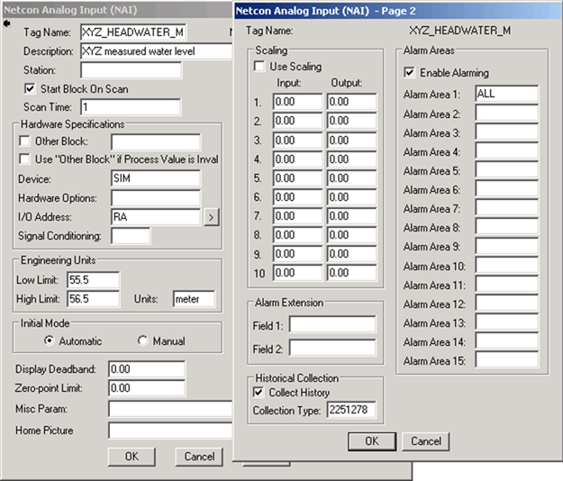
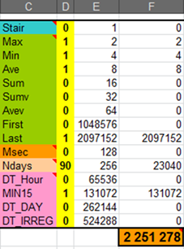
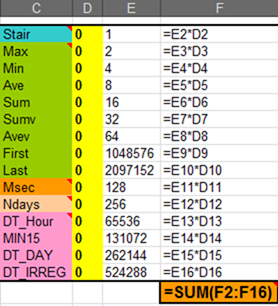
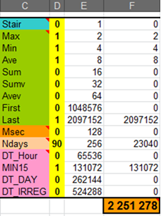
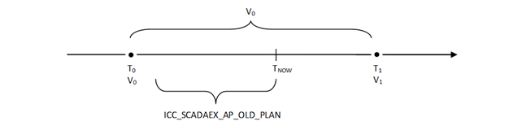
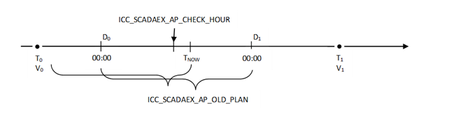

# Powel ScadaEx - User guide

## About this document

This document describes how to use the application. It is intended for a technical audience.

### Documentation overview

|DOCUMENT|WHEN|TARGET GROUP|LOCATION|
|--------|----|------------|--------|
|SmG Release notes|Overview|System owner, system administrator/IT operations, end user|myPowel, Powel ftp-server|
|ScadaEx Installation and Configuration guide|Set-up|System administrator/IT operations|myPowel, Powel ftp-server|

### Writing conventions

- **Bold** is used for menu items, dialog boxes, buttons and functions in GUI.
- `>` is used to separate a sequentially selection of menu items, e.g. File > Save as.
- The typewriter font is used in code examples.
- Numbered lists are used for steps in a process.
- Bulleted lists are used for items without priority.
- ***Note!*** is used in front of important information.
- ***Tip!*** is used in front of additional information.

## Introduction

ScadaEx is a software component that integrates the Powel SmG system and the Nematic Scada system. The component can be considered as an extended Scada component, and therefore it has been given the name “ScadaEx”. This comprehensive functionality includes two-way exchange of time series data between the Nematic/iFIX real-time database and the SmG time series database (Oracle), autopilot functionality, and naming conventions between the Powel Simulator data model and the Scada real time database.

ScadaEx is a single application that runs on the Scada node side by side with the Nematic and its underlying iFIX system. The application can operate in one of several modes at a time, but multiple instances can be started to operate different modes on the same node. Currently the following modes of operation are defined:

- Transfer of values from Nematic real time data base to the Powel SmG data base for historical storage (“HistoryCollection” mode).
- Transfer of values from Powel SmG database to specified Nematic real time database entities (“TsToScada” mode).
- Autopilot driver, feeding the Nematic real-time database blocks with values according to autopilot plans (“AutoPilot” mode).

The program uses a cross reference file for mapping between Nematic identities and SmG time series identities.

### Terminology

The following table contains explanations of important terminology used in this document:

|EXPRESSION|EXPLANATION|
|----------|-----------|
|Powel SmG|Powel Smart Generation, a product name of Volue AS (www.volue.com). Delivers Energy Management Software (EMS) for production planning and optimization. Integrates with Netcontrol’s Nematic product.|
|Nematic|Product name of Netcontrol (www.netcontrol.fi). Extends iFIX from Intellution into a usable SCADA for powerplants.|
|iFIX|Product name for GE Intelligent Platforms (www.ge-ip.com), part of the Proficy portfolio (“Proficy iFIX HMI/SCADA”). Delivers the building blocks (the SCADA engine) for Netcontrol’s Nematic product.|
|Node, Tag and Field|Node is the name of a SCADA server, tag is the name of a database block and field is an attribute on the database block. An individual attribute in an iFix database is usually referred to using a combined unique identifier “NODE.TAG.FIELD”, denoted NTF for short.|

### ScadaEx version history

The following table shows important changes in ScadaEx:

|VERSION|ADDED/IMPROVED/REMOVED|DESCRIPTION|
|-------|----------------------|-----------|
|10.2.1|Added|Support for logging to Windows Event Log instead of console.|
||Added|Support for installing and running as a Windows Service.|
||Added|Support for reading command line arguments from file (command file).|
||Improved|Command line syntax extended to support new features (Windows Event Log, Windows Service, command file etc.), and some other general improvements. All changes are backwards compatible so existing commands should function as before.|
||Improved|Modifications in the main collection loop logic of history collection, primarily related to database disconnection and the creation of files. The configuration variable ICC_IFIX_MIN_QREAD is now only considered when database is not connected, and default value is the value of ICC_IFIX_MAX_CACHE.|
||Added|Added configuration variables ICC_SCADAEX_USE_EVENTLOG, ICC_SCADAEX_EVENTSOURCE, ICC_IFIX_CACHEDUMP_DIR and ICC_SCADAEX_COMMANDFILE.|
||Improved|Renamed configuration variable SCADAEX_DEBUGLEVEL to ICC_SCADAEX_DEBUGLEVEL (conformance with name format of the other variables).|
||Removed|Removed configuration variable DEBUG_IFIXIMP. Use ICC_SCADAEX_DEBUGLEVEL instead.|
|Phoebe|Improved|A new instance of Autopilot trace file including date stamp in the name is created when Autopilot is started.|
||Improved|An option to turn on/off Ifix log to ICC-Log with the configuration variable SCADAEX_LOG_IFIX (TRUE/FALSE or YES/NO). Default value is no logging to ICC log.|
||Improved|Logging user messages to console (if present) when shutting down ScadaEx with <CTRL_C> EVENT.|
||Added|Added configuration variable LOG_XTRA_2_TRACE_FILE to add more information to Autopilot trace file to ease debugging. Default value is TRUE.|

## Modes of operation

ScadaEx can be started in one of three modes of operation:

- Transfer real time values from Nematic Scada to SmG for historical storage.
We call this the “HistoryCollection” mode in this document, although various names such as “HistoryStorage”, “HistoricalCollection”, “ScadaValuesToHistDb” and “TsToHistDb” are also used.
- Monitor planning time series in SmG and update set-points in Nematic Scada data blocks according to various specifications, working as an autopilot controller for the objects. We call this the “AutoPilot” mode.
- Transfer additional time series from the SmG database to Nematic Scada, such as min/max limits etc. We call this the “TsToScada” mode

### HistoryCollection: Transferring values from Nematic to SmG

In a SmG/Nematic integrated system the SmG database is the storage space for all historical information from the Scada real-time database. The data will be stored in time series of irregular interval type, so-called break point time series, so that every value from Netcon can be stored. Scheduled tasks can be set up to aggregate the original time series with very fine resolution into fixed interval time series with more practical resolutions like hour or 15 minutes. Since the amount of data in the original break point time series may get very high, it is recommended to delete values that exceed a specified age from these, and instead use aggregated time series for long term storage. This deletion can also be set up as scheduled task. Powel supplies scripts and database jobs to support this functionality.

To import values from the Nematic/iFIX database into the time series database use the following syntax:

```cmd
ScadaEx.exe ScadaValuesToHistDb|TsToHistDb <scada_node>
```

Example:

```cmd
ScadaEx.exe ScadaValuesToHistDb SN01
```

ScadaEx will establish contact with the Nematic Spontaneous Data Message interface to get information about which items in the real time database that should be transferred to the time series database. The connection is done via a published data queue in Nematic, which is identified by a queue number. ScadaEx can be configured to connect to a specific queue number with configuration variable `ICC_IFIX_QUEUE` (default value is 4).

Corresponding time series identities are, if necessary, automatically created in the SmG database. Information from the Nematic real-time database is used to establish the time series with as much as possible correct information about measurement units, how the collected points are to be interpreted (line between points or staircase), etc. The time series type will be of type “irregular”, thus any timestamp down to millisecond resolution can be stored.

The storage of historical values from the Netcon database blocks into corresponding time series in the SmG database is configured on special fields on the individual database blocks. The main switch is the “Collect History” option on the database blocks. This must be enabled for ScadaEx’s HistoryCollection functionality to get access to its values. The screenshot below illustrates a database block for an imaginary reservoir called “XYZ” with history collection enabled.



The configuration for the SmG storage is set in a numeric input field `Collection Type`, in the same `Historical Collection` group as the main `Collect History` switch. The value in this field specifies the “historical mode”. The value is a binary encoded number that represents all parameters needed by the SmG system. This will be described in detail in [Collection type (history mode)](#collection-type-history-mode).

#### How Nematic/iFIX tag gets mapped into time series

The time series identifier for a given Scada database block is generated by appending “.hist” to the tag name. E.g.”NCSI.XYZ_G1_MW” will be stored to time series “XYZ_G1_MW.hist”. This can however be changed in two ways:

1. By setting a generic format string in configuration variable `ICC_IFIX_NAME_FMT`.
2. By adding explicit mapping to a cross reference file, referred to by configuration variable `ICC_IFIX_NAME_MAP`.

The generic format string in the environment variable ICC_IFIX_NAME_FMT must be a valid tscode string, but two format parameters are supported that will be replaced by ScadaEx when applying the format to a given tag:

- %%N
  - Will be replaced by the node name when performing the mapping.
  - Optional.
- %%s
  - Will be replaced by the tag name when performing the mapping.
  - Required.

***Note!*** The %%s parameter (which represents the tag name) is required, while the %%N (representing the node name) is optional. Also note that if %%N is used then it is a requirement that it occurs before the %%s in the format string – the node name must be a prefix of the tag name. The default behaviour corresponds to a format string “%%s.hist”.

A cross-reference file specifies explicit mapping from a complete node.tag.field into a tscode. Reference to the file can be specified in the configuration variable `ICC_IFIX_NAME_MAP`. The path may be given as an absolute or relative path, relative paths will be resolved based on the `ICCDIR` configuration variable. If no such variable is defined, ScadaEx defaults to the file “ifix_name_map.txt”, which must be the name of a file in the `ICCDIR` directory for it to be found. When mapping a given tag to a time series a match in the cross-reference file overrides any other rules. If a file is found but a tag is not found, then the generic format string will be used instead to get time series for this tag.

The format of the cross-reference file is:

```txt
<TAG> <TSCODE>
```

Example file map file contents

```txt
XYZ_G1_MW G_XYZ_G1_MW_X_HIST
XYZ_G2_MW G_XYZ_G2_MW_X_HIST
```

With the example map file above the values collected from tag XYZ_G1_MW will be stored to a time series identified by tscode “G_XYZ_G1_MW_X_HIST”.

The time series identifiers are “full name”, which means they may contain path in addition to the tscode (short name). For instance, the configuration variable `ICC_IFIX_NAME_FMT` may be set to “/my/path /%%s.hist”.

***Notes!***

The current limitation in the SmG database is that the maximum length of a tscode is 40 characters and of a path 512 characters. If these limitations are violated in the map file or configuration variable, a database error (“ORA-12899: value too large for column”) will occur.

The path separator in SmG is ‘/’, and this character is a legal character in tag names in iFIX. Thus, mapping may lead to part of the tag name being stored as path and part as tscode. To avoid this it is possible to set the configuration variable `ICC_SCADAEX_DBPATH_FIX`, which will replace any occurrences of ‘/’ in the tag name with ‘_’ to ensure the entire name is used for the tscode identifier of the time series.

#### Collection type (history mode)

The “Collection Type” parameter in the “Historical Collection” configuration of Netcon database blocks is used to set a mode of (a set of parameters for) the history collection of the block.

The historical values stored for a Netcon database block with history collection enabled will always be initially stored in a break point time series in the SmG database. ScadaEx will create the time series if it does not exist. But as described above there are usually additional operations that one would want to be performed on the stored values. Every changed value from Scada will be stored in the break point time series, the storage space required for these time series can therefore become a problem. Thus, it is recommended to regularly aggregate the break point time series into coarser resolution like 15 minute or hour interval time series. Powel offers scripts that can be set up as scheduled tasks to perform the aggregation, followed by deletion of old break points from the original break point time series. These scripts use the information from the collection type parameter to decide what operations to perform on each individual break point time series.

The collection type defines:

1. If milliseconds precision should be used for time stamps in the break point time series.
2. The number of days back from current day to keep raw data values in the break point time series. The value 0 means that no deletion shall be performed; we want all break points to be kept forever.
3. What statistical time series should be created from the raw data for permanent historical storage, e.g. min/max/average values for each hour.
4. Time resolution of the aggregated (permanent) historical time series.
5. What curve shape the break point time series should have: “Linear” or “staircase start of step”.

The historical mode configuration must be encoded as a binary number to be able to set it as “Collection Type” on a Nematic database block. A simple Excel worksheet is useful to assist the encoding of the value. The screenshot below show a worksheet encoding the same value as was set in the “Collection Type” in the screenshot in [HistoryCollection: Transferring values from Nematic to SmG](#historycollection-transferring-values-from-nematic-to-smg).



How are the individual configuration parameters listed in column C in the worksheet encoded into an integer value? Below is the definition of each of the parameters. The binary value is also shown, as a hex encoded value with decimal value in parenthesis. All except the number of days (NDAYS) is simple indicator values, represented by a single bit.

|Parameter name|Binary value hex (decimal)|Explanation|
|||How to interpret points in the historical time series? ***Note!*** This parameter will only be considered when the time series is created, any later change the curve shape needs to be done manually on the time series in the SmG database.|
|HIST_MODE_LINEAR|0x00000001 (1)|Default curve shape. 1 means “linear”, useful for reservoir storage etc. 0 means “staircase start”, useful for metered energy, indicators etc.|
|||How to aggregate the historical values for permanent storage? One or multiple of the following bits may be set, each bit set will indicate a separate aggregated time series using a specified aggregation method. The period to aggregate over is defined in a different parameter, described later.|
|HIST_MODE_MAX|0x00000002 (2)|Largest value|
|HIST_MODE_MIN|0x00000004 (4)|Smallest value|
|HIST_MODE_AVE|0x00000008 (8)|Average of all values|
|HIST_MODE_SUM|0x00000010 (16)|Sum of all values|
|HIST_MODE_SUMV|0x00000020 (32)|Sum of values found|
|HIST_MODE_AVEV|0x00000040 (64)|Average of values found|
|HIST_MODE_FIRST|0x00100000 (1048576)|Value at end|
|HIST_MODE_LAST|0x00200000 (2097152)|Value at start|
|||Consider millisecond precision of the timestamps of items read from the history queue?|
|HIST_MODE_MSEC|0x00000080 (128)||
|||How long, in number of days, should raw-data values be kept in the break point time series? After this time the values can be removed from the break point time series and the aggregated time series are used for permanent storage. Default value is 10 days. NB: This parameter is an integer value stored in binary format, not a simple 1-bit indicator like the other parameters. The definition is therefore a bit more complex than the others. 8 bits are used to store the value, this means maximum possible value is 255 (days). The 8 bits are stored from bit 9 to bit 16, so to encode a given number of days integer one can simplify this by multiplying the number with 256 (0x100), and just make sure the number is never above 255.|
|HIST_MODE_NDAYS|0x0000FF00|Bitmask to get the 8 bits from bit 9 to bit 16 where the actual integer representing number of days is stored.|
|HIST_MODE_NDAYS_BIT|8|NDAYS, the integer value, start at bit 8.|
|||What resolution should the aggregated series have? This also defines the period of the aggregation function (min, max, sum, etc.). Default is hour, but 15 minutes resolution is recommended. Day resolution is not recommended.|
|HIST_MODE_DT_HOUR|0x00010000 (65536)|Fixed hour resolution.|
|HIST_MODE_DT_MIN15|0x00020000 (131072)|Fixed 15 minutes resolution|
|HIST_MODE_DT_DAY|0x00040000 (262144)|Fixed day resolution.|
|HIST_MODE_DT_IRREG|0x00080000 (524288)|Irregular resolution - break point time series.|

An easy way to encode the historical type value from the individual parameters is to just sum together the decimal values of all parameters that should be set. E.g. to aggregate maximum in 15 minutes intervals the historical type is 2+131072 = 131074. The exception is the number of days (NDAYS), which you must multiply with 256 before summing it with the others. Below is an example of how a simple Excel worksheet can be created as a simple tool to generate the historical type value from the individual parameters.

   

The historical mode definition specified on the database block is interpreted by ScadaEx when it prepares the basic break point time series to store the block’s values into. ScadaEx converts the binary number into a text string format so that it can store it in the description field of the time series register table in the SmG database. This string will later be read by the aggregation scripts and used to decide how to perform the aggregation (and deletion).

The string format can be described like this:

```cmd
<numdayshistory>,<timeresolution>,<function>
```

The format parameter `<numdayshistory>` is a number, with default value 10, that corresponds to the `HIST_MODE_NDAYS` bit. Parameter `<timeresolution>` is `DAY`, `HOUR`, `MIN15`, or `IRREG`, corresponding to the `HIST_MODE_DT` bits. Default is `HOUR`, although `MIN15` is recommended. Multiple resolutions may be specified. The parameter `<function>` is `first`, `last`, `min`, `max`, `sum`, `ave`, `sumv`, or `avev`, corresponding to the bits `HIST_MODE_FIRST` etc, these decide how the calculation of the aggregated values will be performed. Using the aggregation scripts the result will be aggregated time series with same name as the break point time series, but with a suffix corresponding to the mode (e.g. “XYZ.HEADWATER_M.hist.Min”).

If the storing of metadata string to the time series fails, the SQL update statement is written to a file with name \<tscode>.txt in a pre-defined directory. The generated file contains ready-to-execute SQL statements which updates the required fields. A suitable tool for executing the statements is the SQL*Plus program from Oracle.

The directory can be customized using configuration variable `ICC_IFIX_HISTMODE_DIR`. Absolute or relative paths are supported. Relative paths will be according to the working directory (`ICCDIR`). Default is relative path “ifix_histmode”, which will be used if the configuration variable is not specified or specified directory cannot be found or cannot be created (e.g. due to invalid path). Fall-back if all other fails, is to use the working directory (`ICCDIR`) itself. The directory will be created if not already exists, but only the last component of directory path can name a new directory, any intermediate directories must exist.

The historical mode string of the time series will be updated each time ScadaEx is started, but the information deciding the curve shape of the break point series is only used when the break point is first created. Any needed modifications later must be done manually.

#### Queue collection and check rate

ScadaEx collects values from the Nematic data queue as soon as there are data. The values are placed into an in-memory value cache, and they are stored down to the SmG timeseries database when a certain number of values have been cached or when the system seems to be idle for some time.

In the normal situation, when ScadaEx is able to empty the Nematic data queue, it will check for new items in the queue at a regular rate. Default rate is about every 5 seconds (5000 milliseconds). Between each queue check ScadaEx will suspend itself - sleep. If there are data in the queue, all data is read and stored before going to sleep for another 5 seconds. This value can be changed by setting `ICC_IFIX_SLEEP` to an integer representing number of milliseconds. A lower value means decreasing the response-time, but wasting some CPU when there is small amount of data to be stored. Minimum possible sleep time is 100 milliseconds.

#### Value cache and queue collection strategy

The number of elements that ScadaEx will collect into its in-memory value cache before storing them permanently in the SmG database is default set to 5000. A suitable value can be set by changing the contents of the configuration variable `ICC_IFIX_MAX_CACHE`, e.g. ICC_IFIX_MAX_CACHE=10000 would force the cache to be flushed to the database only when the number of cached items reaches 10000. A small value means there is a lot of SQL*Net traffic when there is a lot of values to store. A large value means larger blocks of data is transferred to the SQL database at a time.

ScadaEx HistoryCollection works by running a main collection loop that fetches items from the iFIX queue and adds them to the memory cache. The collection loop run until it has filled the memory cache or emptied the queue. If the queue is emptied then it goes to sleep a number of milliseconds, configured by variable `ICC_IFIX_SLEEP` (default 5000, meaning 5 seconds), before it repeats the procedure. If the size of the cache reached the configured maximum size then the cache will be stored into the SmG database, and the cache will be cleared, before the sleep followed by continued collection from the queue. If the age of the first item currently in cache is older than some limit, then the cache will be stored into the database even if it has not reached the maximum size. The default age is 5 seconds, but this can be customized using configuration variable `ICC_IFIX_MAX_CACHE_AGE`, by setting a value that represents age in number of seconds (default is 5, minimum is 1). This is the base scenario, but there are different situations and configuration variables that affect this, as described in the following sections.

Whenever reading the next item from the iFIX queue is unsuccessful, either because an error code was returned or an overflow, the collection loop is aborted and the recovery procedures described in [Overflow in the iFIX message queue](#overflow-in-the-ifix-message-queue) and [Loss of communication with the iFIX message queue](#loss-of-communication-with-the-ifix-message-queue), are triggered.

When the database connection is working, the collection loop will be aborted when the maximum cache size is reached - to store the cache into the database, as described above. After the cache has been stored the collection loop will be re-started immediately without the sleep period.

When the database becomes disconnected, reconnection will be attempted regularly according to `ICC_IFIX_RECONNECT_DELAY`. If reconnection is not possible then the collection loop will continue even if the cache size has reached the configured maximum. Cache size will then exceed the maximum (`ICC_IFIX_MAX_CACHE`). If the database connection keeps being in a disconnected state, then the collection loop will continue until a given number of items have been read in the current collection loop sequence (since the previous sleep or commit attempt). The configuration variable `ICC_IFIX_MIN_QREAD` defines this minimum, the default value is the same as the cache size – given by variable `ICC_IFIX_MAX_CACHE` with default value 5000. The reason for this minimum parameter is to avoid reading a single item at the time from the queue before attempting to reconnect and commit, when the cache size is full and more. But even if ScadaEx are unable to reconnect it should still be set to attempt to store the cache into the database regularly, since the backup procedure with writing cache contents to file as described in Loss of database communication/failure to insert values into the SmG database (below) is only triggered when cache storage fails.

#### Error handling

##### Loss of database communication/failure to insert values into the SmG database

Reconnection will always be performed at each attempt to commit cache, therefore the cache configuration variables described in [Value cache and queue collection strategy](#value-cache-and-queue-collection-strategy), like `ICC_IFIX_MAX_CACHE` and `ICC_IFIX_MIN_QREAD`, will affect the reconnection behaviour. Reconnection will also be attempted before other operations that require database connection, but to limit the number of such reconnection attempts the configuration variable `ICC_IFIX_RECONNECT_DELAY` was introduced. The default value is 10 seconds, which means functions depending on database connection (except commit cache) will not try to reconnect if it is less than 10 seconds since the previous time reconnection was tried. Attempting to reconnect too often may lead to heavy load on the client application (high CPU usage etc.) or operations may “hang” until a timeout is reached. The result may be that ScadaEx fails to keep up with the input rate to the data queue, and it may end up losing items due to overflow in the queue.

When ScadaEx HistoryCollection fails to write cache contents to the database, e.g. when database is not running or the network connection to the database is not functioning, the default behaviour is to continue collecting values into the cache and attempt to reconnect to the database to store the cache contents later. Possible problems with this default “naive” approach are:

- Application failure or other software/hardware problems during the database disconnection will lead to loss of all cached data.
- Memory consumption of the ScadaEx process will keep growing as more values needs to be kept in cache, and if it grows out of the operating system limits then this will result in application failure as described in the previous point. This is a very probable situation if the database connection is not restored for a long time and the rate of data into the iFIX queue is high.

For extended security ScadaEx can be configured to store the cache contents as SQL statements in a text file when the cache cannot be stored to the database. The generated files will contain ready-to-execute SQL statements which stores the cache data into the database. The files will not be imported into the database by ScadaEx, it must be done manually by executing the statements in a suitable tool such as the SQL*Plus program from Oracle.

This file-based backup procedure can work in one of two different modes, configured by setting one of the two configuration variables:

- `ICC_IFIX_DUMP_TO_FILE_ON_ERROR`
  - We call this “dump mode”.
- `ICC_IFIX_BACKUP_TO_FILE_ON_ERROR`
  - We call this “backup mode” or “copy mode”.

Both settings will make ScadaEx store the cache contents to file when the normal storage to SmG database fails. The difference is that configuration variable `ICC_IFIX_DUMP_TO_FILE_ON_ERROR` will make ScadaEx clear the memory cache after it has been written to file, and ScadaEx will continue as normal - as if the cache was successfully stored. The configuration variable `ICC_IFIX_BACKUP_TO_FILE_ON_ERROR` will enable writing to file but without clearing the memory cache.

The disadvantage of clearing the cache every time (dump mode) is that it always requires a manual operation to import the created file into the database, even if ScadaEx manages to reconnect to the database and continue its operation. When the cache is not cleared (copy mode) after writing to file, then all values will be stored to database if/when the connection is successfully re-established, and the copy-files do not have to be imported later and can safely be deleted – no manual operations are necessary. But, as with the naive approach, there is a risk of application failure due to memory exhaustion. If the disconnect lasts a long time the memory usage of the ScadaEx may increase to the limits of the system, leading to application failure. The copy-file backup makes sure the entire cached items are not lost in case of such problems. But ScadaEx cannot start without a working database connection to do initial login, because it needs the database connection to initialize mapping information before it can collect items from the queue. So, if the database disconnection continues after ScadaEx have stopped, then data cannot be collected from the data queue from the time the application stops and until the database connection is working again and ScadaEx restarted. If this results in overflow in the queue, then some data will be lost. The advantage of the copy mode as opposed to the naive approach is that we avoid losing all previously cached data in the case of failure, we just have to manually import the generated files when the database is available again (like with the dump mode). Therefore, the dump mode, enabled by configuration variable `ICC_IFIX_DUMP_TO_FILE_ON_ERROR`, is the safest option – the option that will minimize the risk of data loss. As noted above, the disadvantage with the dump mode is that manual work needs to be performed. With transient connection problems one needs to regularly check the dump folder (`ICC_IFIX_CACHEDUMP_DIR`, see below) to import any dump files that have been created to avoid “holes” in the stored time series. For systems where frequent transient disconnects are common a pragmatic solution may be to just stick with the default naive approach, or even better enable the copy mode (`ICC_IFIX_BACKUP_TO_FILE_ON_ERROR`). But, to repeat: One needs to be aware of the risk for data loss in case of long-lasting database problems. Parameters that affect the decision of which to use is the stability of the network/database connection, the amount of memory on the computer and the data rate into the iFix queue.

As an example, one can choose to use the default naive approach or the enhanced “copy mode” in the normal operation, but when the database has to be disconnected for planned maintenance one can chose to switch to dump mode before disconnecting the database. To do so one must disable the configuration variable `ICC_IFIX_BACKUP_TO_FILE_ON_ERROR`, set variable `ICC_IFIX_DUMP_TO_FILE_ON_ERROR`, and then restart the application. Since one must restart the application for the configuration change to have affect, it is important to do this before the database maintenance begins.

Files will be created in a pre-defined directory, file names will be generated according to format “<date_time_17c>_histvalues_dump.sql” when cache is cleared (dump mode), and “<date_time_17c>_histvalues_copy.sql” when cache is kept (copy mode). The files in copy mode will be incremental; the newest successfully written file will contain all cached items since the database disconnection started, and if it gets necessary to perform manual import only this one file should be necessary to import. The dump-files are not incremental; you always have to import all files created since the database disconnection started to avoid data loss.

The directory where the files are stored can be customized by configuration variable `ICC_IFIX_CACHEDUMP_DIR`. Relative paths will be resolved according to `ICCDIR`. Default is relative path “ifix_cachedump” (resolved to %ICCDIR%\ifix_cachedump), which will be used if variable is not specified or specified directory cannot be found or cannot be created (e.g. due to invalid path). The directory will be created if not already exists, but only the last component of directory path can name a new directory, any intermediate directories must exist. Fall-back if all other fails, is to use the working directory (`ICCDIR`) itself.

The files will (when configured) be created every time an attempt to commit the cache fails. The section [Value cache and queue collection strategy](#value-cache-and-queue-collection-strategy) describes what triggers a commit attempt. For the dump option (`ICC_IFIX_DUMP_TO_FILE_ON_ERROR`) the defined max size of the cache (`ICC_IFIX_MAX_CACHE`) or the age limit (`ICC_IFIX_MAX_CACHE_AGE`), depending on the data queue rate, is the parameters that decides when the dump files will be created. The maximum size of the dump files will be according to `ICC_IFIX_MAX_CACHE`. For the copy option (`ICC_IFIX_BACKUP_TO_FILE_ON_ERROR`), where the cache is not cleared after the file has been created, the cache is likely to grow past the configured max size during a long database disconnect. If the queue rate is high the configuration variable `ICC_IFIX_MIN_QREAD` is the single configuration parameter that most likely decides how often the files will be created: The collection loop keeps collecting items from the queue until the min queue read option triggers it to abort to attempt commit – and then the file copy will be created if commit fails. If the queue rate is low the queue is more likely to be emptied regularly, and after the defined size of the cache has been exceeded a commit will be attempted before sleep each time the queue is emptied. This may lead to files being created frequently, with few additional insert statements in each new file.

If the application is stopped at a time when it is not connected to the database, it will attempt to reconnect to write any remaining cached items to the database. If the reconnection fails ScadaEx will always write the cache contents to file, even if none of the configuration variables described above is specified.

##### Duplicate items

The database error `ISAM_DUPLICATE_KEY` may occur in the following cases:

1. Two ScadaEx instances is running in HistoryCollection to the same SmG database, and an incorrect configuration makes them attempt to store the same values into the same time series.
2. At start-up of HistoryCollection, when the last stored value in a previous instance have the same time stamp as the first value to be stored in the current instance. This should not result in any data loss since a commit will have been performed after storing the initial value during the initial state processing.
3. It has been set manual values in the Netcon database when automatic data collection is still running.

Only increasing timestamps is allowed for the same time series, any values that has older time stamp than the previous will be discarded. ScadaEx will log information about such occurrences.

The behaviour described above may be configured by setting variable `ICC_IFIX_NO_RM_DUPENTRIES`, to turn off the duplicate entry filtering in the memory cache, and `ICC_IFIX_NO_TIMESTAMPFILTER` to turn off the increasing time stamp requirement.

##### Overflow in the iFIX message queue

When the iFix message queue overflows the initial response in ScadaEx is to save the current values contained in the cache. Thereafter the default behaviour is to perform a recovery procedure: Basically, it is clearing the internal mapping information and then running the initial state processing that is always run initially when HistoryCollection is started. The recovery algorithm is time-consuming, and depending on the queue rate, it may likely just make the situation persist. The recovery procedure can therefore be turned off by setting the configuration variable `ICC_IFIX_IGNORE_OVERFLOW`, in which case when an overflow is detected ScadaEx just continues collecting items from the queue after the cache has been saved.

##### Loss of communication with the iFIX message queue

When ScadaEx detects an error in the communication with the iFix message queue the response is similar to what is described in [Overflow in the iFIX message queue](#overflow-in-the-ifix-message-queue), but in this case it is not possible to turn off the recovery procedure. Also, one additional recovery operation is performed: The connection to the iFix queue is closed and attempted to be re-opened. If opening the connection fails it will be re-tried up to 10 times and if still no connection can be made the application will stop.

### TsToScada: Transferring data from time-series in SmG database to Nematic Data-blocks

To start export of time-series values from SmG database to Nematic database-blocks, use the following syntax:

```cmd
ScadaEx.exe TsToScada <configuration_file> [Debug]
```

Example:

```cmd
ScadaEx.exe TSTOSCADA C:\Powel\IccDir\iccfiles\ts_to_scada_map.txt
```

If the given configuration file is not found, or ScadaEx does not have permission to read it, then the configuration variable `ICC_IFIX_EXP_MAP` will be checked. If set then the value is assumed to be a file path, and ScadaEx will attempt to read that file instead. If the configuration variable is not set, then it tries to read a file with name “ts_to_ifix_map.txt” in the current working directory.

The configuration file essentially contains the list of time-series that should be transferred to Nematic, with one line for each element to be transferred. In addition to the reference to time series and to Nematic “Node.Tag.Field” , there is a specification for method to be used when fetching data from the time-series and the time-period in which the specified function is applied to the timeseries.

#### File format for time series export list

The general format can be described as:

```txt
<TSCODE> <ntf> <function> [<periodspec>]
```

|FORMAT TAG|DEFINITION|COMMENT|
|----------|----------|-------|
|\<ntf\>|A complete identifier in the Netcon database built from three parts with a dot to separate them: “node.tag.field”.||
|\<function\>|first\|last\|min\|max\|sum\|ave\|sumv\|avev\|autopilot\|qmaxflow\|minmaxref(<floatnum>)|See below for more information|
|\<periodspec\>|\<simple_periodspec\>\|\<complete_periodspec\>|Monitoring period and time period that the operation will be performed on.|
|\<simple_periodspec\>|(+\|-)\<num\>[montstart\|weekstart\|daystart\|hourstart]|NB: No space between <num> and <…start>.|
|\<complete_periodspec\>|START=\<timespec\> END=\<timespec\>||
|\<timespec\>|[\<timezone\>] \<timeref\>[\<timeadd\>]*||
|\<timezone\>|LOCAL\|UTC|Default is STANDARD|
|\<timeref\>|YEAR\|MONTH\|WEEK\|DAY\|HOUR\|MIN\|SEC\|NOW|Meaning the current year month, week, day, hour, minute and second.|
|\<timeadd\>|(+\|-)\|(\<hms\>\|\<num\> \<periodspecifier\>)||
|\<hms\>|hour:min:sec|E.g. 01:30:05|
|\<num\>||A number, e.g. 10.|
|\<periodspecifier\>|y\|m\|w\|d\|h|For year month, week, day and hours.|

If no periodspec is specified then by default "START=NOW-00:01:00, END=NOW" will be used.

For a linear series other than hour resolution, the value of “first” is a linear interpolation between actual values on each side of the moment in time asked for. For a discrete series, the value is the same in the whole interval.

##### Examples of \<timespec>

- LOCAL WEEK+08:00:00
  Means start of current week 08:00 in local time.
- MONTH
  Means start of current month.
  
##### Examples of configuration file contents

- SVG_PROD_PLAN_MW MSTR.SVG_PLAN_MW.F_CV first 0
- SVG_PROD_PLAN_MW MSTR.SVG_PLAN_MW.F_INFO1 ave START=NOW END=HOUR+1h
- SVG_ÖVY_MÖH.hist MSTR.SVG_ÖVY_MÖH.F_INFO1 minmaxref(0.2) START=WEEK+08:00:00 END=NOW

##### Examples of \<simple_period_spec>

|SPECIFYING A FIXED PERIOD RELATIVE TNOW|EFFECTIVE PERIOD|
|---------------------------------------|----------------|
|+0|Tnow .. Tnow + 0 seconds|
|+3600|Tnow .. Tnow + 3600 seconds|
|-3600|Tnow – 3600 seconds .. Tnow|

|SPECIFY PERIODS RELATED TO CALENDAR UNITS|EFFECTIVE PERIOD|
|-----------------------------------------|----------------|
|0weekstart|From weekstart up to Tnow|
|-weekstart|From previous weekstart up to Tnow|
|+1weekstart|From Tnow until start of next week|
|0daystart|From start of current day until Tnow|
|0monthstart|From start of current month until Tnow|
|-1hourstart|From start of previous hour until Tnow|

***Note!*** Note above that there should be no space between the digit 0/1 and the term daystart, weekstart etc. – it should be a single “word”!

##### Description of functions that are applied on specified interval

|FUNCTION|DESCRIPTION|
|--------|-----------|
|first|Value of TS at start of the interval|
|last|Value of TS at end of the interval|
|min|Smallest value in the interval|
|max|Largest value in the interval|
|sum|Sum of all values in the interval (integral of f(t) dt).|
|ave|Average value of the values in the interval (integral of f(t) dt divided by t).|
|sumv|Sum of the values found in the interval|
|avev|Average of values found in the interval (sum of values found divided by number of values found)|
|autopilot|The first value for a predefined period of 60 seconds starting at the time of the evaluation (TargetTime in AutoPilot, current time in TsToScada). Mostly used in AutoPilot mode.|
|qmaxflow|Similar to autopilot function, but in addition it only returns value 0.0 or 1000.0: Value 0.0 if missing or close to null (absolute value is 0.1 or less), else value 1000.0.|
|minmaxref(limit)|The result is a kind of first hour-average within the monitoring period where this value is larger than the given float value argument. Returns (min+max)/2 of values, starting search for min/max at the beginning of the interval, continuing the search for min/max until end of interval or the difference between a value and min or max exceeds specified ‘limit’. The intention for the function is to provide a reference value for reservoir levels that have special restrictions based on max. deviation during a specified period. E.g. a reservoir level is not allowed to vary with more than 0.25 m starting from beginning of week. Solution: Transfer measured reservoir level to the timeseries database. Use that series to calculate the reference value that is to be used for deviation-alarm (+-0.125m). Then add the following to the TsToScada configuration file: `rsv_level_mas mstr.rsv_level_mas.f_info1 minmaxref(0.25) 0weekstart`|

#### Configuration

##### Controlling the update and refresh rate

The update- and refresh rates are controlled by the following configuration variables:

- `ICC_2IFIX_SLEEP` = 5000 milliseconds, between each update of ts-values.
- `ICC_2IFIX_REFRESH` = 5’th time check database for new values, read if new values.

### AutoPilot

The AutoPilot mode of ScadaEx reports changes in production plans stored as time series in SmG to the Scada system. Only changes in values are reported - setpoints. The autopilot will monitor time series both back in time and forward in time within a defined monitoring window to be able to spot changes that can affect the current (or near future) setpoints. The normal usage is to use Powel Simulator as a utility for production planning, and store plans that are committed into the special Current Plan Scenario (CPS). The CPS scenario is a dedicated scenario meant to, at all times , contain the detailed production plan for all components in the water course that is considered the best for the active planning period. The AutoPilot function will normally be configured to map the planning time series from the CPS scenario to corresponding Netcon database blocks for execution of the plans.

To start the autopilot utility, monitoring time-series in the SmG database and writing set points to Nematic database-blocks, use the following syntax:

```cmd
ScadaEx.exe AutoPilot <configuration_file> [Debug]
```

Example:

```cmd
ScadaEx.exe AUTOPILOT C:\Powel\IccDir\iccfiles\autopilot_map.txt
```

If the given configuration file is not found, or ScadaEx does not have permission to read it, then the configuration variable `ICC_SCADAEX_AP_FILE` will be checked. If set then the value is assumed to be a file path, and ScadaEx will attempt to read that file instead. If the configuration variable is not set, then it tries to read a file with name “autopilot.txt” in the current working directory.

#### Configuration file format

The AutoPilot configuration file allows a high degree of customization. It supports to different types of configuration modes: Standard and custom. With standard configuration one specifies the node and tag in the Nematic database, and ScadaEx will assume some specific fields exists for this tag and will map them to time series with specific names according to the tag identifier. There are two different variations of standard configurations: One for plants and one for reservoirs. With custom configuration one has full control over all aspects of the autopilot, including the mapping between individual fields (identified by the complete node.tag.field) in the Nematic database and time series in the SmG database.

Comments are allowed in the configuration file, but only on whole lines by writing ‘#’ as the first character in the line.

##### StandardPowerPlant

The general format can be described like this:

```txt
StandardPowerPlant <node>.<plant> <num_units> <dt_start_sec> <dt_stop_Sec> <dt_oper_sec>
```

The keyword “StandardPowerPlant” must be followed by a node-tag identifier where node identifies the Scada node and tag identifies the plant. Then it must follow an integer specifying the number of generator units in the plant, followed by three time-delay parameters (in seconds) for the plant: start-up delay, stop delay and operational delay.

It is important to tune the delay parameters correctly for the execution of the plans to be performed as intended. The start-up delay will be used by ScadaEx when there is a change from zero value to a non-zero value. ScadaEx will send such plans to the Scada system the given number of seconds before the actual point in time when the new plan shall be executed. The stop-delay is similar, but used when there is a change from non-zero value to zero value. The operational delay is also used in a similar matter, but for any changes between different non-zero values.

Using a standard power plant configuration, the following SmG time series and Netcon objects (node.tag.field) will be used:

|TYPE|TIME SERIES (IF APPLICABLE)|NODE.TAG.FIELD|
|----|---------------------------|--------------|
|Plant|\<plant\>_M3S.plan|NODE.\<plant\>_NSI.F_AP_GSUM_NTS_M3S|
|Generator unit i (repeat for each unit)|\<tag\>_G\<i\>_MAX_M3S.plan|NODE.\<plant\>_NSI.F_AP_G\<i\>_QMAX|
|Target time|N/A|NODE.\<plant\>_NSI.A_AP_TIME|
|Execute|N/A|NODE.\<plant\>_NSI.A_AP_SEND|
|Missing/changed plan|N/A|NODE.\<plant\>_KÖRPLAN_IDAG_SAKNAS.F_CV|
|Missing/changed plan|N/A|NODE.\<plant\>_KÖRPLAN_IMORGON_SAKNAS.F_CV|
|Missing/changed plan|N/A|NODE.\<plant\>_KÖRPLAN_ÄNDRAD.F_CV|

Monitoring period is “START=LOCAL DAY END=LOCAL DAY+2d”, but this can be overridden by configuration variable ICC_SCADAEX_AP_TIMESPEC.

Target time is written to Nematic as a string in format HH:MM:SS, but the format may be customized with configuration variable `ICC_IFIX_TARGETTIME_FMT` (using C string format specifiers, e.g. “%02h:%02m:%02s”). For the current time, or any target times that have been passed, the string “NOW” will be written instead (immediate execution). Time zone is according to `ICC_IFIX_TZ_STD`.
From the mapping definition described above we see that only discharge plans, unit m3/s, is supported for StandardPowerPlant. To run the AutoPilot using power plans, unit MW, you have to use CustomAutopilot. This will be described in [CustomAutopilot](#customautopilot).

##### StandardReservoir

The general format can be described like this:

```txt
StandardReservoir <node>.<rsv> <num_gates> <dt_start_sec> <dt_stop_Sec> <dt_oper_sec>
```

The identifiers are similar to StandardPowerPlant, but the mapping is different:

|TYPE|TIME SERIES (IF APPLICABLE)|NODE.TAG.FIELD|
|----|---------------------------|--------------|
|Reservoir|\<rsv\>_LUCKA_M3S.plan|\<rsv\>_LUCKA_M3S.plan|
|Target time|N/A|NODE.\<rsv\>_NRI.A_AP_TIME|
|Execute|N/A|NODE.\<rsv\>_NRI.A_AP_SEND|

##### CustomAutopilot

The following is the required initial definition of a custom autopilot unit:

```txt
CustomAutopilot <node>.<tag> <dt_start_sec> <dt_stop_sec> <dt_oper_sec>
```

One must also specify at least one time series, called the main time series, for the unit:

```txt
MainTS <tscode> <ntf> <function> [<periodspec>]
```

Optionally one may specify additional time series, called subordinate time series, by adding one or several lines according to the following format:

```txt
SubTS <tscode> <ntf> <function> [<periodspec>]
```

Also, one may optionally customize the target time and execute identifiers to use:

```txt
TargetTime <ntf>
Execute <ntf>
```

And also, optionally customize alarm objects in Nematic:

```txt
AlarmToDay <ntf>
AlarmNextDay <ntf>
AlarmChange <ntf>
```

See [File format for time series export list](#file-format-for-time-series-export-list) for a description of the various identifiers, such as ntf, function and periodspec. But note that the operation identifier for AutoPilot is almost always “autopilot”. Also note that the monitoring period defined by the periodspec identifier is crucial for the autopilot to respond to all plan changes.

#### Monitoring period and memory clean-up

The time period specified in time series references in the configuration of AutoPilot and TsToScada is used to evaluate the time series functions first, min, max, etc. It defines the reference period, e.g. using function sum will result in summing values within the entire monitoring period.

A bit less intuitive use of the specified period is to monitor changes in time series. When ScadaEx is refreshing its internal memory representation of time series it reads a change log from the database and uses the monitoring period to filter the changes relevant at the current time. It does not only include changes that are strictly within the period, but is smart enough to detect changes outside the monitoring period that may influence the values inside the period for a break point time series (depending on the step type). Changes that are detected will be logged to Powel Activity Log, and to Windows Event log (if enabled). It will also be written to the console window, but only if debug level is at least 2. The log message is in the format:

```txt
AP-<ChangeType>:”<TSCODE>”[YYYY.MM.DD hh:mm:ss LT] <value(s)>
```

Where ChangeType is “CH” if it was a changed value, in which case the value identifier describes both the new value and the old: “<new_val> (old=<old_val>)”.

ChangeType is NW if a new value was added and RM if a value was removed, in which case the value identifier contains the new/removed value.

The specification of the monitoring periods is as follows:

- AutoPilot
  - StandardPowerPlant and StandardReservoir uses a monitoring period set by configuration variable ICC_SCADAEX_AP_TIMESPEC, default "START=LOCAL DAY END=LOCAL DAY+2d", the same for all time series.
  - Using CustomAutopilot one can set an individual period for each time series. If omitted the default is to use “START=LOCAL DAY END=LOCAL DAY+2d”. Note that this default value is not changed by the configuration value ICC_SCADAEX_AP_TIMESPEC!
- TsToScada
  - Can specify an individual period for each time series. If omitted then the default is to use “START=NOW-00:01:00, END=NOW”.

For performance reasons ScadaEx keeps an internal memory representation of the time series it has encountered. This does at least include the monitoring period, but as the time passes the period will extend backwards since there is no replacement policy or automatic clearing of unused data. Therefore, the memory representations may after some time contain a lot more information than what is strictly needed. This is one reason why it is important to filter on a monitoring period when refreshing the internal representation. But to avoid ever growing memory consumption Scada will from time to time, default every 24 hours but configurable with `ICC_2IFIX_MEMCLEANUP` for TsToScada and `ICC_SCADAEX_AP_MEMCLEANUP` for AutoPilot, clear its entire internal memory representation. This will trigger the relevant data – and only what is currently relevant based on the monitoring period at that time – to be re-read fresh from the database.

#### TargetTime and Execute

The TargetTime identifies refers to a field in the real-time database where ScadaEx will write a time stamp representing the requested time of execution of the change. The value is written as a string “hh:mm:ss”. The string format can be customized by setting configuration variable `ICC_IFIX_TARGETTIME_FMT`, the value must be a C-style output format string – the default corresponds to “%02h:%02m:%02s”.

The Execute identifier refers to a field in the real-time database that works as a switch to enable an autopilot command sent. Typical field name is `A_AP_SEND`, if string value, or `F_AP_SEND`, if float value. ScadaEx detects the prefix “A” and “F” and writes the value as “YES” and 1.0 respectively.

In case any problems ScadaEx will not set the execution field. It will log “Final execute command skipped for safety reasons” if it failed to write some of the values to Netcon or if it discovered a missing value in any of the planning time series. Setting configuration variable `ICC_IFIX_EXEC_ON_FAILED_VALUES` will make ScadaEx set the execution flag even if writing of some values failed, and setting `ICC_IFIX_EXEC_ON_MISSING_VALUES` will make it set the execution flag even if missing values were detected.

#### Alarms

The AutoPilot operational mode has the ability to set alarms in the Nematic database based on some conditions of the configured time series. There is one set of generic alarms dedicated to the ScadaEx AutoPilot, and there are individual alarms for the individual plants.
For the generic ScadaEx alarms there are two alarms: Plan missing, and plan changed. The alarm blocks are predefined with tag name `AP_PLAN_MISSING` and `AP_PLAN_CHANGE`. No error message will be logged if these blocks do not exist, or if writing to them for some reason fails. These alarms can be used as an indicator of the overall state of the AutoPilot, but the main alarms to consider is the individual alarms for the plants.

For individual plant alarms there are three different alarm types:

- Plan changed
- Missing plan current day
- Missing plan next day

For standard configurations (StandardPowerPlant) the alarms are set as a value in field F_CV in alarm blocks with tag name depending on the plant names configured in the configuration file (“\<plant>_KÖRPLAN_IDAG_SAKNAS”, “\<plant>_KÖRPLAN_IMORGON_SAKNAS” and “\<plant>_KÖRPLAN_ÄNDRAD”). For CustomAutopilot the entire node.tag.field identifier of the alarm blocks must be specified. In any case the value is set as a float value, 0.0 when alarm is off (silent) and 1.0 when alarm is on. After setting an alarm field, when the alarm conditions are no longer present ScadaEx will reset the alarm field value (silence the alarm).

##### Plan changed alarm

Any changes in values for the current day in the time series referred to in the AutoPilot configuration file will be reported as a plan changed alarm.

Also changes in plan for the next day may be reported, but this depends on the current clock time. When the time has passed a predefined hour of the day (configuration variable `ICC_AP_PLANCHANGE_NEXT_DAY_HOUR`), default is 17:00, then any changes in the plan for the next day will also make the plan changed alarm to be reported. Note that the alarm is the same as when the plan is changed in the current day, the alarm value is written to the same node.tag.field in the Nematic database.

The plan changed alarm will remain set for at least 3 seconds. When ScadaEx Autopilot runs it’s update procedure, if it detects an plan changed alarm was set for 3 seconds ago or more then the it resets the alarm (changes value from 1.0 to 0.0 in the node.tag.field of the alarm).

##### Plan missing alarm

For the plan missing current day ScadaEx supports two different alarm modes: “Hercules” and “PowelSimShop.”

The Hercules mode requires a value at the first hour (at time 00:00) every day. If not a value at 00:00 the previous midnight then it will be reported as missing plan then current day, and if not a value at 00:00 the following midnight it will be reported as missing plan next day.

As with plan changed, missing plan next day is not reported until after a specific time of the day. This can be customized by configuration variable `ICC_SCADAEX_AP_CHECK_HOUR`. Default is 21, which means only after 21:00 and 24:00 the plans for the next day will be checked and possibly reported missing. When the time passes midnight any next day alarms will be reset.

In contrast to plan changed, with plan missing there is two different alarms (node.tag.fields) for the current day and next day alarms.

The PowelSimShop mode uses a gliding time window to decide whether a plan is missing or not. This mode is targeted specifically at break point time series supported in SmG, where a value at any point in time will be interpreted as the logical value at any point in time following that time and before any next point value. This means a single break point value at some time T0 will be read as the logical value at any time after time T0, until some value at time T1 – possible hours or days later. The gliding window defines how long back in time the actual break point value can be before it should be considered an old value – and trigger ScadaEx to report it as a missing plan. The size of this time window can be customized as a number of hours given by configuration variable `ICC_SCADAEX_AP_OLD_PLAN`. Default value is 24. For the current day alarm the time window is relative to the current clock time, and for the next day alarm the time window is relative to the following midnight.



Example: We have set the time window to 3 hours (ICC_SCADAEX_AP_OLD_PLAN=3). The current clock time (TNOW) is 13:00. If the newest break point value in one of our planning time series (referred from the AutoPilot configuration file) at the current time is at 09:00 (T0) then this defines the logical value (V0) also at 13:00, but since the “physical” break point is more than 3 hours old at this point, ScadaEx will set the plan missing alarm. If a new value is entered for time 12:00 then the plan missing alarm will be turned off, since this value is not considered old.



Another example: We have the default 24-hour time window, but have set the configuration variable ICC_SCADAEX_AP_CHECK_HOUR to 12. This means after 12:00 we want the alarm for plan missing next day if there is not a plan value in the entire day (24 hours before following midnight). If current clock time is 13:00 (TNOW) and no break point values exist in the 24 hours before this time, then both the alarm for missing plan this day and next day will be set. If a value arrives before the current time but within both time windows for plan this day and next day, say for time 12:30, then the missing plan alarm this day will be turned off but also the alarm for next day since we are within the 24 hour window before midnight.

## Command line reference

ScadaEx is a basically a command line application. It reads input as command line arguments and writes output to the console window. From version 10.2.1 it does support logging to Windows Event Log and also running as a Windows service, then it will not run as a regular command line application - but the setup of these options should be done from using dedicated setup command line arguments.

Some generic notes:

- All arguments are case insensitive.
- Use double quotes around any arguments containing space.

### Main options

Syntax string:

```cmd
ScadaEx.exe [-run|-service|-setup] ...
```

Additional arguments (represented by “...” in the syntax string) depend on the initial argument:

- If the argument is “-setup”, additional arguments are specified in [Setup options](#setup-options).
- If the argument is “-run”, additional arguments are specified in [Run options](#run-options).
- If the argument is “-service”, additional arguments are specified in [Service options](#service-options).

### Setup options

Syntax string:

```cmd
-setup [InstallService|UninstallService|InstallEventLog|UninstallEventLog] ...
```

Additional arguments (represented by “...” in the syntax string) depend on the initial argument:

- If argument is InstallService or UninstallService, additional arguments are specified in [Installing and uninstalling service](#installing-and-uninstalling-service).
- If argument is InstallEventLog or UninstallEventLog, additional arguments are specified in [Installing and uninstalling event log](#installing-and-uninstalling-event-log).

***Note!*** All setup options require administrator privileges.

#### Installing and uninstalling service

Syntax string for installing as service:

```cmd
-setup InstallService <service_name> [<run_options> [<display_name> [<description>]]]
```

Arguments:

- Required argument \<service_name> is a string that will be the name of the service installed.
- Optional argument \<run_options> must be a string according to [Setup options](#setup-options), same as when using “-run" in the main syntax instead of “-setup”.
- Optional argument \<display_name> is a string that will be used as “display name” for the service, e.g. the Services administrative tool in Windows lists all services according to this name. If not specified, then the service will be listed according to the main service name.
- Optional argument \<description> is a string that will be used as description for the service, e.g. the Services administrative tool in Windows shows the description for the service currently selected.

***Notes!***

- Use double quotes around any arguments containing space.
- The optional argument \<startup_arguments> is required if the optional argument \<display_name> is to be set, and likewise the optional \<display_name> is required if the optional argument \<description> is to be set. But you can set any of the arguments except \<service_name> to empty string (""), in which case they will be ignored, and defaults will be used.
- The installed service will be configured with mostly default settings, e.g. manual start-up, log on as the Local System account etc. Manual inspection of the service configuration, e.g. using the Services administrative tool in Windows, should always be done after installation.
- The service can also be installed using other utilities, such as Windows’ SC command line program, but you will need to make sure the command string is according to the description in [Service options](#service-options).

Syntax string for uninstalling service:

```cmd
-setup UninstallService <service_name>
```

Arguments:

- Required argument \<service_name> is a string that represents the name of the service, same as the corresponding argument when the service was installed.

***Notes!***

- Use double quotes around the service name argument if it contains space.
- If the service with the given name exists it will be uninstalled, regardless if it was installed with the ScadaEx’ InstallService option and regardless if the service is a ScadaEx service at all.
- The service can also be uninstalled using other utilities, such as Windows’ SC command line program.

#### Installing and uninstalling event log

Syntax string for installing event log:

```cmd
-setup InstallEventLog [AutoPilot|TsToScada|ScadaValuesToHistDb]
```

Arguments:

- Specifying one of the optional arguments (AutoPilot, TsToScada or ScadaValuesToHistDb), which identifies one of the modes of operation described in ScadaEx version history

The following table shows important changes in ScadaEx:

|VERSION|ADDED/IMPROVED/REMOVED|DESCRIPTION|
|-------|----------------------|-----------|
|10.2.1|Added|Support for logging to Windows Event Log instead of console.|
||Added|Support for installing and running as a Windows Service.|
||Added|Support for reading command line arguments from file (command file).|
||Improved|Command line syntax extended to support new features (Windows Event Log, Windows Service, command file etc.), and some other general improvements. All changes are backwards compatible so existing commands should function as before.|
||Improved|Modifications in the main collection loop logic of history collection, primarily related to database disconnection and the creation of files. The configuration variable ICC_IFIX_MIN_QREAD is now only considered when database is not connected, and default value is the value of ICC_IFIX_MAX_CACHE.|
||Added|Added configuration variables ICC_SCADAEX_USE_EVENTLOG, ICC_SCADAEX_EVENTSOURCE, ICC_IFIX_CACHEDUMP_DIR and ICC_SCADAEX_COMMANDFILE.|
||Improved|Renamed configuration variable SCADAEX_DEBUGLEVEL to ICC_SCADAEX_DEBUGLEVEL (conformance with name format of the other variables).|
||Removed|Removed configuration variable DEBUG_IFIXIMP. Use ICC_SCADAEX_DEBUGLEVEL instead.|
|Phoebe|Improved|A new instance of Autopilot trace file including date stamp in the name is created when Autopilot is started.|
||Improved|An option to turn on/off Ifix log to ICC-Log with the configuration variable SCADAEX_LOG_IFIX (TRUE/FALSE or YES/NO). Default value is no logging to ICC log.|
||Improved|Logging user messages to console (if present) when shutting down ScadaEx with <CTRL_C> EVENT.|
||Added|Added configuration variable LOG_XTRA_2_TRACE_FILE to add more information to Autopilot trace file to ease debugging. Default value is TRUE.|

- [Modes of operation](#modes-of-operation), will create an event source with a predefined name according to the mode (“AutoPilot”, “TsToScada” or “HistoryCollection”).
- If the optional argument is omitted, then a requirement is that the configuration variable ICC_SCADAEX_EVENTSOURCE is set and contains the name of the event source to be used.

***Notes!***

- When multiple instances of ScadaEx are installed on the same computer using the same optional argument, all instances will be logging with the same event source. Setting the configuration variable ICC_SCADAEX_EVENTSOURCE and dropping the optional arguments following the InstallEventLog argument makes it possible to customize the event source for each instance individually.
- When using ICC_SCADAEX_EVENTSOURCE it is important that the same configuration variable (same value) is set in the environment of the ScadaEx instance that will be logging with this event source.

Syntax string for uninstalling event log

```cmd
-setup UninstallEventLog [All|AutoPilot|TsToScada|ScadaValuesToHistDb]
```

Arguments:

- Same as for installing, but with one exception: “All” will uninstall all event sources installed.

### Run options

Syntax string:

```cmd
[-run] [CommandFile] [<command_file>] [AutoPilot <configuration_file> [Debug]] | [TsToScada <configuration_file> [Debug]] [ScadaValuesToHistDb|TsToHistDb <scada_node>]
```

Arguments:

The arguments mostly specify mode of operation according to ScadaEx version history.

The following table shows important changes in ScadaEx:

|VERSION|ADDED/IMPROVED/REMOVED|DESCRIPTION|
|-------|----------------------|-----------|
|10.2.1|Added|Support for logging to Windows Event Log instead of console.|
||Added|Support for installing and running as a Windows Service.|
||Added|Support for reading command line arguments from file (command file).|
||Improved|Command line syntax extended to support new features (Windows Event Log, Windows Service, command file etc.), and some other general improvements. All changes are backwards compatible so existing commands should function as before.|
||Improved|Modifications in the main collection loop logic of history collection, primarily related to database disconnection and the creation of files. The configuration variable ICC_IFIX_MIN_QREAD is now only considered when database is not connected, and default value is the value of ICC_IFIX_MAX_CACHE.|
||Added|Added configuration variables ICC_SCADAEX_USE_EVENTLOG, ICC_SCADAEX_EVENTSOURCE, ICC_IFIX_CACHEDUMP_DIR and ICC_SCADAEX_COMMANDFILE.|
||Improved|Renamed configuration variable SCADAEX_DEBUGLEVEL to ICC_SCADAEX_DEBUGLEVEL (conformance with name format of the other variables).|
||Removed|Removed configuration variable DEBUG_IFIXIMP. Use ICC_SCADAEX_DEBUGLEVEL instead.|
|Phoebe|Improved|A new instance of Autopilot trace file including date stamp in the name is created when Autopilot is started.|
||Improved|An option to turn on/off Ifix log to ICC-Log with the configuration variable SCADAEX_LOG_IFIX (TRUE/FALSE or YES/NO). Default value is no logging to ICC log.|
||Improved|Logging user messages to console (if present) when shutting down ScadaEx with <CTRL_C> EVENT.|
||Added|Added configuration variable LOG_XTRA_2_TRACE_FILE to add more information to Autopilot trace file to ease debugging. Default value is TRUE.|

[Modes of operation](#modes-of-operation), and the syntax string for the different modes are described there.

- The syntax is backwards compatible, to run AutoPilot just call “ScadaEx.exe AutoPilot \<cfgfile>” etc.
- All arguments are optional, if ScadaEx is started without any command line arguments then a command file is assumed, and a reference to the command file must be set as environment variable ICC_SCADAEX_COMMANDFILE.

***Note!*** The command file variable is not a regular configuration variable, it must be present in the environment ScadaEx is started from because it is used before the regular configuration variables are loaded. However it can be set as a configuration variable argument on the command line as described in [Setting configuration variables using command line arguments](#setting-configuration-variables-using-command-line-arguments).

#### Command file

Any of the arguments after the optional CommandFile argument in the syntax string above may be loaded from a text file at start-up instead of specifying them on the command line. A reference to the command file must be specified as the command line argument instead. It can also be set as environment variable or configuration variable command line argument, but cannot be a configuration variable as described above.

Examples of commands that will use a command file called “mycmd.txt”:

- ScadaEx.exe mycmd.txt
- ScadaEx.exe COMMANDFILE mycmd.txt

When ScadaEx starts it will read the contents of the command file and evaluate the arguments as if they were specified as regular command line arguments.

Some special features of the command file:

- Individual arguments must be written on separate lines, separated by a newline instead of space as on the command line.
- Arguments do not have to be surrounded by double quotes. Spaces within a single argument will be handled properly without it as a result of using newline as separator.
- Comments may be written in the text file by prefixing the line by the ‘#’ character. Only whole-line comments are supported.

Note that if given as a relative path it will be resolved according to the process’ initial current directory, and not according to the `ICCDIR` configuration variable like other references to files. The reason for this is that the command file must be read before the configuration variables are loaded, and therefore the `ICCDIR` variable is not available at that point (assuming it is stored in the regular SmG configuration).

### Service options

Syntax string:

```cmd
-service <run_options>
```

Arguments:

- \<run_options\> represents a list of arguments according to the syntax described in [Run options](#run-options).

***Notes!***

- The service option is not supposed to be used other than as part of the executable command when installing ScadaEx as a Windows service. The setup option for installing service adds this automatically.

### Setting configuration variables using command line arguments

Configuration in ScadaEx is based on variables defined as name-value-pairs. They can be set as Windows environment variables or Powel configuration variables, see ScadaEx Installation and Configuration guide. But as a third alternative the configuration variables can also be set as regular command line arguments (also via command file). The advantage of this is that it is easy to set individual configuration for a single instance of ScadaEx.exe, without having to start ScadaEx from a batch script that sets the environment variables using set-commands before starting ScadaEx.exe.

The support for configuration variables as command line arguments can be described by the following points:

- The format is:
  `<variable_name>=<value>`
- The entire string must be written without any space between the variable=name, even if surrounded by quotes. The reason for this is that any whitespace following the equal sign will be included as prefix of the value, which is probably not what is intended.
- If the value contains space then the entire expression (“<variable_name>=<value>”) must be surrounded by double quotes, or else it will not be recognized as a single command line argument.
- If the variable is already set in process environment it will be overwritten, and no value ("<variable_name>=") will remove it.
This is different from when loading SmG configuration variables into process environment, as described in *ScadaEx Installation and Configuration guide*.
- The search stops at the first (rightmost) argument it finds not to contain a '=' character. All arguments to the right of this (if any) have been recognized as environment variable arguments (they contained a '=' character) - these will be removed from the argument list before later evaluation.
- When using a command file the same environment variable settings can be included. Since the separator is newline, the individual arguments do not have to be quoted even if they include space. Also, they variables does not have to be at the end of the argument list in the file, it can be anywhere in between.

***Note!*** In some cases, setting the environment variables before ScadaEx is started, e.g. in a batch file, will have a slightly different effect. The reason for this is that a few configuration variables are used very early in the application start-up process, before configuration is loaded and before the command line arguments are processed. This is mostly the common configuration variables `ICC_SCADAEX_DEBUGLEVEL`, `ICC_SCADAEX_USE_EVENTLOG` and `ICC_SCADAEX_EVENTSOURCE`. These variables will be re-read after configuration has been loaded, but any use before that point will only see customizations set in the environment that called ScadaEx. E.g. setting debug level in the calling environment (e.g. batch file) will enable logging of debug information during parsing of command line arguments, while setting the debug level as a configuration variable in the command line string cannot be considered before the command line string has been processed. See *ScadaEx Installation and Configuration guide* for more information.
