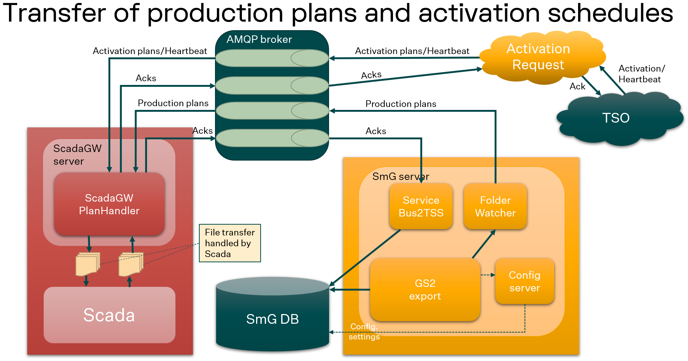
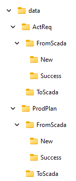
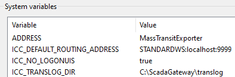
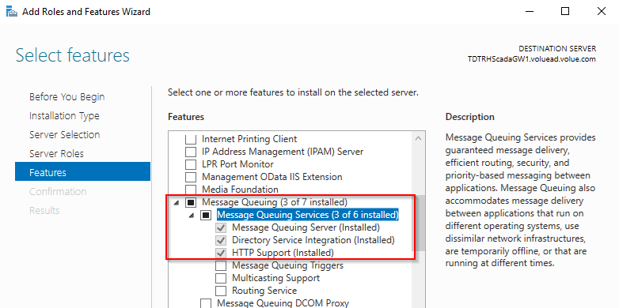
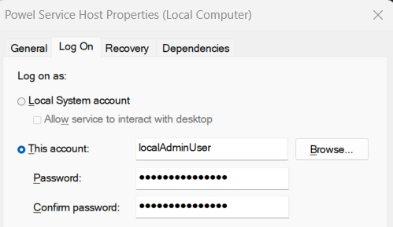
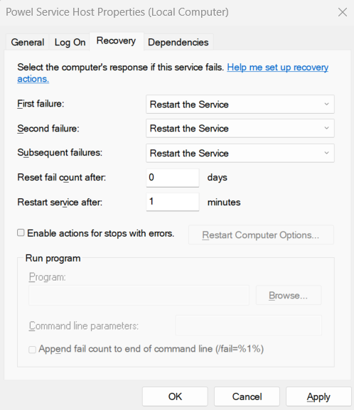
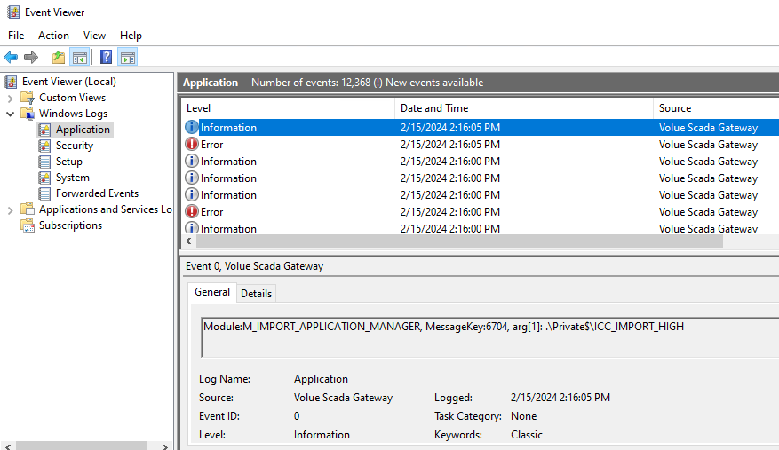

# Scada Gateway PlanHandler Installation and Configuration Guide

This installation guide is primarily intended for installation and configuration of the ScadaGateway PlanHandler that allows transfer of activation schedules, heartbeat and production plans from an AMQP message queue to a directory where the Scada system fetches the information as files, and transfer of acknowledgement information files provided by the Scada system in another directory back to another AMQP message queue.

The figure below show the intended setup for the Scada Gateway PlanHandler module.



- [Scada Gateway PlanHandler Installation and Configuration Guide](#scada-gateway-planhandler-installation-and-configuration-guide)
  - [Modules and functionality usage](#modules-and-functionality-usage)
  - [System requirements](#system-requirements)
  - [Pre-requisites](#pre-requisites)
    - [Access to the AMQP queues](#access-to-the-amqp-queues)
    - [File share to accessible from Scada](#file-share-to-accessible-from-scada)
    - [System parameters](#system-parameters)
    - [Microsoft Visual C++ Redistributable Version](#microsoft-visual-c-redistributable-version)
    - [Install MSMQ features](#install-msmq-features)
    - [Configure MSMQ for Scada Gateway](#configure-msmq-for-scada-gateway)
  - [Installing the Scada Gateway software](#installing-the-scada-gateway-software)
    - [Update configuration files](#update-configuration-files)
      - [Modify $INSTALLDIR\\bin\\ServiceHost.exe.config](#modify-installdirbinservicehostexeconfig)
      - [Check $INSTALLDIR\\config\\FileWatcherImportParametersFile.json](#check-installdirconfigfilewatcherimportparametersfilejson)
      - [Check $INSTALLDIR\\config\\MassTransitExportParametersFile.json](#check-installdirconfigmasstransitexportparametersfilejson)
      - [Check $INSTALLDIR\\config\\RabbitMqParameters.json](#check-installdirconfigrabbitmqparametersjson)
  - [Run Scada Gateway as a Windows service](#run-scada-gateway-as-a-windows-service)
  - [Updating Scada Gateway software](#updating-scada-gateway-software)
  - [Troubleshooting](#troubleshooting)
    - [Service fails to start](#service-fails-to-start)

## Modules and functionality usage

This chapter describes how the different modules and functionalities are used within the Scada Gateway to support given functionality:

1. **PlanHandler** - This module is used to transfer activation plans, production plans, and heartbeat messages from message brokers hosted locally or in SaaS. The messages are delivered from Activation Request and planning/optimisation solutions running locally or in SaaS, and the received messages are stored as files on the specified directories for the Scada system to pick up.
2. **AutoPilot** - This module is used together with the PlanHandler module to automatically transfer changes in activation and production plans as new set-points to the Scada system using either the ICCP or the OPC UA communication protocol.
3. **Reader** - This module is used to transfer changes in metering points from the Scada system, using either the ICCP or the OPC UA communication protocol, to backend systems using message queues.
4. **FileWatcher** - This module is used to observe new files (containing either acknowledge messages received from the Scada system, or defined messages from other systems) on specified directories and put the files on a related message queue.
5. **RabbitMQ** - This functionality is used to integrate with RabbitMQ brokers hosted locally or in SaaS.

## System requirements

Scada Gateway is recommended to run on Microsoft Windows Server 2022 with .NET Framework 4.8 installed.
Minimum server requirements are 2 CPU cores, 4 GB memory and 50 GB disk.

The following port is in use:

- Port 5671 for AMQPs traffic (or port 5672 for AMQP traffic) to the message broker.

## Pre-requisites

### Access to the AMQP queues

Scada Gateway will make connections with a message broker in order to receive and send messages from and to Activation Request and Volue Smart Energy software.

It is recommended to configure Scada Gateway and the message broker to use encrypted AMQPs communication on port 5671. It is also possible to use AMQP communication on port 5672. The connection requirements are defined by the message broker and can be ensured by using user and password, certificate and access keys.

RabbitMQ is the preferred message broker, but we also have experience using Azure Service Bus. Other message brokers supporting AMQP may also be possible to use.

The following queues are used in the sample configuration:

- ActReq2ScadaQueue - the queue where activation schedules and heartbeat messages from Activation Request are received from.
- ProdPlan2ScadaQueue - the queue where production plan messages from SmG are received from.
- ScadaAckQueue - the queue where acknowledgement messages from Scada are sent to.

### File share accessible from Scada

The Scada Gateway configuration is by default configured to use the following top level structure:


On the Scada Gateway server there must exist a file share where the files transfered by Scada Gateway is stored. These files types are:

- Activation plan and heartbeat messages from Activation Request to Scada,
- Acknowledge messages on activation plan and heartbeat messages from Scada to Activation Request,
- Production plan messages from SmG to Scada, and
- Acknowledge messages on production plan messages from Scada to SmG.

This file share is in the configuration sample files defined with `C:\ScadaGateway\data` as the top node and the following structure below:



### System parameters

The following system parameters needs to be defined:



### Microsoft Visual C++ Redistributable Version

It is necessary to install the latest C++ redist package from Microsoft: <https://aka.ms/vs/17/release/vc_redist.x86.exe>

### Install MSMQ features

On Windows Server 2022 this is done in this way:

- In Server Manager, click Features.
- In the right-hand pane under Features Summary, click Add Features.
- In the resulting window, expand Message Queuing.
- Expand Message Queuing Services.
- Click Message Queuing Server, Directory Services Integration, and HTTP Support.
- Click Next, then click Install



### Configure MSMQ for Scada Gateway

Run as administrator:

```cmd
C:\ScadaGateway\bin\CreateDataExchangeQueues.bat
```

## Installing the Scada Gateway software

The Scada Gateway software is delivered as a simple zip installer (f.ex. `ServiceHost_12.7.0.736.zip`) and is unzipped directly to the location where you want the installation to be (named `$INSTALLDIR` and is in the sample configurations set to `C:\ScadaGateway`). Binary files are stored in the `bin` subdirectory, while most config sample files are stored in the `config` subdirectory (only the `ServiceHost.exe.config.sample` file must be stored in the `bin` subdirectory).

### Update configuration files

After unzipping the software the first time, it it necessary to remove the `.PlanHandlerSample` part the following configuration file names:

- bin\ServiceHost.exe.config.PlanHandlerSample - Main configuration file for the Scada Gateway
- config\FileWatcherImportParametersFile.json.PlanHandlerSample - Configuration of the FileWatcherImport functionality.
- config\MassTransitFileWatcherExportParameters.json.PlanHandlerSample - Configuration of the MassTransitFileWatcherExport functionality.

#### Modify $INSTALLDIR\bin\ServiceHost.exe.config

- The `log4net` section defines where logging from the Scada Gateway is located and how it is configured. This is the default setup:
  
  ```xml
  <log4net>
    <appender name="RollingFileAppender" type="log4net.Appender.RollingFileAppender">
      <file type="log4net.Util.PatternString" value="C:\ScadaGateway\log\Powel.Icc.ServiceHost.log"/> <!-- where the log is created -->
      <appendToFile value="true"/>
      <rollingStyle value="Date"/>
      <datePattern value="_yyyyMMdd"/>
      <maxSizeRollBackups value="14"/> <!-- number of log files kept in the directory -->
      <threshold value="DEBUG"/> <!-- the file log level, legal values: ALL, DEBUG, INFO, WARN, ERROR, FATAL, OFF -->
      <layout type="log4net.Layout.PatternLayout">
        <conversionPattern value="%d [%t]%-5p %c.%M() - %m%n"/>
      </layout>
      <preserveLogFileNameExtension value="true" />
    </appender>
    <root>
      <level value="ERROR"/> <!-- default log level, legal values: ALL, DEBUG, INFO, WARN, ERROR, FATAL, OFF -->
      <!-- <level value="ALL" /> -->
      <appender-ref ref="RollingFileAppender"/>
      <!-- appender-ref ref="UdpAppender"/-->
    </root>
  </log4net>
  ```

- The `serviceIterationClasses` section defines which functionality that is loaded as part of Scada Gateway and shall look like this for the PlanHandler functionality:
  
  ```xml
  <serviceIterationClasses>
    <add value="Powel.Icc.Messaging.DataExchangeManager.ImportApplicationManagerService.ImportApplicationManagerService, ImportApplicationManagerService"/>
    <add value="Powel.Icc.Messaging.FileWatcherDataExchangeManager.FileWatcherDataExchangeManagerService, FileWatcherDataExchangeManagerService"/>
    <!-- <add value="Powel.Icc.Messaging.MassTransitDataExchangeManager.MassTransitDataExchangeManagerService, MassTransitDataExchangeManagerService" /> --> <!-- Accessing RabbitMQ on-premise -->
    <add value="Powel.Icc.Messaging.RabbitMqDataExchangeManagerService.RabbitMqDataExchangeManagerService, RabbitMqDataExchangeManagerService" /> <!-- Accessing RabbitMQ in SaaS -->
  </serviceIterationClasses>
  ```

  NB! Remember to activate also the `MassTransitDataExchangeManagerService` class if there is a need to access RabbitMQ on-premise.

- The `appSettings` section define parameters for the different functionalities. For the PlanHandler functionality, these parameters are in use:
  
  ```xml
  <appSettings>
    <add key="ServiceName" value="Volue Scada Gateway"/> <!-- name of the service in Windows Event viewer -->
    <add key="RunWithoutDatabase" value="True"/> 
    <!-- Common to DataExchangeManagerService modules -->
    <add key="TimeoutInSecondsBeforeTerminatingModules" value="70"/>
    <!-- MassTransitDataExchangeManager -->
    <add key="MassTransitDataExchangeManager.Enabled" value="false" /> <!-- true if accessing RabbitMQ on-premise -->
    <add key="MassTransitDataExchangeManager.ExportParametersFilePath" value="C:\ScadaGateway\config"/>
    <add key="MassTransitDataExchangeManager.RabbitMqUri" value="amqp://server:5672/companyVH"/> <!-- must be updated to customer installation -->
    <add key="MassTransitDataExchangeManager.RabbitMqUsername" value="user"/> <!-- must be updated to customer installation -->
    <add key="MassTransitDataExchangeManager.RabbitMqPassword" value="password"/> <!-- must be updated to customer installation -->
    <add key="MassTransitDataExchangeManager.RabbitMqUseTLS" value="false"/> <!-- set to false if running with amqp -->
    <add key="MassTransitDataExchangeManager.RabbitMqSslProtocol" value="Tls12"/>
    <add key="MassTransitDataExchangeManager.RabbitMqClientCertificateFilename" value="C:\Certificates\ClientCertificateAndKey.pfx"/> <!-- must be updated to customer installation -->
    <add key="MassTransitDataExchangeManager.RabbitMqCertificatePassphrase" value="password"/> <!-- must be updated to customer installation -->
    <add key="MassTransitDataExchangeManager.RabbitMqCertificateServername" value="*"/>
    <!-- RabbitMqConnectionManager -->
    <add key="RabbitMqConnectionManager.ImportParametersFilePath" value="C:\ScadaGateway\config" />
    <add key="RabbitMqConnectionManager.ImportParametersFile" value="RabbitMqParameters.json" />
    <add key="RabbitMqConnectionManager.ImportParametersFilter" value="RabbitMqParameters.json" />
    <!-- RabbitMqDataExchangeManager -->
    <add key="RabbitMqDataExchangeManager.Enabled" value="true" /> <!-- true if accessing RabbitMQ in SaaS -->
    <add key="RabbitMqDataExchangeManager.ConnectionName" value="AncitraStaging" />
    <!-- FileWatcherDataExchangeManager -->
    <add key="FileWatcherDataExchangeManager.Enabled" value="true"/>
    <add key="FileWatcherDataExchangeManager.ImportParametersFilePath" value="C:\ScadaGateway\config"/>
    <!-- ImportApplicationManagerLogic -->
    <add key="RabbitMqRunner.ConnectionName" value="AncitraStaging" />
    <add key="RabbitMqUri" value="amqp://localhost:5672/CompanyVH" /> <!-- must be updated to customer installation -->
    <add key="RabbitMqUsername" value="user" /> <!-- must be updated to customer installation -->
    <add key="RabbitMqPassword" value="password" /> <!-- must be updated to customer installation -->
    <add key="RabbitMqUseTLS" value="false" /> <!-- must be updated to customer installation -->
    <add key="RabbitMqSslProtocol" value="Tls12" />
    <add key="RabbitMqClientCertificateFilename" value="C:\Certificates\ClientCertificateAndKey.pfx" /> <!-- must be updated to customer installation -->
    <add key="RabbitMqCertificatePassphrase" value="[$SECRET:RabbitMqCertificatePassphrase:$]" /> <!-- must be updated to customer installation -->
    <add key="RabbitMqCertificateServername" value="*" />
  </appSettings>
  ```

#### Check $INSTALLDIR\config\FileWatcherImportParametersFile.json

This file describe how to handle acknowledgement files from Scada. The sample version looks like this:

```json
{
  "FileWatchers": [
    { // Acknowledgement from Scada to Activation Request
      "Directory": "C:/ScadaGateway/data/ActReq/FromScada/New", // must match wanted directory structure
      "FileNameTemplate": "Acknowledgement_*.json", // must match file name created by Scada
      "Description": "",
      "Priority": "HIGH",
      "Protocol": "RABBITMQ", // Legal values: RABBITMQ, MASSTRANSIT. Defines which interface to use accessing RabbitMQ.
      "Metadata": [
        {
          "Key": "ExternalText",
          "Value": "Volue.MassTransit.Contracts.ExternalMessage.SCADA.Acknowledgement:ScadaAckQueue" // QueueName is optionsal, must match AMQP configuration
        }
      ],
      "OnSuccess": "move {%fp} C:/ScadaGateway/data/ActReq/FromScada/Success" // must match wanted directory structure
    }
  ]
}
```

#### Check $INSTALLDIR\config\MassTransitExportParametersFile.json

This file describe how to handle messages received from Activation Request and SmG using MassTransit accessing RabbitMQ on-premise. The sample version looks like this:

```json
{
  "MessageTypes": [
    { // Activations/heartbeats from Activation Request in format V1 to Scada
      "MessageType": "Volue.MassTransit.Contracts.TimeSeriesMessage.ActivationRequestModels.V1.TimeSeriesMessage",
      "QueueName": "TestQueue1", // must be updated to customer installation
      "Priority": "HIGH",
      "Protocol": "SAVEFILE",
      "Metadata": [
        {
          "Key": "ExternalText",
          "Value": "C:/ScadaGateway/data/ActReq/ToScada/AcReq_{%t}.json"
        }
      ]
    },
    { // Activations/heartbeats from Activation Request in format V2 to Scada
      "MessageType": "Volue.MassTransit.Contracts.TimeSeriesMessage.ActivationRequestModels.V2.TimeSeriesMessage",
      "QueueName": "TestQueue2", // must be updated to customer installation
      "Priority": "NORMAL",
      "Protocol": "SAVEFILE",
      "Metadata": [
        {
          "Key": "ExternalText",
          "Value": "C:/ScadaGateway/data/ActReq/ToScada/AcReq_{%t}.json"
        }
      ]
    },
    { // Production plans from SmG in GS2 format to Scada
      "MessageType": "Powel.Icc.Messaging.DataExchangeManager.DataExchangeApi.DataExchangeExportMessage",
      "QueueName": "TestQueue3", // must be updated to customer installation
      "Priority": "NORMAL",
      "Protocol": "SAVEFILE",
      "Metadata": [
        {
          "Key": "ExternalText",
          "Value": "C:/ScadaGateway/data/ProdPlan/ProdPlan_{%t}.gs2"
        }
      ]
    }
  ]
}
```

#### Check $INSTALLDIR\config\RabbitMqParameters.json

This file describe how to handle messages received from Activation Request and SmG without using MassTransit. The sample version looks like this:

```json
{
  "Connections":
  [
    {
      "Name": "AncitraStaging",
      "Username": "ancitra-staging--CustomerServiceHost",
      "Password": "Secret",
      "Hostname": "rabbitmq.staging.ancitra.volue.com",
      "VirtualHost": "AncitraStagingVH",
      "Port": 5673,
      "NetworkRecoveryInterval": "",
      "ContinuationTimeout": "",
      "Ssl": {
        "IsEnabled": true,
        "TlsVersion": "Tls12",
        "Verify": "Fdqn",
        "ServerName": "staging.ancitra.volue.com",
        "Certificate": {
          "IsEnabled": false,
          "ClientCertificatePath": "",
          "ClientCertificatePassphrase": ""
        }
      },
      "MessageTypes": 
      [
        { // Activations/heartbeats from Activation Request in format V1 to Scada
          "Enable": true,
          "Description": "TimeSeriesMessage version 1 sent as activation",
          "MessageType": "Volue.RabbitMq.Contracts.TimeSeriesContracts.ActivationRequestModels.V1.TimeSeriesMessage",
          "QueueName": "TimeSeriesExport",
          "Priority": "HIGH",
          "Protocol": "SAVEFILE",
          "Metadata": [
            {
              "Key": "ExternalText",
              "Value": "C:/ScadaGateway/data/ActReq/ToScada/Activation1{%fmt}_{%mt}_{%t}.json"
            }
          ]
        },
        { // Activations/heartbeats from Activation Request in format V2 to Scada
          "Enable": false,
          "Description": "TimeSeriesMessage version 2 sent as activation",
          "MessageType": "Volue.RabbitMq.Contracts.TimeSeriesContracts.ActivationRequestModels.V2.TimeSeriesMessage",
          "QueueName": "TestQueue2",
          "Priority": "NORMAL",
          "Protocol": "SAVEFILE",
          "Metadata": [
            {
              "Key": "ExternalText",
              "Value": "C:/ScadaGateway/data/ActReq/ToScada/Activation2{%fmt}_{%mt}_{%t}.json"
            }
          ]
        },
        { // Production plans from SmG in GS2 format to Scada
          "Enable": true,
          "Description": "Production plans sent as GS2 message",
          "MessageType": "Powel.Icc.Messaging.DataExchangeManager.DataExchangeApi.DataExchangeExportMessage",
          "QueueName": "ProdPlan2Scada",
          "Priority": "NORMAL",
          "Protocol": "SAVEFILE",
          "Metadata": [
            {
              "Key": "ExternalText",
              "Value": "C:/ScadaGateway/data/ProdPlan/ToScada/ProdPlan{%fmt}_{%mt}_{%t}.gs2"
            }
          ]
        },
        {
          "Enable": true,
          "Description": "Scada readings sent as GS2 message",
          "MessageType": "Powel.Icc.Messaging.DataExchangeManager.DataExchangeApi.DataExchangeExportMessage",
          "QueueName": "Scada2SmG",
          "Priority": null,
          "Protocol": null,
          "Metadata": [
          ]
        },
        {
          "Enable": true,
          "Description": "Acknowledgements on Activations and heartbeats from ActReq",
          "MessageType": "Volue.MassTransit.Contracts.ExternalMessage.SCADA.Acknowledgement",
          "QueueName": "ScadaOutput",
          "Priority": null,
          "Protocol": null,
          "Metadata": [
          ]
        }
      ]
    }
  ]
}
```

## Run Scada Gateway as a Windows service

Initiate the service using the Powershell command `New-Service` and run it as `Administrator`. This operation will register the service in Windows EventLog.

```powershell
PS C:\> New-Service -Name "Powel Service Host" -BinaryPathName c:\ScadaGateway\bin\ServiceHost.exe
```

From the `Services`interface show the properties of the `Powel Service Host` service and:

1. Change logon to be a local admin user:

   
2. Change how failures in the service are recovered:

   

After the service is installed and started, you will see log messages in the Windows Event Viewer:



Check out any error or warning messages in order to identify errors in the configuration.

## Updating Scada Gateway software

The normal operation when updating the software is to:

1. Stop the Scada Gateway service (named "Powel Service Host")
2. Copy the files in the new distribution into the existing directory of Scada Gateway ($INSTALLDIR)
3. Start the Scada Gateway service again.

## Troubleshooting

### Service fails to start

- Look for errors in the Windows `Event Viewer` for the `Volue Scada Gateway` application.
- Try to fix it by:
  - Fixing configuration.
    - If the error points to some illegal format of the configuration, it is practical to use an editor that are able to understand JSON and XML formats, f.ex. Notepad++.
  - Fix other problems.
