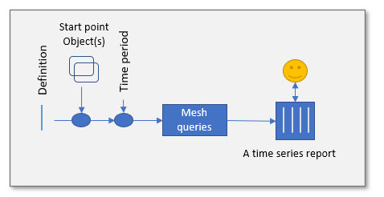
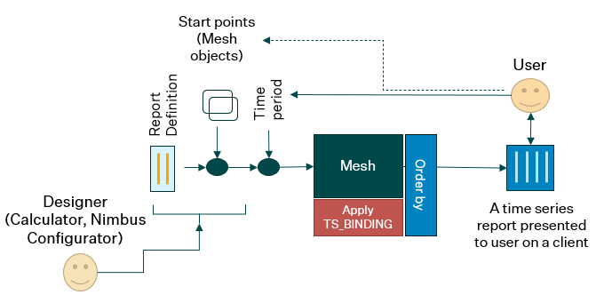
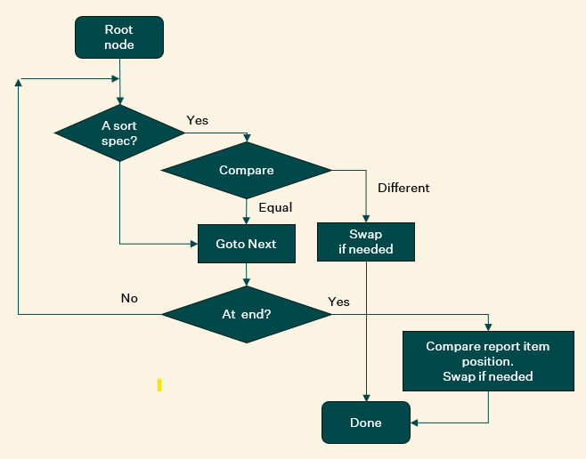
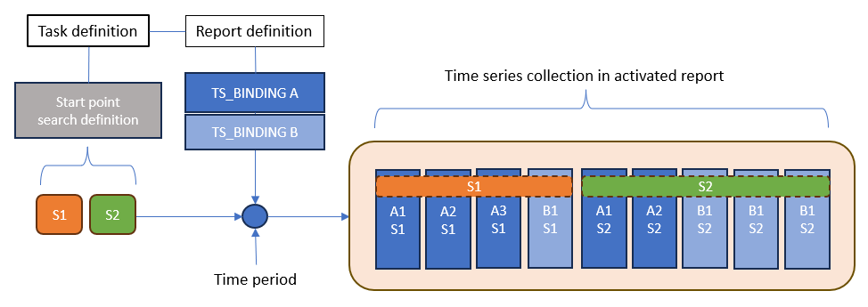
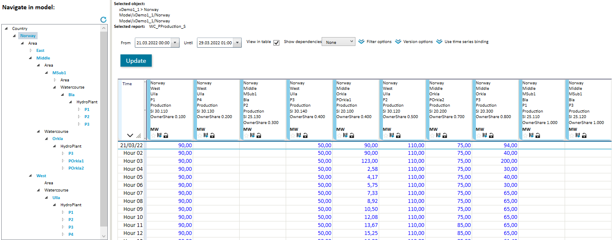
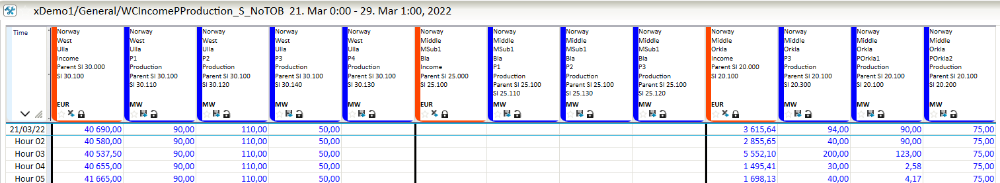
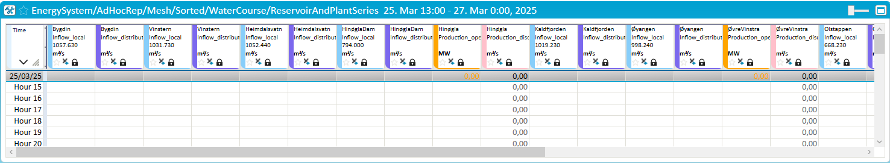

# Layout of template time series reports



## Table of contents

- [Layout of template time series reports](#layout-of-template-time-series-reports)
  - [Table of contents](#table-of-contents)
  - [Shortcuts](#shortcuts)
  - [General introduction](#general-introduction)
    - [Mesh provide a generic report definition](#mesh-provide-a-generic-report-definition)
    - [Which time series becomes part of a report?](#which-time-series-becomes-part-of-a-report)
    - [How to control the layout of the generated report?](#how-to-control-the-layout-of-the-generated-report)
    - [Template report activation](#template-report-activation)
    - [Different time series data sources](#different-time-series-data-sources)
  - [Time series report layout](#time-series-report-layout)
    - [The order by features supported by Mesh template reports](#the-order-by-features-supported-by-mesh-template-reports)
      - [Evaluating the order by criterion](#evaluating-the-order-by-criterion)
      - [Mesh object path](#mesh-object-path)
      - [The order-by specification format](#the-order-by-specification-format)
    - [Multiple scopes of order by definition](#multiple-scopes-of-order-by-definition)
      - [Local](#local)
      - [Start points](#start-points)
      - [Global](#global)
      - [Some examples of start point definitions](#some-examples-of-start-point-definitions)
    - [Best practice](#best-practice)
      - [The implications of report activation process](#the-implications-of-report-activation-process)
      - [Simple reports](#simple-reports)
      - [Cluster reports](#cluster-reports)
      - [Complex reports](#complex-reports)
      - [Some general remarks](#some-general-remarks)
    - [Maintain a global sorting definition](#maintain-a-global-sorting-definition)
  - [Some examples using order by in template reports](#some-examples-using-order-by-in-template-reports)
    - [Local scope order by](#local-scope-order-by)
    - [Task setup using start point ordering](#task-setup-using-start-point-ordering)
    - [Global sorting using topology](#global-sorting-using-topology)

<div style="page-break-after: always;"></div>

## Shortcuts

If you know the basics and just want to check some details, here are some fast track shortcuts:

- I want to sort the results from a single `TS_BINDING` query.  
  
  Use the `TEMPLATE_ORDER_BY` column attribute. Here is the [syntax](#the-order-by-specification-format). This approach has a *Local* scope.
- I want to sort the start points before activating a report.  
  
  Extend the sort definition by appending `ORDER_BY:<sort definition>` to the *start point* search definition as described [here](#start-points).  
  PS! The `ORDER_BY:` keyword must be *immediately* after the search definition (no comma, no space, nothing).
- I want to apply a global ordering on the complete set of time series found in a report.  
  
  Then you should add a section to the start point definition starting with the keyword `;ORDER_BY_CONFIG:<sort definition>`, see more details [here](#global).  
  
  As this is a **standalone** section it must be separated by the start point search definitions using the *semicolon* separator. It is the same sort definition format as used above. Be aware that a global sort definition will discard any other order by setup provided (*Local* or *start point*)
  - The value next to this keyword may be an in-place definition or it may be a reference to a Mesh resource "*file*", see [here](#maintain-a-global-sorting-definition) for how to create/maintain such definitions.

## General introduction

[About Mesh model definition and models.](../mesh/glossary/MeshGlossary.md)

This document focus on multiple aspects of time series reports where Mesh model objects are the data providers. 
The report definition uses this information to find time series to include in an activated report as described later in this document.
A report definition is currently stored in Oracle database (table RC_SET ++) and is edited
by the SmP Calculator tool. The definition format is basically the same as for SmP time series reports
that was introduced in the beginning of 90's. A report definition consist of the following sections:

- General report attribute-value pairs
- Column definitions with attribute-value pairs (sometimes referred to as report items)

On each column definition there must be a reference to something that can provide time series data, a time series source.  
In general, the following source types are available:

- Time series name or time series key (attribute DBI_KEY)
- Local time series expression (a block wrapped with #SLV_START ... ##SLV_END)
- Time series query (attribute TS_BINDING)

In Mesh template reports it is only the **TS_BINDING** approach that is supported.  

### Mesh provide a generic report definition

The Mesh models are based on a domain description called Mesh model *definition*. It defines object types and
value attributes on those, as well as attributes that describe how object types relate to other object types. A Mesh model consist
of instances of available types and connections between them. Time series attribute definitions attached to an object type regulate which
time series that are available on instances of that type. Such queries are expressed as the value of the TS_BINDING attribute on 
column definitions.

Mesh template report definitions may also refer to other attributes to be shown in for example column header or to be used as criterion for sort operations.

A report column definition in Mesh context 
*may* expand to multiple time series, whereas the SmP version provide a 1:1 ratio between column definition and
time series to be included in the activated report. Whether you to use the 1:1 approach or more dynamic 1:n approach to get the report layout as you want it in Mesh
also depends on the power and flexibility of the *order by* feature. How to utilize *order by* to achieve a desired layout is discussed later in this document.

Because the Mesh report can be applied at different start points it will increase efficiency/maintainability even when you create reports where each TS_BINDING maps to one time series.

### Which time series becomes part of a report?

The column definition attribute named `TS_BINDING` is used to lookup time series to be part of an activated report.
Some of the collected time series may not immediately appear in the visible view onto the report due to page configurations and hierarchical grouping.
There are also options to dynamically include more time series by retrieving series that are used to provide initial series trough calculations.
Adding previous versions of initial series is another option to dynamically extend the report.

The `TS_BINDING` attribute **value** in Mesh context is associated
with Mesh model instances that holds time series. To describe where to look for time series we use the Mesh model *definition*.
The TS_BINDING value is a query and not a fixed reference, therefore a template report will adapt to the current state
of the Mesh model.

A query against a given Mesh model may result in zero, one or *many* time series. This dynamic behavior also have
impact on how other report attributes are defined, for instance by using macros that makes the
value of attributes adapt to the concrete time series found. `$OBJ_NAME` is an example  of such a macro and will expand to the
name of the Mesh model object that owns the concrete time series attribute.

### How to control the layout of the generated report?

The template based approach provided by Mesh is based on a high level report definition that expands to real 
contents by use of queries into the Mesh model. That means the *same* report definition can be applied to
different areas of the Mesh model and thereby provide different contents.

This expandable and reusable report definition gives a lot of advantages but also less direct control over the layout, that is
the order of the appearance typically visible in a table view. To compensate for this, the Mesh report definition and report activation
provide different **order by** alternatives.

### Template report activation

A template report definition is based on a Mesh model *definition* but needs additional context to be activated:

- A Mesh model where there are instances of the object types found in the Mesh model *definition*
- A start-point definition
- A time period that defines which part of each time series that are read/calculated and visualized in the client that activated the report.

The starting point definition can be given in two ways:

- By user in a Nimbus AdHoc report task
  - View and select a Mesh object or multiple Mesh objects in a tree viewer
  - View a list of available Mesh template reports that are relevant for selected Mesh object.
  - A report is activated when both Mesh start-point object(s) and report are selected
  
- By designer of a Nimbus Mesh task
  - This is done from Nimbus Configurator, allowing the designer to associate specific reports and start-points to
    be activated/viewed on certain areas of the Nimbus screen.

Be aware that some Mesh template report definitions are designed to work with instances of a *specific object type* as start point.  
If the report is not associated with a specific object type, then the report can be combined with any Mesh "node" object.
But, it will not necessarily resolve to any contents because the TS_BINDING queries may not find any time series when applied.



The figure above summarize the report activation process and the players involved. Some comments:

- To the left there is a "designer" that uses some tools to provide report definitions accessible for client user to the right
  - The Calculator is currently used to make and maintain report definitions
  - The Nimbus Configurator is currently used to create Nimbus tasks where time series reports are a crucial part
- The report definition contains one of more report column definitions, each having a TS_BINDING attribute that target time series attributes in the Mesh model
  - At this stage the designer makes a choice whether this is a report definition that assume the start point is a specific Mesh object type or not
  - This choice impact on how the TS_BINDING specifications are formulated.
- On Nimbus task configuration, the designer must also define one or more start points. This can be as generic as the Mesh model scope or it can be 
  one or more specific Mesh objects explicitly identified or by a search expression. 
- The user have the freedom to select starting point(s) and time period from where the time series data is requested when in Ad Hoc report context.

### Different time series data sources

Where to go to find time series data is defined by the TS_BINDING attribute in a report definition.
The value of a TS_BINDING attribute is a search specification that based on a starting point find time series attributes in a Mesh model.

This dynamic expansion may end up at time series attributes having different scope:

- it is attached to a physical time series, i.e. a time series stored in the database
- there is a local calculation expression attached to this Mesh model object (instance)
- there is a calculation expression defined for this attribute definition, i.e. defined as part of Mesh model definition
- there is none of the above data sources, but the `Session series` feature is activated. In this case there will be created a 
  a temporary time series in memory (breakpoint resolution) with session scope. Session scope means the time series will not be visible 
  outside current Mesh session

The list above also describe the internal priority. For example:

- the values are retrieved from the physical tie series even if there are a 
specific or general calculation expression available 
- a local expression (at instance) will be used in stead of the general expression

## Time series report layout

In previous sections we have briefly described the process of activating a report definition at one or more start-points in a Mesh model.
That process is about collecting time series to be part of the activated report. In this section we will discuss how this collection of time series
is ordered and "decorated" when presented out of the box.

There are at least two different layout specifications:

- The order of appearance in a tabular view layout
  - Originally, before Mesh, this was controlled by the order of column definitions in the report definition
  - The dynamic behavior of Mesh template reports makes *order by* features important
- Legends, headers, colors, pages, groups ++
  - A lot of these attributes have to use macros that makes it possible to adapt to the properties of current object
    - Without macros all the attributes that originates from the same report column definition would be equal

### The order by features supported by Mesh template reports

There are three levels where you can configure this:

- Local
  - Applied to results from a single TS_BINDING request
- Start point
  - Control the order of start points applied to build the report instance
- Global
  - Apply a full sort operation when **all** series are collected

The *Global* approach overrule the other two definitions.
*Start point* ordering and and *Local* ordering can work together.

#### Evaluating the order by criterion

The sorting algorithm that is used in Mesh evaluates a potential criterion value for each hierarchical level of the
object path, starting from top level which is the model components. (A component is a Mesh object owned directly by the Mesh model). If the criterion value is equal for the compared objects, then move on to next hierarchical
level and do the same type of operation.

The basic algorithm can be illustrated like this:



This flow shows the main process. There are some special handling when the hierarchical paths have different depth and the two objects to compare have different type.

If the objects to compare have different type this logic is applied:

- If the sort definitions involved are compatible - proceed as normal. Example: Both types have `Topology` as definition
- If not compatible, try to find equal types further down the object path

#### Mesh object path

As we understand from the flow chart above, each object in Mesh have a unique path.

See [description of Mesh path.](../mesh/glossary/MeshGlossary.md#object-path)

In a template report definition the contents refer to Mesh model objects, more precise
to time series attributes or time series collection attributes.

Each part of the object path below the model name may have an **order-by** specification attached.
Such specifications are linked to objects through their object type.

The **order-by** specification provide details on how to find the criterion value associated with a concrete instance.  

#### The order-by specification format

The following format is used to configure how the sorting should be done:

- `TypeName=Sortdef[,TypeName=Sortdef ...]`
  - Sortdef is: `AValidSearchDef[:D][;AValidSearchDef[:D] ...]`
    - There might be several search definitions in prioritized order. First definition that find a valid criterion value is used.
    - A trailing `:D` means descending sort operation

To be used in criterion value comparison the search specification must end up at an attribute having one of these types:

- Integer - a fixed number
- Double - a decimal number
- String - a set of characters
- Node - in this case it is internally mapped to a String that contains the name of the node

In addition, it is possible to use the following predefined keywords as an alternative to providing a search definition.
These are available:

- `Name` - use the name of the object as criterion value
- `Index` - use the position of report column definition from where this object originates (which TS_BINDING is coming from)
- `Topology`- applicable for objects part of `EnergySystem` watercourse and associated case structure. The system dynamically attach increasing numbers from top to bottom in a watercourse and uses that as criterion value. 
- `Ignore` - do not apply any comparison 

In addition to a valid `TypeName` it is possible to use a generic type name `Default` which then hold a definition for all types are not explicitly mentioned in the order by definition.

Examples:

- `Default=Ignore,Reservoir=.HRWL:D`
  - Sort objects by the descending `HRWL` attribute value (Highest Regulated Water Level) found on instances of type `Reservoir`
  - For all other types - do no comparison
- `Default=Ignore,WaterCourse=Name,cWaterCourse=Name,Reservoir=.HRWL,cReservoir=to_Reservoir.HRWL`
  - Same as a above, but group according to watercourse name and use ascending order
  - Included specification for case objects
    - For cReservoir objects - go to linked asset object (`to_Reservoir`) and use `HRWL`

*PS! For the `TEMPLATE_ORDER_BY` definition it was possible to have a simplified format like `.HRWL` or even `HRWL` which the sort algorithm would take
as a definition implicitly connected to the type owning the time series attribute.* **This is no longer supported.**

### Multiple scopes of order by definition

As mentioned earlier there are thee levels where an order by definition is applicable.

#### Local

At this level we use the report column definition attribute `TEMPLATE_ORDER_BY`.

The definition is used to sort the time series attributes found from applying the search
operation defined by the `TS_BINDING`. The sorted list is added to collection of time series for activated report.

Example:
`TS_BINDING`         `*[.Type=Reservoir].ReservoirLevel_operative`
`TEMPLATE_ORDER_BY`  `Default=Ignore,Reservoir=.HRWL:D`

#### Start points

As seen in [MainComponents](#Main) an activated report that is visible to the user always need one or more starting points.

The activation process can be described by the following pseudo code:

```
for each startPoint in startPoints
   for each columnDefinition in columnDefinitions
       tslist = apply search based on TS_BINDING from startPoint
       if there is an order-by definition then apply sort operation to tslist
       add tslist (sorted or not sorted) to activated report contents
```

The scope now is related to sort the list of start-points.

Example of a start point definition:  
`*[.Type=WaterCourse]ORDER_BY:Area=Name,WaterCourse=.SortIndex`

This definition means:

- Find start points by looking for watercourse objects in the current Mesh model. Current model is configured at task level.
- Sort them according to an attribute called `SortIndex` assumed to be available on instances of the WaterCourse type and group them according to area name.

There might be several start point search sections separated with semicolon `;`. Observe that the eventual order by section (starting with `ORDER_BY:`) is defined
**immediately** after the search definition. This is because it *belongs* to that specific search expression. The next search section will have its own order by definition.

Example of multiple start point definitions:  
`*[.Type=WaterCourse]ORDER_BY:Area=Name,WaterCourse=.SortIndex;*[.Type=SomeType]ORDER_BY:Default=Ignore,HydroPlant=.SortIndex`

As described above, the parsing of the start-point definition is rather strict.

#### Global

If there is a global scope order by definition in place, then it will override the definitions described above (*Local* and *Start point*).
In this mode **all** time series that are collected to be part of the activated report are sorted according to the global definition.

Global definitions are stored in the Mesh resources section. See details on how to [create/edit/delete](#maintain-a-global-sorting-definition) such definitions.

To associate a report activation with a global sorting definition there are currently three options:
- Add `ORDER_BY_CONFIG:<path to text file resource>` to the end of start point definition. If there is a search definition in place you have to add a `;` in front of this section. See examples below.
- Add a default order by definition to a predefined location in the Mesh resources:
  - `Resource/ConfigFiles/OrderBy/Default.sort`
- Add order by definition as described above immediately after the `ORDER_BY_CONFIG:` keyword

The format of the global sort specification is the same as already described. When resource "files" are used it normally contains multiple lines, one line per type. Like this:

File *MySort.sort*
```
Default=Ignore
cReservoir=to_Reservoir.HRWL:D
Reservoir=.HRWL:D
```

These two definitions are equivalent:

- `start-point definiton;ORDER_BY_CONFIG:Resource/ConfigFiles/OrderBy/MySort.sort`
- `start-point definiton;ORDER_BY_CONFIG:Default=Ignore,cReservoir=to_Reservoir.HRWL:D,Reservoir=.HRWL:D`

To utilize the special definition `Default.sort` may be convenient but due the its *global* scope it can have side undesired effects.
Therefore, be aware that it might be used in places you did not want it to. To avoid such interference from a "hidden" default you can add a 
global order by definition that explicitly say: *do not apply a global sort operation*. It is done by referring to a resource called
`None.sort`. The system just look at the name and it does not try to look it up, hence it does not need to exist. See example below.

#### Some examples of start point definitions

Examples:
- `*[.Type=HydroPlant];ORDER_BY_CONFIG:Resource/ConfigFiles/OrderBy/MySort.sort`  
    Apply global sort definitions found on `MySort.sort` file. Those types not explicitly mentioned in that definition will use ascending Name as criteria. 
- `*[.Type=HydroPlant]ORDER_BY:HydroPlant=.OwnerShare;ORDER_BY_CONFIG:None.sort`  
    Order starting point list according to ascending value on OwnerShare attribute on HydroPlant. The reference to `None.sort` will ensure that a potential default global sort will not overrule the ORDER_BY settings specified here
- `*[.Type=HydroPlant]ORDER_BY:HydroPlant=.OwnerShare:D,WaterCourse=.SomeAttribute`  
    Sort starting point list according to descending value of OwnerShare attribute. WaterCourse items are sorted according to ascending value of SomeAttribute. PS! These definitions will be ignored if there is a file `Resource/ConfigFiles/OrderBy/Default.sort` installed

### Best practice

It's hard to say what's the preferred method to setup a proper *order-by* definition. It depends on the type of report at hand. 
In this section some hints and considerations are discussed.

#### The implications of report activation process

When you choose an *order-by* method it is important to understand the report activation process and therefore some details about that are described here.



The illustration above shows the following:

- Context
  - There is a task definition 
    - it refers to a report definition
    - it refers to a start point definition
  - The search for start point found two Mesh objects `S1` and `S2`
  - The report contains two column definitions, query `A` and `B`
- Apply report definition for start point `S1`
  - When query `A` was applied to start point `S1` it found time series attribute `A1`, `A2` and `A3`
    - Add these three time series to the report collection
  - When query `B` was applied to start point `S1` it found time series attribute `B1`
    - Add this time series to the report collection
- Apply report definition for start point `S2`
  - When query `A` was applied to start point `S2` it found time series attribute `A1` and `A2`
    - Add these time series to the report collection
  - When query `B` was applied to start point `S2` it found time series attribute `B1`, `B2` and `B3`
    - Add these time series to the report collection

If there are `TEMPLATE_ORDER_BY` definitions on column definitions, the result from query will be sorted according to this before adding it to collection.

If there are `ORDER_BY:` at end of start point search definitions, then the result from start point search operation will be sorted according to this.

#### Simple reports

A simple report is for instance a report based on a definition having *one* column definition.
In such cases use of `TEMPLATE_ORDER_BY` will do.

#### Cluster reports

In this group we have report definitions that refer to several time series relative to a dedicated Mesh object type.
Most often it will be bound to that type and normally have several report column definitions (multiple TS_BINDING definitions). It may reach out to several time series attributes on that type as well as other time series attributes found relative  to this type (up/down or through links).

In such cases use of `ORDER_BY` on start point definitions most likely are the best choice. It can also be combined with `TEMPLATE_ORDER_BY` on queries that may return multiple time series.

#### Complex reports

It's hard to pinpoint exactly what a complex report definition is. One criterion may be that it refers to time series bound to several hierarchical levels. Another is that it contains many column definitions that address time series on different object types.

The use of global sort definition may be considered in these cases.

#### Some general remarks

To summarize:
- Which *order-by* method to use depends on the characteristics of the report definition
- Sort operations on Mesh objects with different depth may be challenging
- Sort definition using keyword `Topology` is a specialized method that can be used on types in the *Watercourse* family as defined in Volue's definition `EnergySystem`. It sort objects from top to bottom, i.e. from highest `Reservoir` or `Creek` and downwards. 
  - From Mesh version 2.18 (check release notes) the topology method can also be applied to start points.
- If sort definition cannot decide between two objects
  - it will try to use default method
  - if one or both objects end up at time series object it will use the `Index` method to decide

### Maintain a global sorting definition

A sort definition is given a name and placed into the Mesh resource section. This usage can be compared to a file stored in a hierarchical file system. The tool `Powel.Mesh.CommandlineRequests.exe` can be used to import, export and list available sorting definitions. The commands to do that are (`clr` is used as an alias):

- Import: 
    ```
    clr -i Default.sort -w ImportTextFile -w Resource/ConfigFiles/OrderBy/Default.sort -S
    ```

- Export:
    ```
    clr -o Default.sort -w ExportTextFile -w Resource/ConfigFiles/OrderBy/Default.sort
    clr -w ExportTextFile -w Resource/ConfigFiles/OrderBy/Default.sort
    clr -w ExportTextFile -w Resource/ConfigFiles/OrderBy/Default.sort -w delete
    ```
    First is export to file, second to standard output (terminal) and last is export to file and delete `Resource` definition.

- List available items:
    ```
    clr -w ListTextFiles -w Resource/ConfigFiles/OrderBy
    clr -w ListTextFiles -w Resource/ConfigFiles/OrderBy -w sort
    ```
    First list all types, second list all with suffix *sort*

PS! At some point there may be a more user-friendly tool to maintain such definitions.

## Some examples using order by in template reports

### Local scope order by

This is the report definition:

```
MESH_SESSION_TS "ON"
OBJECT_TYPE 21
MESH_GUID "85e6f7a9-c82d-452f-a32c-9ca9399ab4f6"
DBI_COLUMN
	TS_BINDING "*[.Type=HydroPlant].Production"
	COLOR_HEAD "Sky Blue"
	NAME "PlantProduction"
	GRAPHTEXT "$FullObjName $AttrName"
	TEXT "$FullObjName#$AttrName#SI $<$.SortIndex>#OwnerShare $<OwnerShare>"
	TEMPLATE_ORDER_BY "Default=Ignore,HydroPlant=.OwnerShare"
END_COLUMN
```

Some comments:

- Searches for all `Production` series on all `HydroPlant` type objects below a watercourse.
- Do a local order by ascending sort using the local attribute value `OwnerShare`
- The column heading (`TEXT` attribute) refers to local attributes for `SortIndex` and `OwnerShare`. The format `$<$.SortIndex>` is the general format where the inner part is a general search expression. The format `$<OwnerShare>` is simpler form when referring to local attributes (attributes on the object owning this time series).




### Task setup using start point ordering

This is the report definition:

```
MESH_SESSION_TS "ON"
OBJECT_TYPE 21
MESH_GUID "85e6f7a9-c82d-452f-a32c-9ca9399ab4f6"
DBI_COLUMN
	GRAPHTEXT "$ObjName $AttrName"
	TS_BINDING "*[.Type=Watercourse].Income"
	TEXT "$FullObjName#$AttrName#Parent SI $<$...SortIndex>#SI $<$.SortIndex>"
	BORDERS "Left"
	COLOR_HEAD "Orange Red"
	NAME "WCIncome"
END_COLUMN
DBI_COLUMN
	GRAPHTEXT "$ObjName $AttrName"
	TS_BINDING "*[.Type=HydroPlant].Production"
	TEXT "$FullObjName#$AttrName#Parent SI $<$...SortIndex>#SI $<$.SortIndex>"
	COLOR_HEAD "Blue"
	NAME "PlantProduction"
END_COLUMN
```

Start point definition (inside task definition):

`*[.Type=Watercourse]ORDER_BY:Default=Ignore,Watercourse=.SortIndex:D`

This means activate the report definition for all `Watercourse` objects found in this Mesh model. The order of the objects are given by *descending* `SortIndex` found on the `Watercourse` objects.

The result of this report activation in Nimbus looks like this:



### Global sorting using topology

This is the report definition:

```
OBJECT_TYPE 21
MESH_GUID "c36b3004-3f89-4f60-a473-a80c83f13f23"
DBI_COLUMN
     GRAPHTEXT "$ObjName $AttrName"
     TS_BINDING "*[.Type=Reservoir].Inflow_local"
     COLOR_HEAD "Light Sky Blue"
     TEXT "$ObjName#$AttrName#$<HRWL>"
     NAME "Inflow_local"
END_COLUMN
DBI_COLUMN
     TEXT "$ObjName#$AttrName"
     GRAPHTEXT "$ObjName $AttrName"
     TS_BINDING "*[.Type=Reservoir].Inflow_distributed"
     COLOR_HEAD "Medium Slate Blue"
     NAME "Inflow_distributed"
END_COLUMN
DBI_COLUMN
     TEXT "$ObjName#$AttrName"
     GRAPHTEXT "$ObjName $AttrName"
     TS_BINDING "*[.Type=HydroPlant].Production_operative"
     COLOR_HEAD "Orange"
     NAME "Production_operative"
END_COLUMN
DBI_COLUMN
     TEXT "$ObjName#$AttrName"
     TS_BINDING "*[.Type=HydroPlant].Production_discharge"
     COLOR_HEAD "Pink"
     NAME "Production_discharge"
END_COLUMN
```

The report is bound to Mesh object type named `WaterCourse`.

The task definition have this start point definition (Nimbus Configurator):

`*[.Type=WaterCourse&&.Name#L.gen];ORDER_BY_CONFIG:Default=Ignore,HydroPlant=Topology,Reservoir=Topology`

PS! The global order by specification is here added directly in the Nimbus task definition. It is also possible to add this definition to a resource "file" and refer that file with full path into Mesh resource section.

The associated table presentation looks like this:



Some comments to the visible layout:

- The sort definition `Topology` order time series from top highest reservoir in this watercourse
- Time series coming from the same object will be ordered according to position within report definition
  - Therefore `Inflow_local` is located before `Inflow_distributed`
- After some reservoir series there are some contribution from hydro plant object, then from some downstream reservoirs etc.